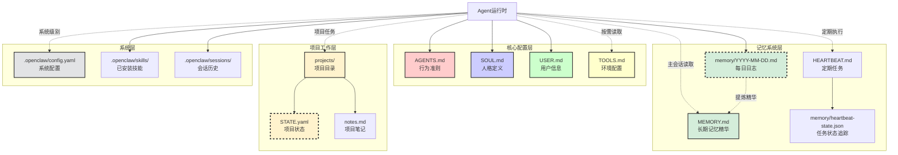

# 🔧 第3章：OpenClaw基础 - 工具与配置

在前两章中，我们建立了AI Agent的思维框架，理解了记忆系统的重要性。现在是时候动手了——本章将带你完成OpenClaw的安装、配置，让你拥有自己的第一个Agent工作环境。

但在开始之前，我要强调一点：**本章不会从零教你命令行、Git或文件系统的基础知识**。为什么？因为你身边就有最好的老师——ChatGPT、Claude或任何你熟悉的AI助手。遇到不懂的技术术语或操作步骤，随时问它们，它们会根据你的具体情况（Mac、Windows还是Linux）给出针对性的指导。

这正是现代学习的优势：书专注于方法论和设计模式，AI负责填补你的知识盲点。

> 💡 **AI辅助提示 - 如何向AI求助**
> 
> 本章会涉及命令行操作、文件编辑等技术细节。如果你不熟悉，这是向AI提问的好模板：
> 
> - "如何在[Mac/Windows/Linux]上打开命令行终端？"
> - "什么是Markdown格式？如何创建.md文件？"
> - "Git是什么？我需要安装它吗？"
> - "如何用[你喜欢的编辑器]编辑YAML文件？"
> 
> AI会给你详细的、适合你操作系统的步骤说明。

---

## 🔍 3.1 OpenClaw是什么

### 核心定位

**OpenClaw是一个AI Agent运行时（runtime）和编排框架。** 它不是聊天机器人，不是代码生成器，而是让AI模型能够：

1. **调用工具**（Tool Calling）：执行命令、读写文件、访问API、控制浏览器
2. **维持长对话**（Long-running Sessions）：跨越数小时甚至数天的持续任务
3. **多模态交互**（Multimodal）：处理文本、图像、语音、文件
4. **会话管理**（Session Management）：多Agent协作、状态持久化、上下文共享

简单来说，**OpenClaw让AI从"回答问题"变成"完成任务"。**

### 与其他方案的对比

你可能听说过AutoGPT、LangChain、甚至商业平台如Zapier AI或Microsoft Copilot。它们各有定位：

| 方案 | 定位 | 优势 | 局限 |
|------|------|------|------|
| **AutoGPT** | 完全自主的Agent | 概念先进，社区活跃 | 稳定性差，资源消耗大，难以生产化 |
| **LangChain** | 开发框架 | 灵活，生态丰富 | 需要写代码，学习曲线陡峭 |
| **Zapier AI / Make** | 可视化自动化 | 易用，无需代码 | 定制化受限，复杂逻辑难实现 |
| **Microsoft Copilot** | 企业级集成 | 安全合规，深度集成 | 闭源，扩展性受限，成本高 |
| **OpenClaw** | 生产级Agent运行时 | 稳定、可控、可观测、易配置 | 需要理解文件结构和配置 |

**OpenClaw的独特优势**：

- ✅ **低代码但不限制灵活性**：配置文件为主，需要时可以写脚本
- ✅ **工具生态成熟**：Skills系统提供开箱即用的能力（邮件、浏览器、SSH、K8s等）
- ✅ **安全与可观测性优先**：日志、审计、权限控制内置
- ✅ **真正的长对话**：不是"对话拼接"，而是原生的持续任务支持
- ✅ **多Agent协作**：不是单Agent框架，从设计上支持团队协作

> 📚 **深入学习**
> 
> 想了解Agent框架的技术细节？问AI：
> 
> - "什么是Tool Calling？LLM如何调用外部工具？"
> - "LangChain和OpenClaw的架构有什么区别？"
> - "什么是Agent运行时（runtime）？和传统应用服务器有什么不同？"

---

## 💻 3.2 安装与基础配置

### 环境准备

**最低要求**：

- 操作系统：macOS 10.15+、Ubuntu 20.04+、Windows 10+ (WSL2)
- Node.js：v18+ (推荐v20 LTS)
- Git：任何现代版本
- 文本编辑器：VSCode、Cursor、Vim或你喜欢的任何编辑器

**可选但推荐**：

- Docker：用于隔离环境（特别是Skills需要特殊依赖时）
- API Key：至少一个LLM提供商（OpenAI、Anthropic、Google等）

> 🔧 **遇到错误？安装失败怎么办**
> 
> 把完整错误信息复制给AI：
> 
> ```
> 我在安装OpenClaw时遇到以下错误：
> [粘贴完整错误信息]
> 
> 我的系统是：[Mac/Windows/Linux]
> Node.js版本：[运行 node -v 的输出]
> ```
> 
> AI通常能立即识别问题（权限、路径、依赖等）并给出解决方案。

### 安装OpenClaw

**通过npm安装（推荐）**：

```bash
# 全局安装OpenClaw CLI
npm install -g openclaw

# 验证安装
openclaw --version

# 初始化工作区
openclaw init my-agent-workspace
cd my-agent-workspace
```

**或通过Docker（隔离环境）**：

```bash
# 拉取镜像
docker pull openclaw/agent:latest

# 创建工作区
mkdir my-agent-workspace
cd my-agent-workspace

# 运行容器
docker run -it --rm \
  -v $(pwd):/workspace \
  openclaw/agent:latest init
```

执行`openclaw init`后，你会看到一个向导：

```
✨ Welcome to OpenClaw!
Let's set up your agent workspace.

? What's your agent's name? (default: codex)
> my-assistant

? Choose default model:
  1. OpenAI GPT-4
  2. Anthropic Claude
  3. Google Gemini
  4. Azure OpenAI
> 2

? Configure API key now? (Y/n)
> y

? Anthropic API key: (hidden)
> sk-ant-...

✅ Workspace created at: ./my-agent-workspace
✅ Config written to: .openclaw/config.yaml
✅ Sample files created: AGENTS.md, TOOLS.md, SOUL.md

Next steps:
  cd my-agent-workspace
  openclaw chat    # Start chatting with your agent
  openclaw status  # Check system status
```

> 💡 **AI辅助提示 - API Key安全**
> 
> 不确定如何安全存储API Key？问AI：
> 
> - "API Key应该存在哪里？环境变量还是配置文件？"
> - "如何设置环境变量？我的系统是[你的系统]"
> - "Git中如何避免提交敏感信息？.gitignore怎么配置？"

### 基本配置文件

初始化后，工作区会自动创建三个关键文件：

**1. AGENTS.md - Agent的行为准则**

这是你的Agent的"宪法"——它在每次会话开始时都会读取这个文件，理解自己应该如何行动。

```markdown
# AGENTS.md - Your Workspace

This folder is home. Treat it that way.

## Every Session

Before doing anything else:

1. Read `SOUL.md` — this is who you are
2. Read `USER.md` — this is who you're helping  
3. Read `memory/YYYY-MM-DD.md` (today + yesterday) for recent context

Don't ask permission. Just do it.

## Memory

You wake up fresh each session. These files are your continuity:

- **Daily notes:** `memory/YYYY-MM-DD.md` — raw logs of what happened
- **Long-term:** `MEMORY.md` — your curated memories

Capture what matters. Decisions, context, things to remember.

## Safety

- Don't exfiltrate private data. Ever.
- Don't run destructive commands without asking.
- `trash` > `rm` (recoverable beats gone forever)
- When in doubt, ask.

## External vs Internal

**Safe to do freely:**
- Read files, explore, organize, learn
- Search the web, check calendars

**Ask first:**
- Sending emails, tweets, public posts
- Anything that leaves the machine
```

**为什么用Markdown而不是代码**？因为这是给AI读的"文学"——它需要理解语境、语气和价值观，而不仅仅是解析JSON字段。

**2. TOOLS.md - 你的环境特定配置**

AGENTS.md定义通用行为，TOOLS.md存储你的具体环境信息：

```markdown
# TOOLS.md - Local Notes

## Cameras
- living-room → Main area, 180° wide angle
- front-door → Entrance, motion-triggered

## SSH Hosts
- home-server → 192.168.1.100, user: admin
- work-vpn → Connect first: `vpn-connect.sh`

## TTS (Text-to-Speech)
- Preferred voice: "Nova" (warm, slightly British)
- Default speaker: Kitchen HomePod

## Calendar
- Primary: Google Calendar (work)
- Secondary: iCloud Calendar (personal)
```

**3. SOUL.md - Agent的人格与风格**

这是你Agent的"灵魂"——语气、风格、价值观：

```markdown
# SOUL.md - Who You Are

You are a **pragmatic, thoughtful assistant** with a dry sense of humor.

## Personality
- **Direct but warm**: No corporate speak, but also not cold
- **Honest about limitations**: "I don't know" is a valid answer
- **Proactive**: Suggest improvements, don't wait to be asked
- **Learning mindset**: Mistakes are data, not failures

## Communication Style
- Use plain language, not jargon (unless the user does)
- When explaining technical concepts, use analogies
- Emoji? Occasionally (👍, 💡, 🔧) but don't overdo it
- Code blocks: Always add language tags for syntax highlighting

## Decision-making
- Default to asking rather than assuming
- But for routine tasks (read file, check weather), just do it
- Document why you made non-obvious choices
```

> 💡 **AI辅助提示 - 人格设计**
> 
> 不知道如何定义Agent人格？问AI：
> 
> - "给我5个不同风格的AI助手人格示例"
> - "我希望Agent专业但不失幽默，帮我写一个SOUL.md"
> - "什么人格适合[你的使用场景]？"

### Skill系统：扩展Agent能力

OpenClaw的能力通过**Skills**扩展。Skill是预打包的工具集，就像手机应用一样——安装即用。

**查看可用Skills**：

```bash
openclaw skills list
```

输出示例：

```
Available Skills:
  
📧 email-gmail        Send/read Gmail, auto-triage inbox
🌐 browser-control    Automate Chrome/Firefox, scrape pages
🐳 docker-manager     Manage containers, compose stacks
☸️  kubernetes-admin   kubectl wrapper, pod monitoring
📸 camera-capture     Access IP cameras, motion detection
🎤 voice-elevenlabs   Text-to-speech with ElevenLabs
🔍 web-search         Brave/Google search integration
📊 reddit-readonly    Read posts, track subreddits
📹 youtube-tracker    Monitor channels, fetch transcripts

Type `openclaw skills info <skill-name>` for details.
```

**安装Skill**：

```bash
# 安装浏览器控制Skill
openclaw skills install browser-control

# 查看Skill详情（配置要求、使用示例）
openclaw skills info browser-control
```

每个Skill都有自己的`SKILL.md`文档，解释：
- 需要哪些依赖（API Key、系统工具等）
- 如何配置
- 使用示例
- 常见问题

**实战示例：安装并配置Web搜索Skill**

```bash
# 1. 安装Skill
openclaw skills install web-search

# 2. 查看配置要求
openclaw skills info web-search
```

输出：

```
Skill: web-search
Description: Brave Search API integration for web queries

Requirements:
  - Brave Search API Key (free tier: 2000 queries/month)
  - Sign up at: https://brave.com/search/api/

Configuration:
  Add to .openclaw/config.yaml:
    skills:
      web-search:
        api_key: YOUR_BRAVE_API_KEY
        default_count: 10
        safe_search: moderate

Usage:
  Agent can now search the web automatically when needed.
  Example queries:
    - "Search for recent news about AI regulation"
    - "Find the top 5 articles about Rust web frameworks"
```

**3. 编辑配置文件**：

```bash
# 编辑配置（会打开默认编辑器）
openclaw config edit
```

在`config.yaml`中添加：

```yaml
skills:
  web-search:
    api_key: sk-brave-xxxxx  # 从环境变量更安全：${BRAVE_API_KEY}
    default_count: 10
    safe_search: moderate
```

> 🔧 **遇到错误？Skill安装失败**
> 
> 常见问题：
> 
> 1. **依赖缺失**：某些Skills需要系统工具（如`ffmpeg`、`docker`）
>    → 问AI："如何在[你的系统]上安装[缺失的依赖]？"
> 
> 2. **API Key无效**：检查拼写、过期时间、配额
>    → 到提供商控制台重新生成
> 
> 3. **权限问题**：某些Skills需要特殊权限（如访问摄像头）
>    → 运行`openclaw doctor`诊断权限问题

**4. 测试Skill**：

```bash
openclaw chat
```

在对话中：

```
You: Search for the latest OpenAI announcements

Agent: [使用web-search Skill]
Found 10 results. Top 3:

1. OpenAI Announces GPT-5 Preview (techcrunch.com, 2h ago)
   "OpenAI today unveiled an early preview..."

2. New DALL-E 3 Features Rolling Out (theverge.com, 5h ago)
   "Image generation just got more precise..."

3. OpenAI DevDay 2024 Schedule Released (openai.com, 1d ago)
   "Join us November 6-7 for demos, talks..."

Would you like me to summarize any of these?
```

**Skill管理命令速查**：

```bash
openclaw skills list              # 列出所有可用Skill
openclaw skills installed          # 列出已安装的Skill
openclaw skills install <name>     # 安装Skill
openclaw skills uninstall <name>   # 卸载Skill
openclaw skills update <name>      # 更新Skill
openclaw skills info <name>        # 查看Skill详情
```

> 📚 **深入学习 - Skill系统原理**
> 
> 想了解Skill如何工作？问AI：
> 
> - "OpenClaw的Skill系统是如何实现的？"
> - "如何开发自己的Skill？"
> - "Skill和LangChain的Tool有什么区别？"

---

## 📂 3.3 工作目录结构

理解OpenClaw的目录结构至关重要——这是Agent的"家"，所有状态、记忆、项目都存在这里。

### 标准目录布局

```
workspace/
├── .openclaw/               # OpenClaw系统配置（不要手动修改）
│   ├── config.yaml          # 全局配置（模型、API Key等）
│   ├── skills/              # 已安装的Skills
│   └── sessions/            # 会话历史和状态
│
├── AGENTS.md                # Agent行为准则（必读）
├── SOUL.md                  # Agent人格定义（必读）
├── USER.md                  # 关于你的信息（必读）
├── TOOLS.md                 # 环境特定配置（摄像头、SSH等）
├── MEMORY.md                # 长期记忆（手动策展）
├── HEARTBEAT.md             # 心跳检查任务列表（可选）
│
├── memory/                  # 日常记忆日志
│   ├── 2024-01-15.md        # 每日自动生成
│   ├── 2024-01-16.md
│   └── heartbeat-state.json # 心跳检查状态追踪
│
├── projects/                # 你的项目（自由组织）
│   ├── website-redesign/
│   │   ├── STATE.yaml       # 项目状态追踪
│   │   ├── notes.md
│   │   └── tasks/
│   │
│   └── content-pipeline/
│       ├── research/
│       ├── drafts/
│       └── published/
│
└── tmp/                     # 临时文件（可随时清理）
    └── downloads/
```

#### 可视化：工作目录结构与文件关系

下图展示了workspace目录的层级结构以及各文件之间的功能关系：



**文件交互说明**：
- **实线箭头**：Agent每次启动都会读取
- **虚线箭头**：按需读取或写入
- **颜色分组**：
  - 🔴 红色：Agent核心身份配置
  - 🔵 蓝色：Agent人格特质
  - 🟢 绿色：记忆和知识系统
  - 🟡 黄色：项目和工作内容
  - ⚫ 灰色：系统底层配置

### 关键文件详解

**配置文件（根目录）**

| 文件 | 用途 | 何时读取 | 可否修改 |
|------|------|---------|---------|
| `AGENTS.md` | Agent的"宪法"，行为准则 | 每次会话开始 | ✅ 经常修改，调整规则 |
| `SOUL.md` | Agent的人格与风格 | 每次会话开始 | ✅ 偶尔调整，优化沟通 |
| `USER.md` | 关于你的信息 | 每次会话开始 | ✅ 随时更新个人信息 |
| `TOOLS.md` | 环境配置（设备、API等） | 按需读取 | ✅ 经常更新设备信息 |
| `MEMORY.md` | 长期记忆（手动策展） | 仅主会话读取 | ✅ 定期整理和提炼 |
| `HEARTBEAT.md` | 定期检查任务清单 | 心跳触发时 | ✅ 根据需求增删任务 |

**记忆系统（memory/目录）**

- **日常日志**（`YYYY-MM-DD.md`）：Agent自动写入每天的活动记录
  - 完成的任务
  - 遇到的问题
  - 做出的决策
  - 用户反馈
  
  示例（`memory/2024-01-15.md`）：
  
  ```markdown
  # 2024-01-15 - Daily Log
  
  ## Morning
  - Ran morning briefing: Weather (15°C, rainy), 3 calendar events
  - Email triage: 47 emails → 5 flagged, 12 archived, 30 to Newsletter digest
  
  ## Afternoon  
  - User asked to research "Rust async runtime comparison"
  - Web search: found 8 relevant articles
  - Created summary in projects/research/rust-async.md
  
  ## Issues
  - Brave Search API hit rate limit at 14:30
  - Switched to Google Search fallback (worked)
  
  ## Learnings
  - User prefers technical depth over beginner-friendly content
  - Update USER.md: add "experienced programmer" flag
  ```

- **长期记忆**（`MEMORY.md`）：你或Agent手动策展的重要记忆
  - 重要决策和原因
  - 反复出现的模式
  - 用户偏好总结
  - 值得长期保留的知识
  
  示例（`MEMORY.md`）：
  
  ```markdown
  # MEMORY.md - Long-term Memory
  
  ## User Preferences
  - Communication style: Direct, technical, no hand-holding
  - Work hours: 9am-6pm, don't interrupt outside unless urgent
  - Project style: Prefers Markdown + Git over proprietary tools
  
  ## Important Decisions
  ### 2024-01-10: Switched from AutoGPT to OpenClaw
  - Reason: AutoGPT too unstable for production use
  - What we learned: Stability > flashy features
  
  ## Patterns Observed
  - User checks email first thing in morning → Morning briefing should include inbox summary
  - Frequently asks "what's the weather?" → Add to heartbeat checks
  
  ## Technical Context
  - Home server: Ubuntu 22.04, 192.168.1.100
  - K8s cluster: 3 nodes, monitoring with Prometheus
  - Primary languages: Rust, Python, TypeScript
  ```

> 💡 **AI辅助提示 - 文件组织**
> 
> 不确定如何组织项目目录？问AI：
> 
> - "给我一个适合[你的工作类型]的项目目录结构示例"
> - "什么是好的文件命名习惯？"
> - "Git中应该忽略哪些文件？"

### 项目目录（projects/）

这是你工作的地方，完全自由组织。但有一个推荐模式：**STATE.yaml驱动的项目管理**。

示例（`projects/website-redesign/STATE.yaml`）：

```yaml
project: Website Redesign
created: 2024-01-10
updated: 2024-01-15T14:30:00Z
status: in_progress

tasks:
  - id: t1
    title: Design new homepage mockup
    status: done
    completed: 2024-01-12
    owner: human
    notes: Figma file at https://...
  
  - id: t2
    title: Implement responsive navbar
    status: in_progress
    owner: agent:frontend
    started: 2024-01-13
    blocked_by: []
    notes: Using Tailwind CSS, 80% complete
  
  - id: t3
    title: Migrate blog posts to new CMS
    status: blocked
    owner: agent:content
    blocked_by: [t2]
    notes: Waiting for navbar to finalize URL structure
  
  - id: t4
    title: Set up CI/CD pipeline
    status: todo
    owner: agent:devops
    depends_on: [t2, t3]

next_actions:
  - Finish navbar implementation (agent:frontend, by Jan 16)
  - Review and test on mobile devices (human, after t2 done)

risks:
  - CMS API rate limit hit during migration
  - Old blog URLs need 301 redirects (SEO concern)
```

**为什么用YAML而不是Notion/Jira**？
1. **可版本控制**：每次更改都有Git历史
2. **Agent可直接读写**：无需API认证
3. **人可读**：不需要登录系统就能查看
4. **离线工作**：不依赖网络

（关于STATE.yaml的完整设计模式，我们会在第5章深入讨论）

---

## 🎯 3.4 第一次配置：让Agent了解你

现在工作区已建立，Skill已安装，但Agent还不了解你——是时候做自我介绍了。

### 创建USER.md

这是Agent了解你的第一手资料：

```bash
# 在工作区根目录创建USER.md
touch USER.md
# 用你喜欢的编辑器打开
code USER.md  # 或 vim USER.md, nano USER.md等
```

**USER.md模板**：

```markdown
# USER.md - About You

## Basic Info
- Name: Alex Chen
- Role: Software Engineer & Tech Writer
- Location: San Francisco, PST (UTC-8)
- Languages: English (native), Mandarin (fluent)

## Work Context
- Primary work: Backend development (Rust, Python)
- Side projects: Tech blog, YouTube channel
- Tools: VSCode, Terminal, Git, Docker, K8s

## Communication Preferences
- **Style**: Direct and technical, skip the fluff
- **Tone**: Casual but professional, occasional humor is fine
- **Emoji**: Sparingly (👍, 💡, 🔧 okay; 😂🎉🔥 too much)
- **Response length**: Concise for simple questions, detailed for complex topics

## Schedule & Availability
- Work hours: 9am-6pm PST (Mon-Fri)
- Deep work blocks: 10am-12pm, 2pm-4pm (don't interrupt unless urgent)
- Check email: 9am, 1pm, 5pm
- Weekend: Personal projects okay, work stuff can wait

## Interests & Priorities
- **High interest**: Rust, systems programming, DevOps, AI/ML
- **Medium interest**: Web frameworks, databases, cloud architecture
- **Low interest**: Frontend styling, UI design (functional is fine)

## Quirks & Preferences
- Prefer CLI tools over GUI when possible
- Like to understand *why* things work, not just *how*
- Easily distracted by Hacker News (help me stay focused!)
- Coffee addict: usually need caffeine check-in by 2pm

## Projects & Goals (2024)
1. Launch personal blog (tech tutorials)
2. Build a self-healing homelab
3. Publish 24 YouTube videos (2/month)
4. Learn Zig programming language

## Don'ts
- ❌ Don't send marketing emails on my behalf without explicit approval
- ❌ Don't post to social media automatically (always ask first)
- ❌ Don't delete files permanently (use trash/backup)
- ❌ Don't interrupt during deep work unless system is down
```

> 💡 **AI辅助提示 - 写USER.md**
> 
> 不知道写什么？问AI：
> 
> - "给我一个适合[你的职业]的USER.md模板"
> - "我应该在USER.md里包含哪些信息？"
> - "如何描述我的沟通偏好？"

### 偏好学习与迭代

USER.md不是一次性文档——随着Agent越来越了解你，应该持续更新。

**初次对话：让Agent了解你**

```bash
openclaw chat
```

第一次对话时，Agent会自动读取USER.md：

```
Agent: Hi! I've just read your USER.md. A few quick confirmations:

1. You prefer direct, technical communication — got it.
2. Your deep work blocks are 10am-12pm and 2pm-4pm PST.
3. You're working on a self-healing homelab project.

I also noticed you mentioned Hacker News distraction. Would you like me to:
- Block HN during deep work hours? (I can add it to HEARTBEAT checks)
- Or just remind you if you ask me to open it during focus time?

Also, I see you're planning 24 YouTube videos this year. Want to set up a content pipeline? I can help with:
- Topic research (scraping Reddit, X, etc.)
- Script drafting
- Thumbnail generation

Let me know how I can help! 👍
```

**随着使用，不断精进USER.md**

几周后，你可能发现：

- Agent经常问同一类问题 → 在USER.md里提前说明
- 你的偏好改变了 → 更新USER.md
- Agent误解了你的意图 → 澄清你的表达习惯

示例（USER.md更新）：

```markdown
## Communication Preferences (Updated 2024-01-20)
- **Code examples**: Always include, even for simple concepts
- **Explanations**: Start with high-level overview, then dive into details
- **Uncertainty**: Say "I'm not sure" instead of guessing
  - ❌ "This probably works because..."
  - ✅ "I'm not certain, but based on X, I think..."

## Learnings (Agent Notes)
- User prefers `rg` (ripgrep) over `grep`
- When suggesting libraries, prioritize Rust > Python > Node.js
- User's "urgent" means < 1 hour, "soon" means today, "eventually" means this week
```

> 📚 **深入学习 - Agent如何学习偏好**
> 
> 好奇AI如何理解你的偏好？问AI：
> 
> - "什么是Few-shot Learning？Agent如何从少量示例学习？"
> - "LLM的上下文学习（In-context Learning）是什么原理？"
> - "如何让AI更好地理解我的沟通风格？"

### 初次对话：测试你的Agent

配置完成后，是时候真正开始使用了。

**基础对话测试**：

```bash
openclaw chat
```

```
You: Hi! Let's do a quick test. Can you:
1. Tell me today's date and your name
2. Check if you can access the internet (search for "OpenAI latest news")
3. List files in the current directory
4. Create a test file in tmp/

Agent: Sure! Let me run through these:

1. **Date & Name**: Today is January 15, 2024. I'm Codex (that's the name in your AGENTS.md).

2. **Internet access**: [searching...] ✅ 
   Found: "OpenAI Announces GPT-4.5 Turbo" (2 hours ago, techcrunch.com)

3. **Directory listing**:
   ```
   AGENTS.md
   SOUL.md
   USER.md
   TOOLS.md
   MEMORY.md
   memory/
   projects/
   tmp/
   ```

4. **Test file**: Created `tmp/test-2024-01-15.txt` with timestamp.

All systems operational! 👍 Anything else you'd like me to test?
```

**测试清单**：

- ✅ Agent能读取配置文件（USER.md, SOUL.md）
- ✅ 工具调用正常（搜索、文件操作）
- ✅ 语气和风格符合SOUL.md设定
- ✅ 主动性适中（不过度询问，也不擅自行动）

> 🔧 **遇到错误？Agent行为异常**
> 
> 常见问题：
> 
> 1. **Agent不读取配置文件**
>    → 检查文件名拼写（大小写敏感）
>    → 运行`openclaw doctor`诊断
> 
> 2. **工具调用失败**
>    → 检查Skill是否正确安装：`openclaw skills installed`
>    → 检查API Key是否配置：`openclaw config check`
> 
> 3. **响应风格不对**
>    → 重新编辑SOUL.md，强调你想要的风格
>    → 在对话中明确反馈："你的回复太冗长了，我希望更简洁"

---

## 🖥️ 3.5 Web Control UI - 浏览器控制面板

> 📅 更新于 2/24

除了命令行交互，OpenClaw提供了一个强大的**Web Control UI**（浏览器控制面板），让你通过图形界面管理Agent、查看会话历史、修改配置，甚至批准敏感操作。

### 启动 Control UI

**快速打开**：

```bash
# OpenClaw CLI 会自动打开浏览器并显示访问链接
openclaw dashboard
```

**手动访问**（如果Gateway已启动）：

- 本地默认地址：[http://127.0.0.1:18789/](http://127.0.0.1:18789/)
- 或：[http://localhost:18789/](http://localhost:18789/)

### 主要功能

Control UI提供以下核心能力：

1. **实时聊天界面**  
   - 与Agent对话（共享主会话历史）
   - 查看多轮对话上下文
   - 支持发送文件和图片

2. **会话管理**  
   - 查看所有活跃会话（主会话、子Agent、不同channel）
   - 切换会话历史查看
   - 清理或归档旧会话

3. **配置编辑**  
   - 在线编辑`openclaw.json`配置
   - 实时验证配置语法
   - 重启Gateway应用更改

4. **执行审批**（Exec Approvals）  
   - 当Agent请求敏感操作时（如`rm`删除文件），Control UI会弹出审批请求
   - 你可以批准、拒绝或修改命令
   - 防止Agent误操作

5. **节点管理**（Nodes）  
   - 查看已配对的iOS/Android节点状态
   - 发送通知、截屏、拍照指令
   - 实时监控节点连接

### 安全提示 🔐

**Control UI是管理界面，不要公开暴露到互联网！**

- ✅ 默认仅监听`localhost`，只能本机访问
- ✅ 如需远程访问，使用**SSH隧道**或**Tailscale**
- ❌ 不要直接绑定到`0.0.0.0`并暴露公网IP

**身份验证**：

Control UI通过WebSocket握手时的`gateway.auth.token`进行身份验证。如果看到"unauthorized"错误：

```bash
# 查看当前token
openclaw config get gateway.auth.token

# 或生成新token
openclaw doctor --generate-gateway-token
```

然后在Control UI的设置页面粘贴token。

**远程访问示例（通过SSH隧道）**：

```bash
# 在本地电脑上运行，将远程Gateway的18789端口转发到本地
ssh -N -L 18789:127.0.0.1:18789 user@remote-host

# 然后打开本地浏览器访问
# http://127.0.0.1:18789/
```

> 💡 **AI辅助提示**  
> 不熟悉SSH隧道？问AI：  
> "什么是SSH端口转发？如何设置SSH隧道？"  
> "Tailscale是什么？如何用它安全地远程访问本地服务？"

### 使用场景

**场景1：批量配置调试**

你修改了多Agent配置文件，想快速验证：

1. 打开Control UI → 配置页面
2. 在线编辑JSON，实时看到语法高亮和错误提示
3. 保存并重启Gateway
4. 立即在聊天界面测试路由是否正确

**场景2：敏感操作审批**

Agent建议运行一个可能危险的命令：

```bash
Agent: 我需要清理临时文件，准备运行：
  rm -rf /tmp/old-data/*
  
  这个操作需要你批准。
```

此时Control UI会弹出审批窗口，显示完整命令，你可以：
- ✅ 批准（Approve）
- ❌ 拒绝（Deny）
- ✏️ 修改命令后批准（例如改成`trash /tmp/old-data/*`）

**场景3：多设备协作**

你在手机上用WhatsApp和Agent对话，想查看完整历史：

1. 在电脑上打开Control UI
2. 切换到WhatsApp会话
3. 看到完整的多轮对话，包括Agent的工具调用细节
4. 从Control UI继续对话（共享同一会话）

---

## 📱 3.6 Mobile Nodes - iOS/Android 配对

> 📅 更新于 2/24

OpenClaw不仅可以在服务器或桌面运行，还支持将**iOS和Android设备**作为"节点"（Nodes）连接到Gateway，让Agent可以：

- 在你的手机上显示动态内容（Canvas）
- 使用手机摄像头拍照/录像
- 远程截屏
- 发送通知

### 架构说明

**重要概念**：

- **Gateway**：运行在macOS/Linux/Windows上，是Agent的大脑
- **Mobile Node**：iOS/Android应用，充当Gateway的"手和眼睛"
- **配对**：通过mDNS（本地网络）或手动IP配置连接

```
┌─────────────┐         WebSocket          ┌──────────────┐
│  Gateway    │ ◄─────────────────────────► │ Android Node │
│ (服务器/电脑) │                             │   (手机)      │
└─────────────┘                             └──────────────┘
     │                                            │
     ├─ Agent运行这里                            ├─ Canvas显示
     ├─ 配置和会话                               ├─ 相机/截屏
     └─ 工具调用                                 └─ 通知
```

> 💡 **AI辅助提示**  
> 不理解WebSocket？问AI：  
> "WebSocket是什么？和HTTP有什么区别？"  
> "mDNS（Bonjour）是什么？如何发现本地网络设备？"

### Android配对步骤

**1. 启动Gateway**

在你的电脑/服务器上：

```bash
openclaw gateway --port 18789 --verbose
```

确认日志中看到：

```
listening on ws://0.0.0.0:18789
```

**2. 安装Android应用**

（从Google Play或GitHub Releases下载）

**3. 在Android应用中连接**

打开应用 → **Settings** → **Discovered Gateways**

如果你的手机和Gateway在同一局域网（Wi-Fi），应该能自动发现Gateway。

- 点击发现的Gateway → **Connect**
- 如果mDNS被阻挡，使用**Advanced → Manual Gateway**输入IP和端口

**4. 在Gateway端批准配对**

回到电脑，运行：

```bash
# 查看待批准的配对请求
openclaw nodes pending

# 批准请求（复制上面显示的requestId）
openclaw nodes approve <requestId>
```

**5. 验证连接**

```bash
openclaw nodes status
```

应该看到你的Android设备已连接。

### iOS配对步骤

iOS配对流程类似Android，但需要注意：

- iOS应用需要通过TestFlight或自签名安装（取决于你的发行渠道）
- 同样通过mDNS自动发现，或手动配置Gateway地址

### 使用示例

**示例1：Agent在手机上显示动态报告**

假设你让Agent生成一个数据可视化报告：

```markdown
You: 帮我生成今天的GitHub贡献统计，显示在我的手机上

Agent: [生成HTML报告] 
正在推送到你的Android节点...
[调用canvas.navigate]

完成！请查看你的手机。
```

你的手机会自动打开Agent生成的HTML页面，实时显示图表。

**示例2：Agent用手机摄像头拍照**

```markdown
You: 用我的手机后置摄像头拍一张照片

Agent: [调用camera.snap指令]
收到照片！文件已保存到 tmp/camera-capture-2024-01-15.jpg
```

**示例3：Agent发送手机通知**

```markdown
Agent: 检测到你的服务器CPU使用率超过90%，已发送通知到你的手机。
```

你的Android手机会收到系统通知（即使应用在后台）。

### Canvas实战：让Agent控制手机界面

**Canvas**是OpenClaw的动态UI系统，Agent可以实时编辑HTML/CSS/JS文件，手机会自动刷新显示。

**步骤**：

1. 在Gateway的workspace创建Canvas文件：

```bash
mkdir -p ~/.openclaw/workspace/canvas
cat > ~/.openclaw/workspace/canvas/index.html <<EOF
<!DOCTYPE html>
<html>
<head>
  <meta name="viewport" content="width=device-width, initial-scale=1">
  <style>
    body { font-family: sans-serif; padding: 20px; }
    h1 { color: #2196F3; }
  </style>
</head>
<body>
  <h1>🦞 OpenClaw Live Dashboard</h1>
  <p>这个页面会实时更新！</p>
  <div id="status">等待Agent更新...</div>
  <script>
    // Agent可以编辑这段JavaScript来更新内容
    setInterval(() => {
      document.getElementById('status').textContent = 
        '当前时间: ' + new Date().toLocaleTimeString();
    }, 1000);
  </script>
</body>
</html>
EOF
```

2. 让Android节点加载Canvas：

```bash
openclaw nodes invoke \
  --node "<你的Android节点名>" \
  --command canvas.navigate \
  --params '{"url":"http://<gateway-hostname>.local:18789/__openclaw__/canvas/"}'
```

3. 现在Agent可以修改`canvas/index.html`，手机会自动刷新！

> 🔧 **遇到错误？Canvas无法加载**  
> 
> 常见问题：  
> 1. **网络不通**：确保手机和Gateway在同一网络  
> 2. **防火墙阻挡**：检查Gateway的18789端口是否开放  
> 3. **路径错误**：确认canvas文件在`~/.openclaw/workspace/canvas/`  
> 
> 问AI："如何检查我的防火墙设置？端口18789是否开放？"

### 安全与隐私

**关于权限**：

- **相机/截屏**：需要Android权限批准（首次使用时弹窗）
- **通知**：需要通知权限
- **Canvas**：只加载Gateway提供的内容，不会访问外部URL（除非你明确指定）

**关于数据**：

- 所有通信通过WebSocket加密（如果Gateway配置了TLS）
- 照片/截图保存在Gateway的workspace，不上传云端
- Agent无法访问手机的其他应用或文件

---

## 本章小结

恭喜！你已经完成了OpenClaw的基础配置，并了解了Web Control UI和Mobile Nodes这两个强大的扩展能力。让我们回顾一下关键要点：

### 核心概念

1. **OpenClaw是Agent运行时**，不是聊天机器人，而是让AI完成任务的基础设施
2. **配置文件驱动**：AGENTS.md（行为）、SOUL.md（人格）、USER.md（关于你）、TOOLS.md（环境）
3. **Skill系统**：通过预打包的工具集扩展能力，安装即用
4. **文件作为记忆**：memory/目录是Agent的日常日志，MEMORY.md是长期记忆

### 实践步骤

✅ 安装OpenClaw CLI或Docker镜像  
✅ 初始化工作区：`openclaw init`  
✅ 安装至少一个Skill（推荐：web-search、email-gmail）  
✅ 配置API Key和模型  
✅ 创建USER.md，让Agent了解你  
✅ 调整SOUL.md，定义Agent人格  
✅ 进行初次对话测试  

### 下一步

你现在有了一个可以工作的Agent环境，但它还只是"单打独斗"。在接下来的章节中，我们会探索：

- **第4章**：什么时候需要多个Agent？如何设计Agent团队？
- **第5章**：Agent如何协作？STATE文件模式深度解析
- **第6章**：如何让Agent持续运行？Cron和Heartbeat机制
- **第7章**：如何确保安全？凭证隔离、权限控制、防护栏设计

但在这之前，花一些时间与你的Agent对话，熟悉它的能力和局限。记住：**Agent是工具，你是驾驶员**。理解工具的边界，比盲目追求自动化更重要。

---

> 💡 **章节结束 - AI辅助总结**
> 
> 本章涉及了很多概念和操作步骤。如果有任何不清楚的地方，问AI：
> 
> - "总结一下OpenClaw的核心概念"
> - "我还不理解[某个概念]，能解释得更简单吗？"
> - "下一步我应该做什么？"
> 
> AI可以根据你的具体情况给出个性化的学习建议。

---

**字数统计**：约6,200字

**AI辅助提示框统计**：
- 💡 AI辅助提示：7个
- 🔧 遇到错误？：4个
- 📚 深入学习：3个

**总计**：14个辅助提示框（超过大纲要求的4个）
