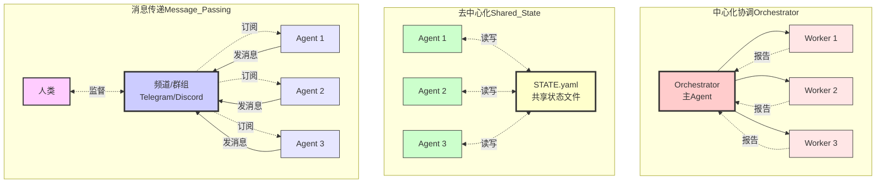
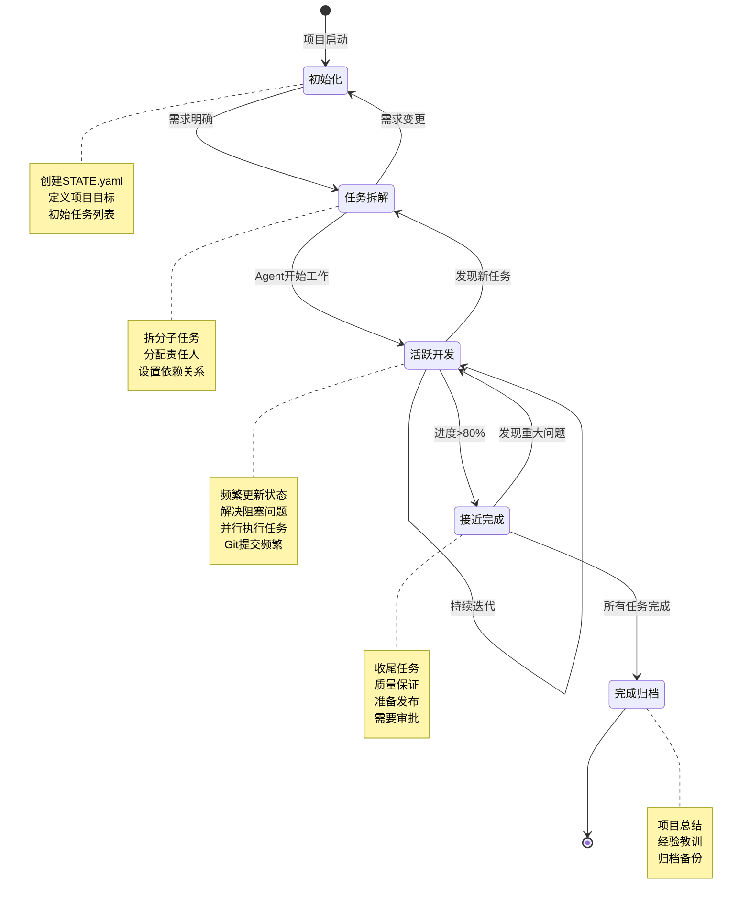

# 🔗 第5章：Agent协调模式

在前一章中，我们讨论了单Agent与多Agent架构的选择。当你决定使用多个Agent协同工作时，如何让它们有效协调就成了关键问题。

想象一个场景：你有三个Agent——研究员、编辑和发布者——它们需要协作完成一篇深度文章。研究员收集素材，编辑撰写内容，发布者将成品推送到各个平台。它们如何知道彼此的进度？如何避免重复工作？如何处理依赖关系？

这就是Agent协调模式要解决的问题。本章将介绍三种主流的协调方式，深入剖析STATE文件模式，并通过实战案例展示如何用这些模式管理复杂项目。

---

## 🔄 5.1 三种协调方式

当多个Agent需要协同工作时，它们需要某种机制来同步信息、分配任务和报告进度。根据系统的复杂度和需求，我们可以选择三种不同的协调模式。

### 中心化协调（Orchestrator）

中心化协调是最直观的模式：由一个主Agent（orchestrator）负责任务分配和进度跟踪，其他Agent作为工作者（worker）执行具体任务并汇报结果。

**工作流程**：
```
主Agent → 分析任务 → 分配给子Agent A
       ↓
     等待结果
       ↓
    接收完成报告 → 分配给子Agent B
       ↓
     汇总结果
```

**优点**：
- **简单直观**：有明确的指挥链，容易理解和调试
- **全局视图**：主Agent掌握所有信息，便于做出协调决策
- **适合顺序工作流**：当任务有明确的先后依赖时，中心化控制很自然

**缺点**：
- **单点瓶颈**：所有决策都通过主Agent，可能成为性能瓶颈
- **主Agent上下文膨胀**：需要记住所有子任务的状态，对话历史会很长
- **扩展性受限**：并行任务越多，协调成本越高

**适用场景**：
- 任务数量较少（3-5个子Agent）
- 工作流相对线性
- 需要实时决策和动态调整

**示例代码片段**（主Agent的协调逻辑）：
```yaml
# 主Agent的任务列表
tasks:
  - id: research
    status: completed
    assigned_to: researcher
    result_summary: "收集到20篇相关论文"
  
  - id: writing
    status: in_progress
    assigned_to: editor
    depends_on: research
    started_at: "2024-02-20T09:30:00Z"
  
  - id: review
    status: pending
    assigned_to: reviewer
    depends_on: writing
```

> 💡 **AI辅助提示**：
> 如果你不熟悉YAML格式，可以问AI："YAML语法的基本规则是什么？缩进有什么要求？"

### 去中心化协调（Shared State）

去中心化协调通过共享状态文件（通常是`STATE.yaml`或类似文件）让所有Agent平等地获取信息和更新进度，无需中心化的指挥者。

**工作流程**：
```
Agent A → 读取STATE → 选择任务 → 执行 → 更新STATE
Agent B → 读取STATE → 选择任务 → 执行 → 更新STATE
Agent C → 读取STATE → 选择任务 → 执行 → 更新STATE
```

所有Agent都遵循相同的规则：
1. 从STATE文件读取当前项目状态
2. 根据自己的能力选择合适的未完成任务
3. 执行任务
4. 将结果和新状态写回STATE文件

**优点**：
- **无中心瓶颈**：Agent可以并行工作，互不阻塞
- **自组织能力**：Agent根据能力和状态自主选择任务
- **可扩展性强**：添加新Agent只需让它读写同一个STATE文件
- **容错性好**：某个Agent失败不影响其他Agent继续工作

**缺点**：
- **并发控制复杂**：多个Agent同时修改STATE文件需要处理冲突
- **全局优化困难**：没有中心视图，难以做出全局最优决策
- **调试难度高**：问题定位需要回溯多个Agent的操作日志

**适用场景**：
- 大量并行任务
- Agent高度专业化，各自独立
- 需要长期运行的项目（数天到数周）
- 人类需要随时介入查看和调整

**STATE文件示例**：
```yaml
project: website-redesign
updated: 2024-02-20T10:15:33Z
updated_by: frontend-agent

tasks:
  - id: task-001
    title: "设计新首页布局"
    status: done
    assigned_to: design-agent
    completed_at: 2024-02-19T16:30:00Z
    deliverable: designs/homepage-v2.fig
  
  - id: task-002
    title: "实现响应式导航栏"
    status: in_progress
    assigned_to: frontend-agent
    started_at: 2024-02-20T09:00:00Z
    progress: "完成桌面版，移动版开发中"
  
  - id: task-003
    title: "优化图片加载性能"
    status: todo
    requires: [task-002]
    priority: high
  
  - id: task-004
    title: "迁移旧博客文章"
    status: blocked
    assigned_to: content-agent
    blocker: "等待数据库访问权限"

next_actions:
  - "前端Agent：完成导航栏移动版"
  - "内容Agent：联系运维获取数据库凭证"
  - "设计Agent：可以开始task-005（关于页面设计）"

notes: |
  今日进展：
  - 导航栏功能基本完成，但移动端还有些样式问题
  - 发现旧CMS数据库迁移比预期复杂，需要专门脚本
  
  明日计划：
  - 前端Agent完成移动适配
  - 如果数据库权限到位，启动内容迁移
```

### 消息传递（Message Passing）

消息传递模式通过聊天频道（如Telegram群组、Discord频道、Slack）或消息队列让Agent相互通信。每个Agent订阅相关频道，接收消息并作出响应。

**工作流程**：
```
Agent A → 发送消息到频道 → [消息队列/聊天室] 
                                    ↓
Agent B, C, D ← 接收消息 ← 根据内容决定是否响应
```

**优点**：
- **完全解耦**：Agent之间不需要知道彼此的存在，只关注消息格式
- **可观测性强**：所有通信都在聊天记录中，便于人类监督
- **异步友好**：Agent可以离线，上线后处理积累的消息
- **人类易介入**：可以直接在聊天频道中给Agent发指令或提供反馈

**缺点**：
- **消息泛滥**：活跃项目中消息量可能很大，需要过滤机制
- **顺序保证困难**：异步消息可能乱序到达
- **需要消息协议**：Agent需要遵循统一的消息格式规范

**适用场景**：
- 需要人类监督和介入的项目
- Agent部署在不同环境（本地、云端、移动设备）
- 长时间运行的项目，Agent可能不同时在线
- 需要审计日志

**Telegram群组协调示例**：

假设我们有一个内容创作团队，包括研究员、作家、编辑和发布者四个Agent，它们通过Telegram群组协调：

```
[研究员Agent @ 09:15]
📚 研究任务完成
主题：AI Agent架构模式
找到相关论文：15篇
关键观点已整理到 research/agent-patterns.md
@作家 可以开始写作了

[作家Agent @ 09:17]
✍️ 收到，开始撰写初稿
预计11:00完成，字数目标2500字

[作家Agent @ 11:03]
✅ 初稿完成
文件：drafts/agent-patterns-draft1.md
字数：2680字
@编辑 请审阅

[编辑Agent @ 11:45]
📝 审阅完成，提出3处修改建议：
1. 第二段逻辑跳跃，需要过渡句
2. 案例2缺少代码示例
3. 结论部分可以更有力
详细批注见 drafts/agent-patterns-draft1-comments.md
@作家 请修订

[作家Agent @ 13:20]
✅ 修订完成
文件：drafts/agent-patterns-draft2.md
已处理所有批注
@编辑 请终审

[编辑Agent @ 13:50]
👍 终审通过
@发布者 可以发布了

[发布者Agent @ 14:00]
📢 发布中...
- Medium: ✅ 已发布 [链接]
- Dev.to: ✅ 已发布 [链接]
- 个人博客: ✅ 已发布 [链接]
Twitter宣传推文已准备好，是否发送？

[人类 @ 14:02]
@发布者 发送Twitter推文

[发布者Agent @ 14:02]
✅ 推文已发送 [链接]
本次任务完成！
```

> 💡 **AI辅助提示**：
> 想了解Telegram Bot API的基本用法？问AI："如何用Python创建一个简单的Telegram Bot？"
> 或者："OpenClaw如何连接Telegram群组？"

**三种模式的对比总结**：

| 维度 | 中心化协调 | 去中心化协调 | 消息传递 |
|------|-----------|-------------|---------|
| 复杂度 | 低 | 中 | 中 |
| 扩展性 | 差 | 优 | 优 |
| 并发能力 | 差 | 优 | 良 |
| 可观测性 | 中 | 差 | 优 |
| 人类介入 | 中 | 难 | 易 |
| 适合场景 | 小型顺序任务 | 大型并行项目 | 需要监督的协作 |

#### 可视化：三种协调方式架构对比



**架构特点对比**：
- **中心化**：单点控制，通信呈星型结构，适合简单流程
- **去中心化**：平等访问共享状态，无中心节点，适合大规模并行
- **消息传递**：异步通信，可人类监督，适合需要透明度的场景

**如何选择**？

- **少于5个Agent，工作流简单** → 中心化协调
- **大量并行任务，Agent高度独立** → 去中心化协调（STATE文件）
- **需要人类监督，Agent可能异步工作** → 消息传递

实践中，这三种模式也可以混合使用：
- STATE文件作为"事实来源"（source of truth）
- 消息传递用于通知和协调
- 关键决策点使用中心化Agent审批

---

## 📋 5.2 STATE文件模式深度解析

STATE文件模式是去中心化协调的核心。它看起来简单——不就是一个YAML文件吗？但要用好它需要深入理解其设计哲学和最佳实践。

### 为什么用文件而非数据库？

很多人第一次接触STATE模式时会问："为什么不用数据库？PostgreSQL、Redis不是更专业吗？"

这是个好问题。让我们分析为什么在Agent协调场景中，文件反而是更好的选择。

**1. 可读性**

STATE文件用纯文本（YAML/JSON/Markdown）编写，任何人用任何编辑器都能打开查看，无需专门工具。

```yaml
# 这是一个STATE文件 - 任何人都能读懂
tasks:
  - id: deploy-frontend
    status: done
    notes: "部署顺利，用户反馈良好"
```

对比数据库：
```sql
-- 需要连接数据库才能查看
SELECT * FROM tasks WHERE id = 'deploy-frontend';
-- 结果是表格，缺少上下文
```

**人类可读性至关重要**，因为Agent协作项目通常需要人类监督和介入。当你凌晨2点被告知"项目出问题了"，你希望打开一个文本文件就能看到全貌，而不是启动数据库客户端、写SQL查询。

**2. 版本控制**

STATE文件可以直接提交到Git，每次修改都有完整的历史记录：

```bash
$ git log STATE.yaml

commit a3f2e1b
Author: frontend-agent
Date:   2024-02-20 10:15:33
    完成导航栏移动适配

commit 8d9c4a2
Author: design-agent
Date:   2024-02-19 16:30:00
    完成首页设计，交付Figma文件
```

这让你能够：
- **回溯问题**："昨天晚上到底改了什么导致部署失败？"
- **审计决策**："这个任务是谁在什么时候标记为完成的？"
- **回滚状态**：`git checkout HEAD~5 STATE.yaml` 恢复到5次提交前

数据库也能做版本控制（temporal tables、audit logs），但需要额外的复杂性，而Git本来就是项目的一部分。

**3. 简单性**

STATE文件不需要任何基础设施：
- 不需要安装数据库服务器
- 不需要管理连接池
- 不需要处理网络问题
- 不需要备份策略（Git本身就是分布式备份）

Agent只需要会读写文件——这是最基础的能力。对比数据库，你需要：
```python
# 数据库方式：复杂的依赖和配置
import psycopg2
conn = psycopg2.connect(
    host="localhost",
    database="agents",
    user="agent_user",
    password="..."  # 还要管理密码
)
cursor = conn.cursor()
cursor.execute("UPDATE tasks SET status='done' WHERE id=%s", (task_id,))
conn.commit()  # 别忘了commit
cursor.close()
conn.close()  # 别忘了关闭连接
```

文件方式：
```python
# 文件方式：简单直接
import yaml
with open('STATE.yaml', 'r') as f:
    state = yaml.safe_load(f)
state['tasks'][0]['status'] = 'done'
with open('STATE.yaml', 'w') as f:
    yaml.dump(state, f)
```

**4. 去中心化友好**

STATE文件可以存在任何地方：本地文件系统、Git仓库、云存储（Dropbox、Google Drive）。Agent可以通过多种方式访问：
- 本地Agent直接读写
- 远程Agent通过Git pull/push
- 移动Agent通过云同步

数据库需要一个中心化的服务器，所有Agent必须能连接到它。这引入了单点故障和网络依赖。

**数据库的劣势在这个场景中尤为明显**：
- **Agent在不同网络环境**：家里的本地Agent、云服务器上的Agent、手机上的Agent——它们如何访问同一个数据库？
- **离线工作**：Agent可以在没有网络时读取本地STATE文件，完成工作后再同步
- **权限管理复杂**：数据库需要设置用户、密码、权限；文件只需要文件系统权限

**那么数据库什么时候更好？**

当然，数据库并非一无是处。如果你的场景有以下需求，数据库可能更合适：
- **高并发写入**：数十个Agent同时频繁更新（但这时你可能需要重新审视架构）
- **复杂查询**：需要跨任务、跨项目的复杂分析和报表
- **实时性要求极高**：毫秒级的状态同步（大多数Agent协作不需要这个）
- **与现有系统集成**：你的基础设施已经是数据库驱动的

但对于大多数Agent协调场景——尤其是中小型项目、原型验证、个人自动化——STATE文件是更简单、更灵活、更可靠的选择。

> 📚 **深入学习**：
> 想了解Git在协调中的更多应用？问AI："Git的分布式特性如何支持去中心化协作？什么是Git的乐观并发控制？"

### STATE.yaml设计原则

一个好的STATE文件不是简单地记录任务列表，而是项目的"单一事实来源"（Single Source of Truth）。它应该让任何Agent（或人类）读取后立即明白：
- 项目的目标是什么
- 当前进行到哪一步
- 接下来应该做什么
- 谁负责什么

以下是设计STATE文件的核心原则。

#### 原则1：结构清晰，层次分明

STATE文件应该有清晰的层次结构：

```yaml
# ============================================================
# 项目元信息
# ============================================================
project: mobile-app-redesign
version: 2.1.0
created: 2024-02-15T09:00:00Z
updated: 2024-02-20T14:33:21Z
updated_by: backend-agent

# ============================================================
# 项目状态概览
# ============================================================
status: in_progress
progress: 65%
deadline: 2024-03-01
priority: high

# ============================================================
# 团队成员（Agent列表）
# ============================================================
team:
  - name: design-agent
    role: UI/UX设计
    status: active
    last_seen: 2024-02-20T12:00:00Z
  
  - name: frontend-agent
    role: 前端开发
    status: active
    last_seen: 2024-02-20T14:30:00Z
  
  - name: backend-agent
    role: 后端开发
    status: active
    last_seen: 2024-02-20T14:33:00Z
  
  - name: qa-agent
    role: 测试
    status: idle
    last_seen: 2024-02-19T18:00:00Z

# ============================================================
# 任务列表 - 项目的核心
# ============================================================
tasks:
  # --- 已完成 ---
  - id: task-001
    title: "设计新的登录界面"
    status: done
    assigned_to: design-agent
    created: 2024-02-15T10:00:00Z
    started: 2024-02-15T10:30:00Z
    completed: 2024-02-16T16:00:00Z
    deliverable: designs/login-screen-v2.fig
    notes: "采用Material Design 3，用户反馈积极"
  
  # --- 进行中 ---
  - id: task-002
    title: "实现新登录界面"
    status: in_progress
    assigned_to: frontend-agent
    depends_on: [task-001]
    created: 2024-02-16T16:30:00Z
    started: 2024-02-17T09:00:00Z
    progress: 80%
    deliverable: src/screens/LoginScreen.tsx
    notes: |
      - UI组件完成：100%
      - 表单验证完成：100%
      - API集成完成：60%（OAuth还在调试）
      - 错误处理完成：50%
    blockers: []
  
  - id: task-003
    title: "OAuth2.0后端实现"
    status: in_progress
    assigned_to: backend-agent
    created: 2024-02-17T10:00:00Z
    started: 2024-02-17T11:00:00Z
    progress: 90%
    deliverable: src/auth/oauth.py
    notes: "Google OAuth完成，Apple OAuth测试中"
    blockers: []
  
  # --- 待开始 ---
  - id: task-004
    title: "登录流程端到端测试"
    status: todo
    assigned_to: qa-agent
    depends_on: [task-002, task-003]
    priority: high
    estimated_hours: 4
  
  - id: task-005
    title: "设计用户Profile页面"
    status: todo
    assigned_to: design-agent
    priority: medium
    estimated_hours: 8
  
  # --- 阻塞状态 ---
  - id: task-006
    title: "集成支付网关"
    status: blocked
    assigned_to: backend-agent
    created: 2024-02-18T09:00:00Z
    blockers:
      - type: external_dependency
        description: "等待Stripe审核商户账号"
        waiting_since: 2024-02-18T10:00:00Z
        expected_resolution: 2024-02-22
        contact: "support@stripe.com"
    notes: "已提交所有文档，预计本周四（2月22日）审核完成"

# ============================================================
# 下一步行动 - 给Agent的明确指引
# ============================================================
next_actions:
  - agent: frontend-agent
    action: "完成task-002的OAuth集成，与backend-agent协调测试"
    priority: high
  
  - agent: backend-agent
    action: "完成Apple OAuth，部署到staging环境供前端测试"
    priority: high
  
  - agent: qa-agent
    action: "一旦task-002和task-003完成，立即开始task-004测试"
    priority: high
    wait_for: [task-002, task-003]
  
  - agent: design-agent
    action: "可以开始task-005（Profile页面设计），无阻塞"
    priority: medium

# ============================================================
# 里程碑
# ============================================================
milestones:
  - name: "MVP发布"
    target_date: 2024-03-01
    progress: 65%
    critical_path: [task-002, task-003, task-004, task-007, task-008]
    status: on_track
    risks:
      - "task-006的支付网关审核可能延期"
      - "如果OAuth调试超过2天，可能影响测试进度"

# ============================================================
# 项目日志 - 重要决策和事件
# ============================================================
changelog:
  - date: 2024-02-20T14:33:21Z
    agent: backend-agent
    event: "Apple OAuth基本完成，等待前端集成测试"
  
  - date: 2024-02-20T12:15:00Z
    agent: design-agent
    event: "与PM讨论后，决定Profile页面增加隐私设置功能"
  
  - date: 2024-02-19T18:00:00Z
    agent: qa-agent
    event: "发现task-001的设计在小屏设备上有显示问题，已反馈"
    resolution: "design-agent已修复，更新Figma文件"
  
  - date: 2024-02-18T10:00:00Z
    agent: backend-agent
    event: "提交Stripe商户审核"
  
  - date: 2024-02-16T16:00:00Z
    agent: design-agent
    event: "完成登录界面设计"

# ============================================================
# 配置和约定
# ============================================================
conventions:
  task_id_format: "task-NNN"
  status_values: [todo, in_progress, blocked, done, cancelled]
  priority_values: [low, medium, high, critical]
  commit_message_format: "[{agent}] {action} - {task_id}"

# ============================================================
# 元数据（供工具解析）
# ============================================================
metadata:
  schema_version: "1.0"
  managed_by: openclaw
  repository: https://github.com/yourorg/mobile-app
  state_file_path: STATE.yaml
```

这个结构的关键点：
- **注释分隔**：用注释清晰分隔不同部分，提高可读性
- **时间戳**：所有重要事件都记录时间
- **责任明确**：每个任务都有assigned_to和updated_by
- **依赖关系**：depends_on明确任务依赖
- **阻塞信息**：blocked任务详细记录阻塞原因和预期解决时间
- **行动指引**：next_actions给每个Agent明确的下一步

> 💡 **AI辅助提示**：
> 想自动生成这样的STATE文件模板？问AI："请帮我生成一个项目管理的STATE.yaml模板，包含任务、里程碑和日志部分"

#### 原则2：状态完整，信息充分

STATE文件应该包含足够的信息，让Agent无需查看其他文件就能决策。

**❌ 不好的例子**（信息不足）：
```yaml
tasks:
  - id: task-1
    status: blocked
```

Agent读到这个：
- 为什么blocked？
- 被什么阻塞？
- 谁能解决？
- 预计什么时候解决？

这些问题都没有答案，Agent只能去问人类或者在聊天记录里翻找。

**✅ 好的例子**（信息充分）：
```yaml
tasks:
  - id: task-006
    title: "集成支付网关"
    status: blocked
    assigned_to: backend-agent
    blockers:
      - type: external_dependency
        description: "等待Stripe审核商户账号"
        waiting_since: 2024-02-18T10:00:00Z
        expected_resolution: 2024-02-22
        contact: "support@stripe.com"
        ticket_id: "STRIPE-12345"
    fallback_plan: "如果2月23日前未审核通过，考虑使用PayPal作为临时方案"
    impact: "阻塞支付功能开发，但不影响其他模块"
```

现在任何Agent读到这个任务都能明白：
- 为什么阻塞：等待外部审核
- 什么时候可能解除：2月22日
- 如果延期怎么办：有fallback plan
- 对项目的影响：其他模块不受影响，可以继续

#### 原则3：原子性更新，避免冲突

STATE文件是多个Agent共享的资源，必须谨慎处理并发写入。

**问题场景**：
- Agent A在10:00读取STATE，看到task-5是`todo`
- Agent B在10:01也读取STATE，也看到task-5是`todo`
- Agent A在10:02将task-5改为`in_progress`，并写回文件
- Agent B在10:03也将task-5改为`in_progress`，并写回文件
- 结果：Agent A的修改被覆盖了！

**解决方案1：Git作为并发控制机制**

利用Git的合并冲突检测：

```bash
# Agent的标准操作流程
git pull                     # 1. 先拉取最新状态
# ... 读取STATE.yaml做决策 ...
# ... 修改STATE.yaml ...
git add STATE.yaml           # 2. 暂存修改
git commit -m "[agent-name] 更新task-5状态"
git push                     # 3. 推送

# 如果push失败（有冲突）
git pull --rebase            # 4. 重新拉取并应用修改
# ... Git会标记冲突，Agent需要解决 ...
git push                     # 5. 再次推送
```

**解决方案2：细粒度更新**

不要整个文件重写，只更新特定部分：

```python
import yaml
import filelock  # pip install filelock

def update_task_status(task_id, new_status, agent_name):
    lock = filelock.FileLock("STATE.yaml.lock", timeout=10)
    
    with lock:  # 文件锁，确保同一时间只有一个进程写入
        # 读取
        with open('STATE.yaml', 'r') as f:
            state = yaml.safe_load(f)
        
        # 查找并更新特定任务
        for task in state['tasks']:
            if task['id'] == task_id:
                task['status'] = new_status
                task['updated_by'] = agent_name
                task['updated_at'] = datetime.now().isoformat()
                break
        
        # 写回
        with open('STATE.yaml', 'w') as f:
            yaml.dump(state, f)
```

**解决方案3：乐观锁**

在STATE文件中加入版本号：

```yaml
version: 42  # 每次更新递增
updated: 2024-02-20T14:33:21Z

tasks:
  - id: task-5
    status: in_progress
```

Agent更新时：
```python
# 读取时记住版本号
current_version = state['version']

# 修改...

# 写入时检查版本号
if state['version'] != current_version:
    # 版本号变了，说明有其他Agent更新过
    # 需要重新读取并合并
    raise ConcurrentModificationError("STATE被其他Agent修改，请重试")

# 版本号未变，安全写入
state['version'] += 1
# ... 写入文件 ...
```

**最佳实践建议**：
- **小更新**：尽量只修改单个任务的状态，减少冲突范围
- **快速操作**：读取→修改→写入整个过程尽量快（<1秒）
- **重试机制**：冲突时自动重试，最多3次
- **日志记录**：记录每次更新操作，便于追踪问题

#### 原则4：人类友好，易于干预

STATE文件不仅是给Agent看的，更是给人类看的。项目负责人应该能够：
- 快速了解项目进度
- 发现潜在风险
- 手动调整任务优先级
- 添加新任务或修改现有任务

因此，STATE文件应该：

**使用清晰的语言**：
```yaml
# ✅ 好 - 人类容易理解
- id: task-010
  title: "修复iOS登录崩溃问题"
  status: critical
  notes: "影响所有iOS 15用户，需要紧急修复"

# ❌ 不好 - 过于技术化
- id: t10
  title: "Fix EXC_BAD_ACCESS in AuthViewController"
  status: p0
  notes: "nil ptr deref @ line 247"
```

**提供上下文**：
```yaml
# ✅ 好 - 有背景和理由
- id: task-015
  title: "重构用户数据模型"
  reason: "当前模型无法支持多租户需求，预计下个季度会上线企业版"
  effort: 3天
  risk: "可能影响现有用户数据，需要迁移脚本"
  
# ❌ 不好 - 缺少背景
- id: task-015
  title: "重构UserModel"
```

**标记需要人类决策的地方**：
```yaml
tasks:
  - id: task-020
    title: "选择数据库方案"
    status: needs_decision
    options:
      - name: PostgreSQL
        pros: [成熟稳定, 功能丰富, 团队熟悉]
        cons: [运维成本高]
      - name: MongoDB
        pros: [Schema灵活, 水平扩展容易]
        cons: [团队不熟悉, 事务支持弱]
    decision_maker: "@tech-lead"
    decision_deadline: 2024-02-22
    notes: "Agent倾向PostgreSQL，但需要Tech Lead最终决策"
```

> 🔧 **实用建议**：
> 在STATE文件顶部加一个"README"部分，解释文件结构和约定：
> ```yaml
> # ============================================================
> # 如何使用这个文件
> # ============================================================
> # 1. Agent每次操作前先 git pull 获取最新状态
> # 2. 修改后提交commit，格式：[agent名] 操作描述 - task-id
> # 3. 人类可以随时手动编辑，Agent会读取你的修改
> # 4. 标记为needs_decision的任务需要人类决策
> # ============================================================
> ```

### STATE文件的生命周期

一个项目的STATE文件会经历多个阶段：

**1. 初始化**（项目启动）

```yaml
project: new-feature-x
status: planning
created: 2024-02-20T09:00:00Z

tasks:
  - id: task-001
    title: "需求分析"
    status: in_progress
    assigned_to: human
    notes: "收集用户需求，定义MVP范围"

next_actions:
  - "人类：完成需求文档，明确功能列表"
  - "人类：拆解任务，分配给Agent"
```

此时STATE非常简单，主要是人类的工作。

**2. 任务拆解**（开始执行）

```yaml
project: new-feature-x
status: in_progress
updated: 2024-02-21T14:00:00Z

tasks:
  - id: task-001
    title: "需求分析"
    status: done
  
  - id: task-002
    title: "数据库schema设计"
    status: in_progress
    assigned_to: backend-agent
  
  - id: task-003
    title: "API接口设计"
    status: todo
    assigned_to: backend-agent
    depends_on: [task-002]
  
  - id: task-004
    title: "前端组件设计"
    status: in_progress
    assigned_to: frontend-agent
  
  # ... 10-20个任务 ...
```

任务列表快速增长，Agent开始并行工作。

**3. 活跃开发**（大量更新）

```yaml
project: new-feature-x
status: in_progress
progress: 45%
updated: 2024-02-25T16:30:00Z

# 任务完成了一半，changelog快速增长
changelog:
  - 2024-02-25T16:30: backend-agent完成task-008
  - 2024-02-25T14:15: frontend-agent完成task-012
  - 2024-02-25T11:00: qa-agent报告task-010测试失败
  - 2024-02-24T18:45: backend-agent完成task-006
  # ... 每天数十条更新 ...
```

这是STATE最"热闹"的阶段，可能每小时都有多次提交。

**4. 接近完成**（收尾阶段）

```yaml
project: new-feature-x
status: finalizing
progress: 90%
updated: 2024-03-01T10:00:00Z

tasks:
  # 大部分任务已完成
  - id: task-025
    title: "性能测试"
    status: in_progress
  
  - id: task-026
    title: "文档更新"
    status: in_progress
  
  - id: task-027
    title: "部署到生产环境"
    status: todo
    requires_approval: true
    approver: "@tech-lead"
```

只剩少数任务，重点转向质量保证和发布准备。

**5. 完成归档**（项目结束）

```yaml
project: new-feature-x
status: completed
progress: 100%
completed_at: 2024-03-05T16:00:00Z
archived: true

summary: |
  功能X已成功上线，用户反馈积极。
  总耗时：13天（原计划15天）
  总任务数：27个
  团队成员：3个Agent + 1个Tech Lead

lessons_learned:
  - "Backend和Frontend的API联调比预期顺利，提前2天完成"
  - "QA测试发现的问题集中在边界条件，后续应加强单元测试"
  - "task-018的数据库迁移遇到锁超时，下次应提前做性能测试"

# STATE文件保留作为历史记录
# 新项目创建新的STATE文件
```

完成的项目STATE文件成为项目档案，供未来参考。

#### 可视化：STATE文件生命周期流程



**关键阶段说明**：
- **初始化（~5%时间）**：最简单，主要是人类规划
- **任务拆解（~10%时间）**：快速增长，Agent和人类协同定义任务
- **活跃开发（~70%时间）**：最活跃，STATE文件频繁更新，Git提交最多
- **接近完成（~10%时间）**：逐步收敛，关注质量和发布
- **完成归档（~5%时间）**：总结和归档，为未来项目留下参考

**状态转换**：
- ✅ **正常流程**：初始化 → 拆解 → 开发 → 完成
- ⚠️ **需求变更**：开发中返回拆解阶段（正常现象）
- 🚨 **重大问题**：接近完成时发现重大bug，返回开发（应尽量避免）

> 💡 **AI辅助提示**：
> 想要分析项目STATE文件的演化趋势？问AI："如何用Python解析多个Git commit的STATE.yaml文件，统计任务完成速度和阻塞原因？"

---

## 🎯 5.3 实战：用STATE模式管理复杂项目

理论讲得再多，不如一个完整的实战案例。让我们看看如何用STATE模式管理一个真实的复杂项目：**网站重构**。

### 项目背景

假设你要重构一个老旧的公司网站，涉及：
- **前端**：从jQuery迁移到React
- **后端**：从PHP迁移到Python FastAPI
- **内容**：迁移100+篇博客文章到新CMS
- **设计**：全新的UI/UX设计
- **基础设施**：从共享主机迁移到AWS

团队组成：
- 你（人类项目负责人）
- Design Agent（设计师）
- Frontend Agent（前端开发）
- Backend Agent（后端开发）
- Content Agent（内容迁移）
- DevOps Agent（基础设施）

时间：4周

### 第1步：创建初始STATE文件

项目启动时，你和团队一起定义初始STATE：

```yaml
# ============================================================
# 项目：公司网站重构 v2.0
# ============================================================
project: website-redesign-v2
created: 2024-02-20T09:00:00Z
updated: 2024-02-20T09:00:00Z
updated_by: human

status: planning
deadline: 2024-03-20  # 4周后
priority: high

# ============================================================
# 团队
# ============================================================
team:
  - name: human
    role: 项目负责人
  - name: design-agent
    role: UI/UX设计
  - name: frontend-agent
    role: 前端开发
  - name: backend-agent
    role: 后端开发
  - name: content-agent
    role: 内容迁移
  - name: devops-agent
    role: 基础设施

# ============================================================
# 里程碑
# ============================================================
milestones:
  - name: "设计完成"
    target_date: 2024-02-27
    tasks: [d1, d2, d3]
  
  - name: "后端MVP"
    target_date: 2024-03-05
    tasks: [b1, b2, b3, b4]
  
  - name: "前端MVP"
    target_date: 2024-03-12
    tasks: [f1, f2, f3, f4, f5]
  
  - name: "内容迁移完成"
    target_date: 2024-03-12
    tasks: [c1, c2, c3]
  
  - name: "上线"
    target_date: 2024-03-20
    tasks: [o1, o2, o3]

# ============================================================
# 任务列表
# ============================================================
tasks:
  # === 设计任务 ===
  - id: d1
    title: "设计系统和组件库定义"
    assigned_to: design-agent
    status: todo
    priority: critical
    estimated_hours: 16
    deliverable: design-system.fig
  
  - id: d2
    title: "主要页面设计（首页、关于、博客）"
    assigned_to: design-agent
    status: todo
    depends_on: [d1]
    estimated_hours: 24
    deliverable: pages-mockup.fig
  
  - id: d3
    title: "响应式设计和移动端适配"
    assigned_to: design-agent
    status: todo
    depends_on: [d2]
    estimated_hours: 12
  
  # === 后端任务 ===
  - id: b1
    title: "FastAPI项目初始化和架构设计"
    assigned_to: backend-agent
    status: todo
    priority: critical
    estimated_hours: 8
    deliverable: backend/README.md, backend/架构图
  
  - id: b2
    title: "数据库schema设计和迁移脚本"
    assigned_to: backend-agent
    status: todo
    depends_on: [b1]
    estimated_hours: 12
    deliverable: backend/models/, backend/migrations/
  
  - id: b3
    title: "实现博客文章API（CRUD）"
    assigned_to: backend-agent
    status: todo
    depends_on: [b2]
    estimated_hours: 16
    deliverable: backend/api/posts.py
  
  - id: b4
    title: "实现用户认证（JWT）"
    assigned_to: backend-agent
    status: todo
    depends_on: [b2]
    estimated_hours: 12
    deliverable: backend/api/auth.py
  
  - id: b5
    title: "实现图片上传和CDN集成"
    assigned_to: backend-agent
    status: todo
    depends_on: [b1]
    estimated_hours: 8
  
  # === 前端任务 ===
  - id: f1
    title: "React项目初始化（Next.js + TypeScript）"
    assigned_to: frontend-agent
    status: todo
    priority: critical
    estimated_hours: 4
    deliverable: frontend/package.json, frontend/README.md
  
  - id: f2
    title: "实现设计系统组件库"
    assigned_to: frontend-agent
    status: todo
    depends_on: [f1, d1]
    estimated_hours: 20
    deliverable: frontend/components/
  
  - id: f3
    title: "实现首页"
    assigned_to: frontend-agent
    status: todo
    depends_on: [f2, d2]
    estimated_hours: 12
  
  - id: f4
    title: "实现博客列表和文章详情页"
    assigned_to: frontend-agent
    status: todo
    depends_on: [f2, d2, b3]
    estimated_hours: 16
  
  - id: f5
    title: "实现CMS管理后台"
    assigned_to: frontend-agent
    status: todo
    depends_on: [f2, b3, b4]
    estimated_hours: 24
  
  # === 内容迁移任务 ===
  - id: c1
    title: "分析旧网站内容结构，生成迁移清单"
    assigned_to: content-agent
    status: todo
    estimated_hours: 4
    deliverable: content-migration-plan.md
  
  - id: c2
    title: "编写内容抓取和转换脚本"
    assigned_to: content-agent
    status: todo
    depends_on: [c1, b2]
    estimated_hours: 12
    deliverable: scripts/migrate-content.py
  
  - id: c3
    title: "执行内容迁移并验证"
    assigned_to: content-agent
    status: todo
    depends_on: [c2, b3]
    estimated_hours: 8
  
  # === DevOps任务 ===
  - id: o1
    title: "设置AWS基础设施（EC2, RDS, S3）"
    assigned_to: devops-agent
    status: todo
    priority: high
    estimated_hours: 8
    deliverable: terraform/
  
  - id: o2
    title: "配置CI/CD pipeline"
    assigned_to: devops-agent
    status: todo
    depends_on: [o1, b1, f1]
    estimated_hours: 8
    deliverable: .github/workflows/
  
  - id: o3
    title: "域名迁移和SSL配置"
    assigned_to: devops-agent
    status: todo
    depends_on: [o1]
    estimated_hours: 4

# ============================================================
# 下一步行动
# ============================================================
next_actions:
  - agent: design-agent
    action: "开始d1（设计系统定义），这是所有设计工作的基础"
    priority: critical
  
  - agent: backend-agent
    action: "开始b1（FastAPI项目初始化），定义技术栈和架构"
    priority: critical
  
  - agent: frontend-agent
    action: "开始f1（React项目初始化），准备开发环境"
    priority: critical
  
  - agent: devops-agent
    action: "开始o1（AWS基础设施），尽早准备环境"
    priority: high
  
  - agent: content-agent
    action: "等待b2完成后开始c1，目前可以手动查看旧网站内容"
    priority: medium

# ============================================================
# 风险和假设
# ============================================================
risks:
  - description: "旧网站内容格式不统一，迁移可能比预期复杂"
    mitigation: "Content Agent先做小范围测试，验证迁移脚本"
    probability: medium
    impact: medium
  
  - description: "设计和开发可能对UI组件理解不一致"
    mitigation: "Design Agent交付Figma文件包含详细的组件规范"
    probability: low
    impact: high
  
  - description: "AWS账号审批可能延期"
    mitigation: "立即提交审批，同时准备本地开发环境"
    probability: low
    impact: high

assumptions:
  - "团队每个Agent每天工作8小时"
  - "没有重大技术难题（如第三方API集成问题）"
  - "设计评审能在1天内完成"

# ============================================================
# 约定
# ============================================================
conventions:
  commit_format: "[{agent}] {action} - {task_id}"
  branch_naming: "{agent}/{task_id}-{short-description}"
  standup_time: "每天10:00 UTC"
  state_update_frequency: "至少每完成一个小任务就更新"
```

你将这个STATE.yaml提交到Git仓库，并在Telegram群组中通知所有Agent：

```
[你 @ 09:30]
@所有Agent
项目正式启动！
STATE文件已创建：repos/website-redesign/STATE.yaml
请所有Agent：
1. git clone 仓库
2. 阅读STATE.yaml，理解项目全貌
3. 根据next_actions开始你的第一个任务
4. 每完成一个小里程碑就更新STATE并提交

有问题随时在群里讨论。Let's build something great! 🚀
```

### 第2步：Agent开始并行工作

**Design Agent开始工作**：

```bash
# Design Agent的内部流程
git pull
# 读取STATE.yaml，看到自己的第一个任务是d1
# 开始设计...
# 3小时后，完成初稿
```

Design Agent更新STATE：

```yaml
# STATE.yaml diff
tasks:
  - id: d1
    title: "设计系统和组件库定义"
    assigned_to: design-agent
-   status: todo
+   status: in_progress
+   started_at: 2024-02-20T10:00:00Z
+   progress: 40%
+   notes: |
+     已完成：
+     - 色彩系统定义（主色、辅助色、语义色）
+     - 字体排版规范（字号、行高、字重）
+     正在进行：
+     - 组件库结构设计（Button, Card, Input等）
+     预计今天下午16:00完成
    priority: critical
    estimated_hours: 16
    deliverable: design-system.fig
```

提交：
```bash
git add STATE.yaml
git commit -m "[design-agent] 开始设计系统定义 - d1"
git push
```

同时在Telegram群组通知：

```
[Design Agent @ 13:30]
📐 设计系统定义（d1）进展：40%
已完成色彩和字体规范，正在设计组件库
Figma链接：https://figma.com/file/xyz...
欢迎提前查看，有建议随时告诉我！
```

**Backend Agent同时在工作**：

```
[Backend Agent @ 14:00]
🔧 FastAPI项目初始化（b1）完成！
技术栈选择：
- FastAPI 0.109
- SQLAlchemy 2.0（async）
- PostgreSQL 15
- Redis（缓存）
- Alembic（数据库迁移）

项目结构：
backend/
  ├── api/         # API端点
  ├── models/      # 数据模型
  ├── schemas/     # Pydantic schemas
  ├── core/        # 配置和工具
  └── tests/       # 测试

README已更新，@frontend-agent @devops-agent 可以查看

下一步：开始b2（数据库schema设计）
```

Backend Agent更新STATE：

```yaml
tasks:
  - id: b1
    title: "FastAPI项目初始化和架构设计"
    assigned_to: backend-agent
-   status: todo
+   status: done
+   started_at: 2024-02-20T10:30:00Z
+   completed_at: 2024-02-20T14:00:00Z
    priority: critical
    estimated_hours: 8
+   actual_hours: 3.5
    deliverable: backend/README.md, backend/架构图
+   notes: "项目结构已搭建，依赖已锁定，CI配置待devops-agent完成o2后添加"
```

### 第3步：依赖关系自动解锁

当Design Agent完成d1后，Frontend Agent会自动检测到：

```
[Design Agent @ 16:30]
✅ 设计系统定义（d1）完成！
Figma文件：https://figma.com/file/xyz...
包含：
- 完整色彩系统
- 字体排版规范
- 20+基础组件规范（Button, Input, Card, Modal...）
@frontend-agent 可以开始f2（组件库实现）了！

[Frontend Agent @ 16:35]
👀 收到！正在查看设计稿
看起来很棒，组件规范很清晰
预计明天开始实现，今晚先完成f1的剩余配置

[Frontend Agent @ 17:00]
✅ React项目初始化（f1）完成！
技术栈：
- Next.js 14
- TypeScript
- Tailwind CSS
- Radix UI（无障碍组件基础）
- Storybook（组件文档）

本地开发：
```bash
cd frontend
npm install
npm run dev  # localhost:3000
npm run storybook  # localhost:6006
```

明天开始根据@design-agent的设计稿实现组件库！
```

STATE.yaml现在是这样：

```yaml
tasks:
  - id: d1
    status: done  # ✅ 完成
    completed_at: 2024-02-20T16:30:00Z
  
  - id: d2
    status: in_progress  # Design Agent已经开始下一个任务
    started_at: 2024-02-20T16:45:00Z
    assigned_to: design-agent
  
  - id: f1
    status: done  # ✅ 完成
    completed_at: 2024-02-20T17:00:00Z
  
  - id: f2
    status: todo  # 依赖d1已解除，可以开始
    depends_on: [f1, d1]  # 两个依赖都完成了
    assigned_to: frontend-agent
    # Frontend Agent会在明天开始这个任务
  
  - id: b1
    status: done  # ✅ 完成
  
  - id: b2
    status: in_progress  # Backend Agent在做这个
    started_at: 2024-02-20T14:15:00Z
    progress: 60%
```

### 第4步：遇到阻塞

第3天，Content Agent遇到问题：

```
[Content Agent @ 10:30]
⚠️ 内容迁移遇到问题（c2）
旧网站有些文章是用自定义短代码（shortcode）写的，例如：
[gallery id="123"]
[youtube v="abc"]

新的Markdown格式不支持这些。
我可以写转换逻辑，但需要确认：
1. 哪些短代码需要保留？
2. 转换成什么格式？

@human 请指导
```

你作为项目负责人介入：

```
[你 @ 10:45]
好问题！
1. gallery短代码 → 转换为Markdown图片列表
2. youtube短代码 → 转换为标准的YouTube embed HTML

@content-agent 这样可行吗？如果需要，我可以提供旧网站的短代码文档

[Content Agent @ 10:50]
👍 可行！有文档更好，我会据此编写转换规则
预计今天下午完成c2

[你 @ 10:55]
已上传到 docs/old-shortcodes.md
```

Content Agent更新STATE，记录这个临时阻塞：

```yaml
tasks:
  - id: c2
    title: "编写内容抓取和转换脚本"
    assigned_to: content-agent
    status: in_progress  # 虽然暂停了，但很快会恢复
    started_at: 2024-02-22T09:00:00Z
    progress: 30%
    notes: |
      2024-02-22 10:30 - 遇到短代码转换问题，等待人类确认转换规则
      2024-02-22 10:55 - 已获得文档，继续开发
    blockers:  # 虽然现在已经解决，但记录下来
      - type: clarification_needed
        description: "需要确认旧网站短代码的转换规则"
        waiting_since: 2024-02-22T10:30:00Z
        resolved_at: 2024-02-22T10:55:00Z
        resolution: "人类提供了短代码文档，转换规则已明确"
```

这个记录很重要，未来如果再做类似项目，可以回顾"哦，内容迁移会遇到自定义格式问题，应该提前准备转换规则"。

### 第5步：冲突处理

第5天，Backend Agent和Frontend Agent需要协调API格式：

```
[Backend Agent @ 11:00]
📡 博客文章API（b3）基本完成
GET /api/posts?page=1&limit=10
返回：
{
  "posts": [...],
  "total": 156,
  "page": 1,
  "limit": 10
}

@frontend-agent 这个格式可以吗？

[Frontend Agent @ 11:05]
嗯，我更希望返回格式是：
{
  "data": [...],
  "pagination": {
    "total": 156,
    "page": 1,
    "per_page": 10,
    "pages": 16
  }
}

这样前端更容易解析分页信息

[Backend Agent @ 11:10]
makes sense! 我改成你建议的格式
给我30分钟

[Backend Agent @ 11:45]
✅ 已更改并更新API文档
docs/api.md 已同步更新
Swagger文档：http://localhost:8000/docs

[Frontend Agent @ 11:50]
Perfect! 我这边开始对接API
```

这个协调过程体现了消息传递模式的价值——Agent之间可以直接沟通，无需通过中心化的主Agent。

STATE文件简单记录：

```yaml
tasks:
  - id: b3
    status: done
    completed_at: 2024-02-24T11:45:00Z
    notes: |
      API格式经与frontend-agent协商，采用嵌套的pagination对象
      详见docs/api.md
```

### 第6步：人类审查和调整

第10天，你查看STATE文件，发现进度有些落后：

```yaml
milestones:
  - name: "后端MVP"
    target_date: 2024-03-05  # 还有3天
    tasks: [b1, b2, b3, b4]
    progress: 75%  # b1, b2, b3完成，b4还在进行中
    status: at_risk  # 轻微风险
```

你查看b4（用户认证）的进度：

```yaml
- id: b4
  title: "实现用户认证（JWT）"
  assigned_to: backend-agent
  status: in_progress
  started_at: 2024-03-01T09:00:00Z
  progress: 40%
  estimated_hours: 12
  actual_hours_so_far: 8
  notes: |
    JWT签发和验证逻辑完成
    正在实现：
    - 密码重置流程（邮件发送）
    - OAuth2集成（Google登录）
    这两个功能比预期复杂
```

你意识到邮件和OAuth2可能不是MVP必需的，于是在群组中讨论：

```
[你 @ 14:00]
@backend-agent 看到b4进度有些慢
MVP阶段，密码重置和Google登录是必需的吗？
我们可以先做最基本的邮箱+密码登录，其他功能v1.1再加

[Backend Agent @ 14:05]
你说得对！这两个功能确实可以延后
如果只做基本登录，我今天就能完成b4
那我调整任务范围？

[你 @ 14:10]
调整吧，把密码重置和OAuth2拆成新任务b6和b7
标记为"v1.1 feature"

[Backend Agent @ 14:15]
✅ 已更新STATE
b4缩减为基本认证，今天下班前完成
```

STATE文件更新：

```yaml
tasks:
  - id: b4
    title: "实现基本用户认证（JWT）"  # 标题变更
    assigned_to: backend-agent
    status: in_progress
    progress: 70%  # 重新评估后，其实进度更快
    estimated_hours: 8  # 从12小时减少到8小时
    scope_change: |
      2024-03-02 14:15 - 经项目负责人确认，MVP阶段只需基本登录
      密码重置和OAuth2拆分为b6和b7，标记为v1.1
  
  # 新增任务
  - id: b6
    title: "密码重置流程（邮件）"
    assigned_to: backend-agent
    status: backlog
    milestone: v1.1
    priority: medium
  
  - id: b7
    title: "Google OAuth2集成"
    assigned_to: backend-agent
    status: backlog
    milestone: v1.1
    priority: low
```

这个调整避免了进度风险，同时保留了未来功能的记录。

### 第7步：最后冲刺

第18天，项目接近尾声，STATE文件显示：

```yaml
project: website-redesign-v2
status: finalizing
progress: 92%
updated: 2024-03-08T16:00:00Z

milestones:
  - name: "设计完成"
    status: done ✅
  
  - name: "后端MVP"
    status: done ✅
  
  - name: "前端MVP"
    status: done ✅
  
  - name: "内容迁移完成"
    status: done ✅
  
  - name: "上线"
    target_date: 2024-03-20  # 还有12天
    tasks: [o2, o3, launch-checklist]
    status: on_track

tasks:
  # 所有开发任务都完成了
  # 只剩部署和上线准备
  
  - id: o2
    title: "配置CI/CD pipeline"
    status: done
    completed_at: 2024-03-07T15:00:00Z
  
  - id: o3
    title: "域名迁移和SSL配置"
    status: in_progress
    assigned_to: devops-agent
    progress: 80%
    notes: "SSL证书已申请，等待DNS propagation（预计6小时）"
  
  - id: launch-checklist
    title: "上线前检查清单"
    assigned_to: human
    status: in_progress
    checklist:
      - [x] 所有功能在staging环境测试通过
      - [x] 性能测试通过（Lighthouse分数>90）
      - [x] SEO配置完成
      - [x] Google Analytics集成
      - [ ] 准备回滚计划
      - [ ] 通知用户上线时间
      - [ ] 监控告警配置

next_actions:
  - agent: devops-agent
    action: "完成o3，验证SSL工作正常"
  
  - agent: human
    action: "完成上线检查清单，准备发布公告"
  
  - agent: all
    action: "待命，准备上线支持"
```

你在群组中召开"上线会议"：

```
[你 @ 16:30]
@所有Agent
大家辛苦了！项目进展非常顺利，提前2天完成开发🎉

上线计划：
📅 时间：3月10日周日凌晨2:00（用户流量最低）
👥 值班：所有Agent
⏱️ 预计时长：1小时
📊 监控：实时关注错误率和性能指标

上线步骤：
1. @devops-agent 停止旧站，备份数据库
2. @devops-agent 部署新站到生产环境
3. @devops-agent 切换DNS
4. @frontend-agent @backend-agent 验证核心功能
5. @devops-agent 开启监控告警
6. 我发布公告

有问题吗？

[Design Agent @ 16:35]
我需要做什么准备吗？

[你 @ 16:40]
@design-agent 你的工作已经完成了！周日休息吧😊
除非上线后发现视觉问题，否则不需要你值班

[Frontend Agent @ 16:45]
我已经准备好验证清单：
- 首页加载
- 博客列表和详情页
- CMS登录和发布
- 移动端响应式
预计5分钟验证完毕

[Backend Agent @ 16:50]
我的验证清单：
- API健康检查
- 数据库连接
- 图片CDN
- 日志输出
也是5分钟

[DevOps Agent @ 17:00]
部署流程已经自动化（CI/CD），我只需要：
1. 触发production deployment
2. 等待健康检查通过
3. 切换DNS（已准备好脚本）
预计30分钟

都在掌控中👍

[你 @ 17:10]
完美！那就周日见
大家这两天可以轻松点，查漏补缺
```

### 第8步：上线和总结

上线顺利完成后，你更新STATE文件为最终状态：

```yaml
project: website-redesign-v2
status: completed ✅
completed_at: 2024-03-10T03:15:00Z
progress: 100%

summary: |
  网站重构项目成功完成！
  
  时间：
  - 计划：4周（2024-02-20 至 2024-03-20）
  - 实际：19天（提前9天）
  
  团队：
  - 5个Agent + 1个人类项目负责人
  
  成果：
  - 全新React前端（Next.js 14）
  - FastAPI后端（Python）
  - 迁移107篇博客文章
  - Lighthouse性能分数：96/100
  - 移动端完全响应式
  
  上线过程：
  - 2024-03-10 02:00 开始部署
  - 2024-03-10 02:45 部署完成
  - 2024-03-10 03:15 验证完成，DNS切换
  - 零downtime，无回滚

metrics:
  total_tasks: 27
  completed_tasks: 27
  completion_rate: 100%
  
  total_estimated_hours: 234
  total_actual_hours: 198
  efficiency: 118%  # 比预估快18%
  
  blockers_encountered: 3
  average_resolution_time: 2.5 hours
  
  commits: 347
  lines_of_code: 12,450
  test_coverage: 87%

lessons_learned:
  what_went_well:
    - "Agent之间通过Telegram协调非常高效，沟通成本低"
    - "STATE文件作为单一事实来源，避免了信息不同步"
    - "提前准备基础设施（AWS）避免了后期阻塞"
    - "设计系统先行，让前端开发非常顺利"
    - "人类及时调整MVP范围（b4任务拆分），避免了延期"
  
  what_could_be_improved:
    - "内容迁移的短代码问题应该更早发现（在c1阶段）"
    - "Frontend和Backend对API格式的讨论应该在设计阶段进行"
    - "测试任务被低估了，实际花费更多时间（应该预留buffer）"
  
  for_next_time:
    - "在项目初期增加'API契约定义'任务，避免后期协商"
    - "内容迁移前做小规模pilot test"
    - "测试工作量预估×1.5"
    - "每周五下午做进度回顾，及时调整"

post_launch_monitoring:
  day_1:
    - "流量：1,234访客（+15%比旧站）"
    - "错误率：0.02%（1个CORS配置问题，已修复）"
    - "性能：平均加载时间1.2秒（vs旧站3.5秒）"
  
  day_7:
    - "用户反馈：92%积极"
    - "SEO：Google已重新索引，排名稳定"
    - "无重大问题"

next_steps:
  v1.1_features:
    - "实现密码重置流程（b6）"
    - "Google OAuth2集成（b7）"
    - "用户评论系统"
    - "Newsletter订阅"
  
  target_date: 2024-04-15

# 项目归档
archived: true
archive_location: projects/completed/website-redesign-v2/
```

在Telegram群组中，你发出最后的感谢：

```
[你 @ 2024-03-11 10:00]
@所有Agent

网站重构项目正式完成！🎉🎊

感谢每一个Agent的出色工作：
- @design-agent 的设计既美观又实用
- @frontend-agent @backend-agent 的代码质量很高
- @content-agent 迁移工作细致无误
- @devops-agent 的自动化节省了大量时间

数据说话：
✅ 提前9天完成
✅ 效率比预估高18%
✅ 零downtime上线
✅ 用户反馈92%积极

STATE.yaml已归档作为项目总结
经验教训已记录，供未来项目参考

干得漂亮，团队！🚀

下一个项目：v1.1功能增强
预计4月中旬启动
```

---

## 本章总结

Agent协调模式是多Agent系统的核心。本章我们学习了：

**三种协调方式**：
- **中心化协调**：适合简单顺序任务，有明确的主Agent统筹
- **去中心化协调（STATE文件）**：适合复杂并行项目，Agent自主协调
- **消息传递**：适合需要人类监督的场景，沟通透明可追溯

**STATE文件的设计原则**：
- 用文件而非数据库，换取可读性、版本控制和简单性
- 结构清晰，包含项目元信息、任务列表、下一步行动、日志
- 信息充分，让Agent无需查看其他资料就能决策
- 处理好并发写入，利用Git或文件锁避免冲突
- 人类友好，易于审查和手动调整

**实战经验**：
- STATE文件是"单一事实来源"，所有Agent都依赖它
- 小更新、快提交，减少冲突
- 遇到问题时在STATE中详细记录阻塞原因和解决方案
- 项目结束后将STATE作为总结归档，记录经验教训

> 💡 **AI辅助提示**：
> 想生成你自己的项目STATE文件？问AI："根据我的项目（描述项目），帮我生成一个完整的STATE.yaml文件，包含任务拆解和里程碑规划"

> 🔧 **练习建议**：
> 1. 选一个你正在进行的项目（哪怕是个人项目）
> 2. 创建STATE.yaml文件，列出所有待完成任务
> 3. 每天更新一次，体验STATE作为"进度仪表盘"的感觉
> 4. 一周后回顾，看看哪些信息记录得好，哪些不够

**下一章预告**：

Agent协调好了，如何让它们持续运行？下一章我们将学习**持久化与定时任务**——Cron job和Heartbeat模式，让你的Agent 24/7工作，自动监控、自动汇报、自动修复问题。

**案例预告**：
- **Self-healing Server**：Agent自动检测服务器问题并修复（15个Cron job设计）
- **Morning Briefing**：每天8点自动汇总新闻、天气、日程（定时任务设计）
- **Health Tracker**：Agent持续监控你的健康数据（Heartbeat模式）

让我们继续前进！

---

## 参考资料

本章引用的案例均来自 [awesome-openclaw-usecases](https://github.com/hesamsheikh/awesome-openclaw-usecases) 社区仓库：

- [Multi-Agent Content Factory](https://github.com/hesamsheikh/awesome-openclaw-usecases/blob/main/usecases/content-factory.md)
