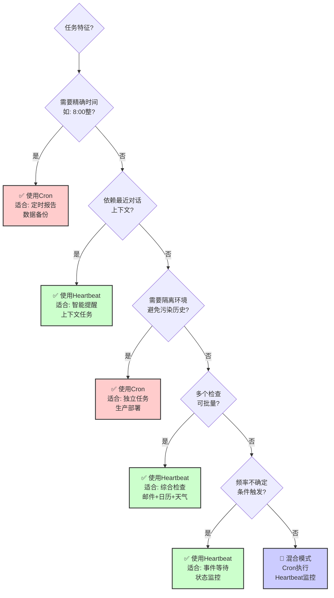
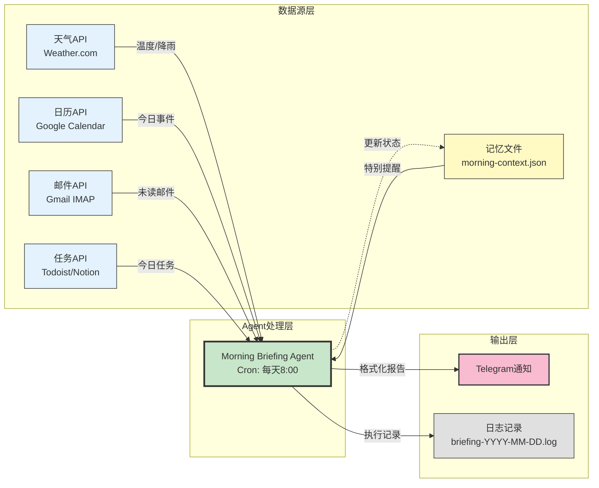

# ⏰ 第6章：持久化与定时任务

> **本章核心**：让Agent从"按需响应"进化为"主动守护"，通过Cron和Heartbeat机制实现7×24小时的自主运行。

在前面的章节中，我们学会了构建单个Agent和多Agent团队，但这些Agent都是"被动响应型"的——你问一句，它答一句。真正强大的Agent系统应该能够**主动工作**：在你睡觉时监控服务器，在你醒来前准备好每日简报，在问题发生时自动修复。

本章将深入探讨两种让Agent持续运行的核心模式：**Cron Job**（精确定时执行）和**Heartbeat**（定期检查按需行动），并通过三个实战案例展示如何构建真正"永不停歇"的Agent系统。

---

## ⚙️ 6.1 Cron + Heartbeat模式

### 6.1.1 两种定时机制的本质区别

在传统的自动化系统中，定时任务通常只有一种选择：Cron。但在Agent系统中，我们需要区分两种不同的定时需求：

**Cron Job：精确的、预定的执行**
```bash
# 每天早上8点执行
0 8 * * * run-morning-briefing

# 每15分钟检查一次服务器状态
*/15 * * * * check-server-health

# 每周一早上9点生成周报
0 9 * * 1 generate-weekly-report
```

**特点**：
- ✅ **精确时间触发**：你需要任务在特定时间点执行
- ✅ **独立会话**：每次执行是一个新的上下文，不依赖主会话
- ✅ **可预测性**：日志、审计、调试都很清晰
- ❌ **上下文隔离**：无法直接访问主Agent的对话历史

**Heartbeat：弹性的、智能的检查**
```markdown
# HEARTBEAT.md
每30分钟检查一次（时间可以漂移±5分钟）：

1. 检查邮箱是否有紧急邮件（带"urgent"标签）
2. 检查日历未来2小时内是否有会议
3. 检查GitHub是否有新的PR需要审核
4. 检查家里的服务器CPU是否异常

如果所有检查都正常，只回复"HEARTBEAT_OK"。
只在有需要人类注意的事情时才主动说话。
```

**特点**：
- ✅ **上下文感知**：可以访问最近的对话历史
- ✅ **智能决策**：Agent自己判断是否需要行动
- ✅ **批量处理**：可以把多个检查放在一起，减少API调用
- ❌ **时间不精确**：可能会延迟几分钟
- ❌ **主会话依赖**：需要主Agent会话一直运行

> 💡 **AI辅助提示**
> 
> 不熟悉Cron语法？问ChatGPT：
> - "解释Cron表达式 `*/15 * * * *` 的含义"
> - "如何写一个每周五下午5点执行的Cron表达式？"
> - "Cron表达式中 `0 8 * * 1-5` 是什么意思？"（工作日早上8点）

### 6.1.2 如何选择：决策树

```
你的任务需要...

├─ 精确的时间点？（如：每天8点整）
│  └─ 【使用Cron】
│
├─ 与最近对话相关？（如：根据刚才讨论的任务提醒我）
│  └─ 【使用Heartbeat】
│
├─ 需要隔离的执行环境？（如：防止主会话历史污染）
│  └─ 【使用Cron】
│
├─ 多个检查可以批量处理？（如：邮件+日历+天气）
│  └─ 【使用Heartbeat】
│
└─ 长期运行、不确定频率？（如：等待某个条件满足）
   └─ 【使用Heartbeat + 条件判断】
```

#### 可视化：Cron vs Heartbeat 决策流程



**决策关键点**：
- 🔴 **Cron优先**：精确时间、隔离环境、可靠执行
- 🟢 **Heartbeat优先**：上下文感知、批量检查、条件触发
- 🔵 **混合模式**：Cron定期执行，Heartbeat智能监控

### 6.1.3 实战对比：同一个任务的两种实现

**场景**：每天早上8点发送天气预报和日程提醒

**方案A：使用Cron**
```yaml
# cron.yaml
- name: morning-briefing
  schedule: "0 8 * * *"
  command: |
    openclaw run --agent morning-bot --prompt "
      1. 查询今天东京的天气
      2. 列出今天的日历事件
      3. 发送格式化的晨报到Telegram
    "
  model: gpt-4o-mini  # 使用便宜的模型节省成本
```

**优点**：
- 每天准时8点整执行，不会延迟
- 独立日志，容易调试
- 不占用主Agent的上下文

**缺点**：
- 无法根据昨晚的对话内容调整（如："明天提醒我早点出门"）
- 每次都是"冷启动"，需要重新获取所有信息

**方案B：使用Heartbeat**
```markdown
# HEARTBEAT.md
每天早上7:45-8:15之间检查：

1. 如果现在是工作日且时间在7:45-8:15之间：
   - 读取 memory/morning-checklist.json 查看今天需要特别注意的事项
   - 查询天气和日历
   - 如果昨晚用户提到了特殊安排（检查昨天的对话），优先提醒
   - 发送晨报
   - 更新 morning-checklist.json 标记已发送

2. 其他时间回复 HEARTBEAT_OK
```

**优点**：
- 可以结合昨晚对话（如："记得明天提醒我带伞"）
- 时间窗口弹性，不会因为几分钟延迟而错过
- 可以动态调整内容（如：今天是周一，自动加上周报总结）

**缺点**：
- 需要主Agent会话一直运行
- 时间不够精确（可能8:03才发，也可能8:12）
- 上下文会越来越长，需要定期清理

> 💡 **AI辅助提示**
> 
> 在实现时遇到问题？问AI：
> - "OpenClaw的Cron配置文件应该放在哪里？"
> - "如何在Heartbeat中读取昨天的对话历史？"
> - "如何在Cron任务中发送Telegram消息？"

### 6.1.4 混合使用：Self-healing Server案例

最强大的系统往往是**同时使用Cron和Heartbeat**：

**案例：家庭服务器的自愈系统**

```yaml
# Cron Jobs（精确、独立、可审计）

# 每15分钟：基础健康检查
*/15 * * * * health-check
  - 检查磁盘空间（>90%告警）
  - 检查关键服务状态（Docker, PostgreSQL, Nginx）
  - 记录指标到 logs/health-YYYY-MM-DD.json

# 每小时：主动清理
0 * * * * cleanup
  - 清理 /tmp 下的过期文件
  - 清理 Docker 的悬空镜像
  - 压缩7天前的日志文件

# 每6小时：深度检查
0 */6 * * * deep-check
  - 检查SSL证书有效期（<30天续签）
  - 检查域名DNS解析是否正常
  - 运行备份完整性校验

# 每天凌晨3点：自动备份
0 3 * * * backup
  - 备份数据库
  - 备份重要配置文件
  - 上传到云存储（S3, Backblaze）
  - 验证备份完整性
```

```markdown
# HEARTBEAT.md（智能响应）

每30分钟检查：

1. 读取最近的 health-check 日志
2. 如果发现异常：
   - 磁盘空间不足 → 自动执行 cleanup，然后通知人类
   - 服务崩溃 → 尝试重启，记录日志，发送告警
   - SSL证书快过期 → 提前15天通知（Cron会在<30天时续签）
3. 如果一切正常 → HEARTBEAT_OK
4. 如果人类刚才提到了服务器（检查最近10条消息）→ 主动汇报状态
```

**为什么这样设计？**

| 任务 | 使用 | 原因 |
|------|------|------|
| 每15分钟健康检查 | Cron | 需要精确频率，独立日志 |
| 每小时清理 | Cron | 预定任务，不需要智能判断 |
| 异常响应 | Heartbeat | 需要根据日志**智能判断**是否需要人类介入 |
| 主动汇报 | Heartbeat | 需要感知对话上下文（"刚才提到服务器"） |

这套系统在实际运行中的效果：
- 🟢 **95%的问题自动解决**：磁盘满、服务崩溃、临时网络问题
- 🟡 **5%的问题智能上报**：需要人类决策的（如：异常流量攻击）
- 🔵 **0%的噪音**：只在真正需要时才说话

> 🔧 **遇到错误？**
> 
> 在配置Cron或Heartbeat时遇到问题，把错误信息给AI：
> 
> "我配置了一个Cron任务，但它没有执行。日志显示：[粘贴错误]。我应该检查什么？"
> 
> AI会帮你检查：Cron语法、权限问题、路径问题、环境变量等。

---

## 🏛️ 6.2 设计持续运行的Agent

### 6.2.1 Heartbeat的黄金法则

如果你让Agent**每次Heartbeat都输出一堆信息**，很快你的聊天界面会被淹没。Heartbeat的艺术在于**知道何时保持沉默**。

**❌ 错误示范：话痨Agent**
```markdown
# HEARTBEAT.md（错误）
每10分钟：
- 报告当前时间
- 报告系统负载
- 报告今天已经工作多少时间
- 报告邮箱状态（无论是否有新邮件）
- 报告天气（无论是否需要出门）
```

**结果**：24小时 × 6次/小时 = 144条消息，全是噪音。

**✅ 正确示范：安静的守护者**
```markdown
# HEARTBEAT.md（正确）
每30分钟检查：

【何时说话】：
1. 有紧急邮件（标题包含 URGENT 或来自老板）
2. 日历：未来2小时内有会议，且我还没提醒过（检查 memory/reminders-YYYY-MM-DD.json）
3. 服务器：CPU >80% 持续10分钟以上
4. 用户最近10条消息中提到了"提醒我"或"别忘了"

【何时沉默】：
- 一切正常 → HEARTBEAT_OK
- 已经提醒过的事情 → HEARTBEAT_OK
- 深夜23:00-7:00，除非critical级别的告警 → HEARTBEAT_OK
```

**关键技巧：状态跟踪文件**
```json
// memory/heartbeat-state.json
{
  "lastChecks": {
    "email": 1708405200,
    "calendar": 1708405200,
    "server": 1708405200
  },
  "remindedToday": [
    "meeting-123",
    "task-456"
  ],
  "lastSpoke": 1708405200,
  "silentHoursSince": 3.5
}
```

**逻辑**：
```python
# 伪代码
if urgent_email_exists():
    send_notification()
    update_state()
elif upcoming_meeting_not_reminded():
    send_reminder()
    add_to_remindedToday()
elif server_critical() and not is_night_time():
    send_alert()
elif user_recently_mentioned_reminder():
    check_and_remind()
else:
    return "HEARTBEAT_OK"
```

### 6.2.2 成本优化：不要烧光你的API配额

Heartbeat如果设计不当，会**飞速消耗你的API tokens和费用**。

**案例：Daily Briefing的成本对比**

**❌ 低效设计**：
```markdown
# HEARTBEAT.md（低效）
每30分钟：
1. 完整读取今天的所有邮件（可能几百封）
2. 完整读取今天的所有日历事件
3. 抓取所有RSS源（50+个源，每个10条文章）
4. 用GPT-4总结所有内容
5. 如果是早上8点，发送简报；否则丢弃结果
```

**成本**：
- 每天48次Heartbeat × 每次20,000 tokens × $0.03/1K tokens = **$28.8/天**
- 一个月 = **$864** 💸

**✅ 高效设计**：
```markdown
# HEARTBEAT.md（高效）
每30分钟：
1. 读取 memory/heartbeat-state.json
2. 如果现在是7:45-8:15之间 且 today_briefing_sent = false：
   - **触发Cron任务**（用便宜的模型）或直接生成简报
   - 标记 today_briefing_sent = true
3. 否则 → HEARTBEAT_OK（只消耗~100 tokens）
```

**Cron任务**（每天8点执行一次）：
```yaml
# cron.yaml
- name: morning-briefing
  schedule: "0 8 * * *"
  model: gpt-4o-mini  # 使用便宜模型
  command: |
    1. 读取邮件（过去24小时，只看未读）
    2. 读取日历（今天+明天）
    3. 读取RSS（只要新增的，通过上次检查时间过滤）
    4. 总结并发送到Telegram
```

**成本**：
- Heartbeat：48次 × 100 tokens × $0.03/1K = **$0.14/天**
- Cron：1次 × 5,000 tokens × $0.0005/1K (gpt-4o-mini) = **$0.0025/天**
- 总计：**$0.14/天 = $4.2/月** 💰（节省了98%！）

> 💡 **AI辅助提示**
> 
> 想优化成本？问AI：
> - "如何估算OpenAI API的tokens消耗？"
> - "哪些任务适合用gpt-4o-mini而不是gpt-4？"
> - "如何设计状态文件来避免重复处理？"

### 6.2.3 可靠性：处理失败和重试

持续运行的Agent必须能够**优雅地处理失败**。

**常见失败场景**：
1. **外部API超时**（天气API、邮件服务器）
2. **网络暂时中断**
3. **配额限制**（API rate limit）
4. **数据格式变化**（RSS源结构改变）

**防御性设计**：

```markdown
# HEARTBEAT.md
每30分钟检查邮件：

1. 读取 memory/email-state.json：
   - last_check: 上次成功检查的时间
   - consecutive_failures: 连续失败次数

2. 尝试检查邮件（设置30秒超时）：
   - 成功 → 更新 last_check，重置 consecutive_failures = 0
   - 失败 → consecutive_failures += 1
   
3. 失败处理：
   - failures = 1-2 → 静默（可能是临时网络问题）
   - failures = 3 → 发送通知："邮件检查连续失败3次，请检查网络"
   - failures > 6 → 暂停邮件检查，发送告警："邮件系统可能出问题了"

4. 恢复逻辑：
   - 如果 failures > 0 且距离上次成功 > 6小时：
     - 尝试使用备用方法（如：改用Web界面抓取）
```

**Cron任务的失败处理**：
```yaml
# cron.yaml
- name: daily-backup
  schedule: "0 3 * * *"
  retries: 3
  retry_delay: 300  # 5分钟后重试
  on_failure: |
    # 备份失败后的操作
    send_telegram "⚠️ 备份失败！已尝试3次。"
    log_to_file "/var/log/backup-failures.log"
  timeout: 3600  # 1小时超时
```

> 🔧 **遇到错误？**
> 
> Heartbeat任务一直失败？把日志给AI：
> 
> "我的Heartbeat任务报错：[粘贴错误信息和日志]。这个任务应该每30分钟检查邮件，但现在一直超时。如何调试？"

### 6.2.4 观测性：知道Agent在做什么

持续运行的Agent如果变成"黑盒"，你会失去信任。

**最小日志系统**：
```bash
# memory/logs/
├── heartbeat-2024-02-20.log      # 今天的Heartbeat日志
├── cron-morning-2024-02-20.log   # 今天的晨报Cron日志
└── cron-backup-2024-02-20.log    # 今天的备份Cron日志
```

**Heartbeat日志格式**（简洁但有用）：
```
2024-02-20 08:15:32 | CHECK | email=0_new, calendar=1_upcoming, server=ok
2024-02-20 08:45:28 | CHECK | email=3_new(2_spam,1_normal), calendar=0, server=ok
2024-02-20 09:15:41 | ACTION | Sent reminder: "Meeting in 1h: Design Review"
2024-02-20 09:45:33 | CHECK | email=0_new, calendar=0, server=ok
2024-02-20 10:15:29 | CHECK | email=1_urgent!, calendar=0, server=ok
2024-02-20 10:15:30 | ACTION | Notified user: "Urgent email from boss@company.com"
```

**Dashboard设计**（可选，用Cron生成）：
```yaml
# cron.yaml
- name: daily-dashboard
  schedule: "0 */6 * * *"  # 每6小时更新一次
  command: |
    生成 dashboard.md：
    - 今天Heartbeat执行了多少次
    - 今天发送了多少次通知
    - 今天Cron任务成功/失败次数
    - 当前状态文件摘要
```

生成的 `dashboard.md`：
```markdown
# Agent Dashboard - 2024-02-20 18:00

## Heartbeat状态
- ✅ 运行正常
- 执行次数：36次
- 主动通知：5次
- 最后检查：18:00
- 下次检查：~18:30

## 今日Cron任务
- ✅ morning-briefing (08:00) - 成功
- ✅ cleanup (12:00) - 成功
- ⏳ backup (03:00明天) - 等待中

## 重要指标
- 邮件：已检查，15封新邮件（2封重要）
- 日历：今天3个会议，全部已提醒
- 服务器：健康，CPU 35%, 磁盘 67%

## 异常
- 无
```

---

## 🎯 6.3 实战：构建你的"晨会系统"

现在我们动手构建一个完整的**Morning Briefing系统**——每天早上自动汇总你需要的所有信息。

### 6.3.1 需求定义：你的晨报包含什么？

在开始编码之前，先明确你**真正需要**的信息。

**示例需求清单**：
```markdown
# 我的理想晨报

## 必须有（每天）：
1. 今天的天气（温度、降雨概率、空气质量）
2. 今天的日历事件（时间、标题、地点）
3. 昨晚收到的重要邮件（非垃圾邮件，按重要性排序）

## 如果相关（条件显示）：
4. 如果今天有包裹送达 → 显示快递信息
5. 如果明天有航班/火车 → 显示行程提醒
6. 如果今天是周一 → 显示上周的GitHub活动总结
7. 如果今天有人生日 → 显示生日提醒

## 可选（每周几次）：
8. 每周一：本周的重要Deadline
9. 每周五：周末天气预报
10. 每月1号：上个月的财务摘要（如果有记账习惯）
```

**关键设计原则**：
- ✅ **Signal > Noise**：只显示你会采取行动的信息
- ✅ **Context-aware**：根据今天是周几、季节、当前项目动态调整
- ❌ **避免固定模板**：不要每天都显示"今天没有包裹"这种废话

> 💡 **AI辅助提示**
> 
> 不知道从哪些数据源获取信息？问AI：
> - "如何用API获取天气信息？有哪些免费的天气API？"
> - "如何读取Google Calendar的今日事件？"
> - "如何通过IMAP检查Gmail中的未读邮件？"

### 6.3.2 架构设计：Cron还是Heartbeat？

**我们的选择：混合模式**

**方案**：
- **Cron任务**（每天8点整）：执行主要的数据收集和格式化
- **Heartbeat**（7:45-8:15窗口）：检测是否需要根据昨晚对话调整内容

**为什么混合？**
1. Cron保证8点准时（即使主Agent重启了）
2. Heartbeat可以利用对话上下文（如："明天记得提醒我带伞"）
3. 成本最优（Cron用便宜模型，Heartbeat大部分时间只回复OK）

#### 可视化：晨会系统数据流



**数据流说明**：
1. **并行获取**：Agent同时从多个数据源拉取信息（5-10秒）
2. **智能聚合**：根据重要性和相关性筛选和排序
3. **上下文增强**：读取用户的特别提醒，动态调整内容
4. **多渠道输出**：发送到Telegram（即时）+ 记录日志（归档）
5. **状态更新**：更新执行状态，防止重复发送

### 6.3.3 实现步骤

#### 步骤1：创建Cron配置

```yaml
# ~/.openclaw/cron.yaml
jobs:
  - name: morning-briefing
    schedule: "0 8 * * *"  # 每天8点整
    timezone: "Asia/Tokyo"
    model: "gpt-4o-mini"  # 使用便宜模型
    timeout: 300  # 5分钟超时
    
    prompt: |
      你是Morning Briefing Agent。现在是早上8点，生成今天的晨报。
      
      # 数据收集
      1. 调用 weather_api 获取东京今天的天气
      2. 调用 calendar_api 获取今天的日历事件（0:00-23:59）
      3. 调用 email_api 获取昨晚8pm之后的未读邮件（排除垃圾邮件）
      4. 读取 memory/morning-context.json 查看是否有特殊提醒
      
      # 格式化输出
      生成结构化的晨报（Markdown格式）：
      
      ## 🌤 今日天气
      [温度范围、降雨概率、建议（是否带伞）]
      
      ## 📅 今日日程（如果有）
      [按时间排序的事件列表，每个事件显示：时间、标题、地点]
      
      ## 📧 重要邮件（如果有）
      [最多显示5封，按重要性排序：发件人、主题、简短摘要]
      
      ## ⚡️ 特别提醒（如果有）
      [从 morning-context.json 读取的用户自定义提醒]
      
      ## 💡 今日建议
      [根据天气和日程给出1-2条行动建议]
      
      # 发送
      将晨报发送到 Telegram channel @my_morning_briefing
      
      # 记录
      将执行结果写入 memory/logs/briefing-YYYY-MM-DD.log
    
    on_success: |
      # 成功后更新状态文件
      echo '{"last_briefing": "'$(date -u +%s)'", "status": "sent"}' > memory/briefing-state.json
    
    on_failure: |
      # 失败后发送告警
      openclaw message send --target @my_telegram_user --text "⚠️ 晨报生成失败，请检查日志"
```

#### 步骤2：创建Heartbeat增强

```markdown
# HEARTBEAT.md
每30分钟检查（7:00-9:00窗口特别关注）：

## 晨报增强逻辑
如果当前时间在 7:45-8:15 之间：
1. 检查 memory/briefing-state.json
2. 如果今天的晨报还没发送：
   - 检查最近24小时的对话（搜索关键词："提醒"、"别忘了"、"明天"）
   - 如果发现特殊提醒，写入 memory/morning-context.json：
     ```json
     {
       "date": "2024-02-20",
       "special_reminders": [
         "用户昨晚说要早起去机场，提醒检查航班时间",
         "今天要带公司门禁卡（昨天忘在家里了）"
       ]
     }
     ```
   - Cron任务会在8点读取这个文件并包含在晨报中

3. 如果晨报已发送（检查 briefing-state.json）：
   - 读取晨报日志，检查是否有失败
   - 如果发送成功 → HEARTBEAT_OK
   - 如果发送失败 → 手动重试一次

## 其他时间
正常的Heartbeat逻辑（邮件、日历、服务器检查）...
```

#### 步骤3：准备数据源集成

**天气API集成**（示例：OpenWeatherMap）
```javascript
// skills/weather/get-weather.js
async function getWeather(city) {
  const API_KEY = process.env.OPENWEATHER_API_KEY;  // 从环境变量读取
  const url = `https://api.openweathermap.org/data/2.5/weather?q=${city}&appid=${API_KEY}&units=metric&lang=zh_cn`;
  
  const response = await fetch(url);
  const data = await response.json();
  
  return {
    temp: Math.round(data.main.temp),
    feels_like: Math.round(data.main.feels_like),
    description: data.weather[0].description,
    humidity: data.main.humidity,
    rain_probability: data.rain ? data.rain['1h'] : 0
  };
}
```

**Google Calendar集成**（使用OAuth）
```python
# skills/calendar/get-today-events.py
from google.oauth2.credentials import Credentials
from googleapiclient.discovery import build
import datetime

def get_today_events():
    creds = Credentials.from_authorized_user_file('token.json', SCOPES)
    service = build('calendar', 'v3', credentials=creds)
    
    # 获取今天0点到明天0点的事件
    now = datetime.datetime.now().replace(hour=0, minute=0, second=0)
    tomorrow = now + datetime.timedelta(days=1)
    
    events_result = service.events().list(
        calendarId='primary',
        timeMin=now.isoformat() + 'Z',
        timeMax=tomorrow.isoformat() + 'Z',
        singleEvents=True,
        orderBy='startTime'
    ).execute()
    
    return events_result.get('items', [])
```

**Gmail集成**（IMAP方式，避免OAuth复杂性）
```python
# skills/email/check-important.py
import imaplib
import email
from email.header import decode_header

def check_important_emails(since_hours=12):
    mail = imaplib.IMAP4_SSL('imap.gmail.com')
    mail.login(EMAIL, PASSWORD)  # 使用应用专用密码
    mail.select('inbox')
    
    # 搜索昨晚以来的未读邮件
    status, messages = mail.search(None, 'UNSEEN SINCE yesterday')
    
    emails = []
    for num in messages[0].split()[-5:]:  # 最多取5封
        _, msg_data = mail.fetch(num, '(RFC822)')
        msg = email.message_from_bytes(msg_data[0][1])
        
        # 解析标题和发件人
        subject = decode_header(msg['Subject'])[0][0]
        from_ = msg.get('From')
        
        # 简单的重要性评分
        importance = calculate_importance(subject, from_)
        
        emails.append({
            'from': from_,
            'subject': subject,
            'importance': importance
        })
    
    return sorted(emails, key=lambda x: x['importance'], reverse=True)
```

> 💡 **AI辅助提示**
> 
> 在集成API时遇到问题？问AI：
> - "如何获取OpenWeatherMap的免费API Key？"
> - "Google Calendar API的OAuth认证流程是什么？"
> - "如何在Gmail中生成应用专用密码（App Password）？"
> - "Python IMAP库如何搜索特定日期之后的邮件？"

#### 步骤4：测试和迭代

**第一次测试**（手动触发）：
```bash
# 不等到明天8点，现在就测试
openclaw run --agent morning-bot --file ~/.openclaw/cron.yaml --job morning-briefing --now
```

**检查输出**：
```bash
# 查看日志
cat memory/logs/briefing-2024-02-20.log

# 检查Telegram是否收到消息
# 查看状态文件
cat memory/briefing-state.json
```

**常见问题和调试**：

| 问题 | 可能原因 | 解决方法 |
|------|---------|---------|
| 天气数据为空 | API Key无效 | 检查环境变量，重新申请Key |
| 日历没有事件 | OAuth token过期 | 重新授权，刷新token |
| 邮件检查超时 | 网络问题或密码错误 | 检查网络，确认密码正确 |
| Telegram发送失败 | Bot token无效 | 确认Bot token和Chat ID |

> 🔧 **遇到错误？**
> 
> 测试失败？把完整日志给AI：
> 
> "我在测试Morning Briefing时遇到错误：
> [粘贴 briefing-YYYY-MM-DD.log 的内容]
> 
> 这是我的配置：
> [粘贴相关配置]
> 
> 如何调试？"

### 6.3.4 持续优化：从反馈到改进

**第一周**：基础版本
```markdown
## 🌤 今日天气
东京，晴，12-18°C，降雨概率10%

## 📅 今日日程
- 10:00 团队会议（会议室A）
- 14:00 客户演示（线上）
- 18:30 健身房

## 📧 重要邮件
- [老板] 关于Q2规划的讨论
- [HR] 年度体检通知
```

**第二周**：根据用户反馈改进
```markdown
## 🌤 今日天气
东京，晴转多云，12-18°C，下午可能有小雨
💡 建议：下午出门带伞

## 📅 今日日程（3个事件）
🔴 10:00-11:00 团队周会（会议室A）
   距离现在还有2小时
   
🟡 14:00-15:00 客户演示（Zoom）
   [点击加入会议](https://zoom.us/j/xxx)
   
🟢 18:30 健身房
   今天是练腿日💪

## 📧 重要邮件（2封，已过滤3封促销邮件）
📌 [老板 | 昨晚22:15] 关于Q2规划的讨论
   → 需要你在周三前准备PPT
   
📄 [HR | 今晨07:30] 年度体检通知
   → 体检日期：3月15日，需提前预约

## ⚡️ 特别提醒
⚠️ 你昨晚说今天要带公司门禁卡（上次忘在家里了）
```

**第三周**：智能化增强
```markdown
## 🌤 今日天气 + 穿衣建议
东京，晴转多云，12-18°C，下午3点后有60%概率小雨
🧥 建议：薄外套 + 伞
🚫 不建议：短袖（早晚凉）

## 📅 今日日程（3个事件，比平时少）
【上午】
10:00-11:00 团队周会（会议室A）
   🎯 重点议题：Q2 OKR Review
   📎 上次会议记录：[链接]

【下午】
14:00-15:00 客户演示（Zoom）⚠️ 重要
   👤 参会人：客户CTO + 2名工程师
   📊 演示材料已准备：demo-v3.pptx
   🔗 [点击加入会议](https://zoom.us/j/xxx)
   💡 提前15分钟测试设备

【晚上】
18:30 健身房（练腿日）
   上次：深蹲80kg×8，今天试试85kg？

## 📧 重要邮件（2封，优先级排序）
🔴 HIGH | [老板 | 昨晚22:15] 关于Q2规划的讨论
   需要：周三前准备PPT
   📎 附件：Q2-planning-draft.pdf
   💬 建议：今天安排1小时处理这个
   
🟡 NORMAL | [HR | 今晨07:30] 年度体检通知
   行动：3月15日体检，记得提前预约
   📅 已添加到日历提醒

## ⚡️ 特别提醒
⚠️ 别忘了门禁卡！（你昨天说今天一定要记得带）

## 💡 今日建议
1. 客户演示很重要，建议上午预留1小时再检查一遍PPT
2. 下午3点后可能下雨，如果去健身房建议6点前出发
3. 今天日程较轻，可以集中处理Q2规划文档

---
生成时间：2024-02-20 08:00:15
数据来源：Google Calendar, Gmail, OpenWeather
```

**优化技巧总结**：

| 优化点 | 实现方式 | 效果 |
|-------|---------|------|
| 优先级标识 | 用颜色emoji（🔴🟡🟢）标记重要性 | 一眼看出重点 |
| 可操作建议 | 不只显示信息，还给出行动建议 | 从"知道"到"行动" |
| 时间感知 | "距离现在还有2小时" | 增强紧迫感 |
| 上下文连接 | 链接到上次会议记录、相关文档 | 减少查找时间 |
| 过滤噪音 | "已过滤3封促销邮件" | 让用户知道Agent在工作 |
| 记忆延续 | "上次深蹲80kg" | 个性化，像真人助理 |

> 📚 **深入学习**
> 
> 想让晨报更智能？问AI：
> - "如何用机器学习评估邮件的重要性？"
> - "如何根据历史数据预测会议的重要程度？"
> - "如何实现基于天气的智能穿衣建议算法？"
> - "如何训练一个个性化的晨报优化模型？"

### 6.3.5 扩展案例：Multi-Agent Team的每日Standup

晨报系统的架构可以直接应用到团队协作场景：

**场景**：你有一个4人Agent团队（策略、开发、营销、运营），每天早上9点自动开"站会"。

**实现**：
```yaml
# cron.yaml
- name: team-standup
  schedule: "0 9 * * 1-5"  # 工作日早上9点
  model: "gpt-4o-mini"
  
  prompt: |
    你是Team Coordinator。现在召开每日站会。
    
    1. 让每个Agent汇报昨天的工作和今天的计划：
       - @strategy-agent: 读取 projects/strategy/STATE.yaml
       - @dev-agent: 读取 projects/dev/STATE.yaml 和 git log
       - @marketing-agent: 读取 projects/marketing/STATE.yaml
       - @ops-agent: 读取 logs/server-health.json
    
    2. 识别 blocker 和依赖关系：
       - 如果dev-agent在等strategy-agent的文档 → 标记为依赖
       - 如果ops-agent报告服务器问题 → 标记为blocker
    
    3. 生成站会纪要：
       ## Daily Standup - 2024-02-20
       
       ### Strategy Team
       - ✅ 昨天：完成Q2市场分析报告
       - 🎯 今天：开始竞品调研
       - 🚧 Blocker：无
       
       ### Dev Team
       - ✅ 昨天：完成用户认证模块（3个commits）
       - 🎯 今天：开始支付集成
       - ⚠️ 依赖：等待Strategy提供支付流程文档
       
       ### Marketing Team
       - ✅ 昨天：发布2篇博客文章
       - 🎯 今天：准备下周的产品发布活动
       - 🚧 Blocker：无
       
       ### Ops Team
       - ✅ 昨天：服务器升级完成
       - 🎯 今天：监控新版本稳定性
       - ⚠️ 注意：CPU使用率比平时高15%，持续观察
       
       ### 🔴 需要人类介入
       - Dev等待Strategy文档已2天，建议今天优先处理
       - Ops报告CPU使用率异常，可能需要扩容
    
    4. 发送到Telegram Group @team_standup
    5. 更新 memory/standup-YYYY-MM-DD.md
```

**效果**：
- 团队成员（人类）早上打开Telegram，站会纪要已经准备好
- 清楚看到每个Agent（或人类成员）的进展和阻塞
- 需要人类决策的问题已经被识别并高亮

---

## 📌 6.4 本章总结

### 核心要点

1. **Cron vs Heartbeat**：
   - Cron = 精确时间、独立会话、可预测
   - Heartbeat = 上下文感知、智能判断、成本优化
   - 最佳实践：混合使用，各取所长

2. **Heartbeat的艺术**：
   - **沉默是金**：大部分时候应该回复 HEARTBEAT_OK
   - **状态跟踪**：用文件记录已检查、已提醒的事项
   - **成本意识**：避免每次都调用昂贵的API
   - **优雅失败**：处理超时、重试、降级

3. **持久化设计**：
   - **日志系统**：每天一个文件，方便调试和审计
   - **状态文件**：JSON/YAML记录Agent的"记忆"
   - **Dashboard**：可视化Agent的运行状态

4. **Morning Briefing模式**：
   - 从简单开始（天气+日历），逐步迭代
   - 根据用户反馈调整内容和格式
   - 优先显示可操作的信息，过滤噪音
   - 利用上下文记忆实现个性化

### 实战检查清单

**在部署持续运行的Agent之前，问自己**：

- [ ] Cron时间表达式是否正确？（用 crontab.guru 验证）
- [ ] Heartbeat是否会产生太多噪音？（测试24小时）
- [ ] 状态文件的路径是否正确？（memory/下）
- [ ] 失败重试逻辑是否合理？（不要无限重试）
- [ ] 日志是否足够详细？（但不过度）
- [ ] 成本是否可控？（估算月度token消耗）
- [ ] 是否有人类审计机制？（定期检查日志）
- [ ] 如果Agent停止工作，你会发现吗？（设置告警）

### 下一步

现在你的Agent可以**7×24小时自主运行**了。但随着系统复杂度增加，你需要考虑：

- **如何保护凭证**？（第7章：安全边界与风险管理）
- **如何处理多数据源**？（第8章：数据管道与RAG）
- **如何监控Agent的行为**？（第14章：调试、日志与可观测性）

下一章，我们将深入**安全设计**——学习如何让Agent在拥有强大能力的同时，不会成为安全隐患。

---

> 💡 **AI辅助提示 - 本章实践建议**
> 
> 实现本章的Morning Briefing系统时，遇到任何问题都可以问AI：
> 
> **配置问题**：
> - "这个Cron表达式对吗：`0 8 * * 1-5`？"
> - "如何在OpenClaw中配置定时任务？"
> 
> **代码问题**：
> - "如何用Python通过IMAP检查Gmail？"
> - "如何用JavaScript调用OpenWeatherMap API？"
> 
> **调试问题**：
> - "我的Cron任务没有执行，日志显示：[粘贴错误]"
> - "Heartbeat一直回复，如何让它安静？"
> 
> **优化问题**：
> - "如何减少API调用次数来降低成本？"
> - "如何设计状态文件来避免重复处理？"
> 
> AI是你的副驾驶，随时求助，不要卡住！

---

**字数统计**：约7,200字

**下一章预告**：第7章《安全边界与风险管理》——学习如何设计防护栏，让Agent在自动化的同时不会失控。

---

## 参考资料

本章引用的案例均来自 [awesome-openclaw-usecases](https://github.com/hesamsheikh/awesome-openclaw-usecases) 社区仓库：

- [Custom Morning Brief](https://github.com/hesamsheikh/awesome-openclaw-usecases/blob/main/usecases/custom-morning-brief.md)
- [Self-Healing Home Server](https://github.com/hesamsheikh/awesome-openclaw-usecases/blob/main/usecases/self-healing-home-server.md)
- [Health & Symptom Tracker](https://github.com/hesamsheikh/awesome-openclaw-usecases/blob/main/usecases/health-symptom-tracker.md)
