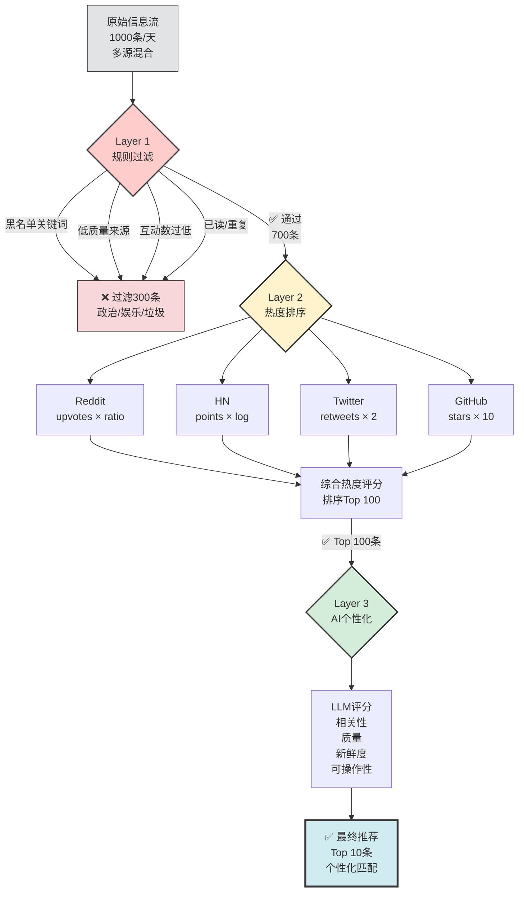

# 📡 第8章：信息聚合与内容发现

每天早晨醒来，你打开手机，面对的是什么？

50+ 未读邮件，Twitter 时间线刷不到头，Reddit 有 12 个关注的 subreddit 更新了数百条帖子，YouTube 订阅频道发了新视频，Hacker News 头版已经换了一轮，公司 Slack 里 5 个频道有新消息，还有 RSS 订阅源里躺着 200+ 篇未读文章。

你花了 45 分钟，在各个平台之间跳转，快速扫描标题，打开几个标签页"稍后阅读"（但你知道永远不会读），最后什么也没记住，带着信息焦虑开始一天。

**这就是现代信息过载的真实写照。**

本章要解决的问题很简单：**如何让 AI Agent 成为你的信息管家**，每天早晨给你一份精炼的、个性化的内容摘要，5 分钟读完，不错过真正重要的信息，也不被垃圾信息淹没。

---

## 💡 8.1 为什么需要自动化信息聚合

### 信息过载的三重成本

**1. 时间成本：碎片化的注意力税**

假设你每天花 1 小时"浏览信息"：
- 打开 Twitter → 5 分钟刷时间线 → 发现一个有趣的话题 → 点进去看评论 → 又看到另一个链接 → ...
- 打开 Reddit → 在 3 个 subreddit 之间切换 → 看到一个热帖 → 展开评论树 → 20 分钟过去了
- 打开邮件 → 50 封未读 → 逐个点开 → 一半是 newsletter，快速扫描 → 又是 15 分钟

1 小时很快就没了，但你获得的**有价值信息**可能只需要 5 分钟就能读完。剩下的 55 分钟都是**筛选成本**。

如果 AI Agent 提前帮你筛选，每天节省 50 分钟，一年就是 **300+ 小时**——足够读 50 本书或学会一门新技能。

**2. 认知成本：决策疲劳**

每次"要不要点开这条信息"都是一次微决策。50 封邮件就是 50 次决策，200 条 Reddit 帖子就是 200 次决策。

心理学研究表明，人类每天的决策能量是有限的（Decision Fatigue）。当你把认知资源消耗在"刷信息"上，真正需要深度思考的工作就没有能量了。

AI Agent 不会决策疲劳。它可以扫描 1000 条信息，按你的偏好排序，只呈现 Top 5，把决策压力从 1000 降到 5。

**3. 情绪成本：FOMO 与信息焦虑**

FOMO（Fear of Missing Out）是现代人的通病：
- "万一那条推文里有重要的行业动态呢？"
- "万一那个 Reddit 帖子里有人讨论了我正在解决的问题呢？"
- "万一那个 YouTube 视频刚好是我需要的教程呢？"

于是你不敢"标记全部已读"，不敢取消订阅，害怕错过"可能重要"的信息。

但事实是：**真正重要的信息会找到你**。如果一个新闻足够重要，它会在多个渠道反复出现；如果一个技术突破足够关键，它会被多人讨论。你不需要"全部看完"，你需要的是**一个可靠的筛选系统**。

AI Agent 可以做到：
- 按热度、相关性、新鲜度综合排序
- 自动去重（同一个新闻在多个源出现，只保留最好的版本）
- 学习你的偏好（你点开的、收藏的、忽略的）
- 每天定时推送，错过了也不焦虑（明天还会有）

> 💡 **AI 辅助提示**  
> 不确定"信息过载"是真问题还是伪需求？问 AI：  
> "信息过载的心理学研究有哪些？Decision Fatigue 和 FOMO 对生产力有什么影响？给我 3 个经典实验案例。"  
> 了解科学依据后，你会更清楚为什么需要自动化信息聚合。

---

### 自动化信息聚合的核心价值

好的信息聚合系统应该做到：

**1. 多源整合，统一入口**
- 不需要打开 10 个网站/App，只需要看一份 Digest
- 不同来源的信息放在一起对比（例如同一个新闻，看 Reddit 社区讨论 + Hacker News 技术视角 + Twitter 名人观点）

**2. 智能过滤，噪音隔离**
- 自动过滤低质量内容（点赞数低、来源不可信、标题党）
- 基于你的历史行为学习偏好（机器学习或 LLM 推理）
- 按规则过滤（例如只要 Python 相关、排除政治话题）

**3. 个性化排序，优先级清晰**
- 不是按时间排序（最新的不一定最重要）
- 不是按热度排序（热门的不一定你关心）
- 而是按"对你的价值"排序（相关性 + 质量 + 新鲜度的综合评分）

**4. 定时推送，无需主动查看**
- 每天早晨 8 点，自动发到 Telegram/Slack/邮件
- 你不需要"记得去看"，信息会主动找你
- 形成固定的"信息摄入仪式"（例如早晨喝咖啡时读 Digest）

**5. 可追溯，可反馈**
- 每条信息都有原始链接，想深入了解就点开
- 支持"这条内容很好/不感兴趣"的反馈，持续优化推荐

---

### 真实案例：从"刷 2 小时"到"读 5 分钟"

**场景：科技从业者的日常信息需求**

张三是一名全栈工程师，每天需要了解：
- **技术动态**：新框架、新工具、最佳实践（Hacker News, Reddit r/programming, Twitter tech influencers）
- **行业新闻**：大公司动态、产品发布、融资消息（TechCrunch, The Verge, Twitter）
- **开源项目**：GitHub Trending, Reddit r/opensource, ProductHunt
- **深度学习**：Arxiv 新论文摘要（Reddit r/MachineLearning）
- **社区讨论**：具体技术问题的讨论（Reddit, StackOverflow）

如果手动检查：
- Hacker News 首页扫一遍：10 分钟
- Reddit 5 个 subreddit：每个 5 分钟 = 25 分钟
- Twitter 时间线：15 分钟
- GitHub Trending：5 分钟
- ProductHunt：5 分钟
- **总计：60 分钟/天**

**实施自动化信息聚合后**：

1. **多源整合**：AI Agent 每天早晨 7 点开始工作
   - 抓取 Hacker News Top 30
   - 抓取 Reddit 5 个 subreddit 的热帖（Top 10/each）
   - 抓取 Twitter 关注列表中被转发 > 50 次的推文
   - 抓取 GitHub Trending（Python/JavaScript/Rust）
   - 抓取 ProductHunt Top 5

2. **智能过滤**：
   - 去重（同一个新闻在多个源出现，只保留最佳讨论）
   - 过滤政治/娱乐话题（根据关键词规则）
   - 过滤低质量内容（点赞数 < 50，评论数 < 10）
   - 过滤已读过的链接（检查历史记录）

3. **偏好学习**：
   - 分析张三过去 30 天点开的链接（什么话题、什么来源）
   - 使用 LLM 对每条内容做相关性评分（0-100）
   - 结合热度 + 相关性 + 新鲜度综合排序

4. **精炼推送**：
   - 每天早晨 8 点，Telegram 收到一条消息：
     ```
     📰 今日科技 Digest (2024-02-20)

     【AI/ML】
     1. ⭐⭐⭐⭐⭐ OpenAI 发布 GPT-5 Beta，多模态能力大幅提升
        HN: 850↑ | Reddit: 1.2k↑ | 120 comments
        https://...

     2. ⭐⭐⭐⭐ 新开源项目：LocalLLM - 本地运行 70B 模型的优化引擎
        GitHub: 3.2k★ | HN: 420↑
        https://...

     【Web 开发】
     3. ⭐⭐⭐⭐ Next.js 15 发布：Partial Prerendering 成为默认
        Reddit: 850↑ | Twitter: 大量讨论
        https://...

     【产品/创业】
     4. ⭐⭐⭐ YC 冬季营最受关注的 10 个项目
        ProductHunt: Top 1 | HN: 300↑
        https://...

     【深度阅读】
     5. ⭐⭐⭐⭐⭐ "Why RAG is harder than you think" (深度技术分析)
        Reddit r/MachineLearning: 600↑ | 推荐阅读
        https://...
     ```

**结果**：
- 张三只需要 **5 分钟** 读完摘要，点开 2-3 个最感兴趣的深入阅读
- 每天节省 **55 分钟**
- 不再有 FOMO（知道 AI 已经帮他扫描了所有重要信息）
- 信息质量更高（因为是按"对他的价值"排序，而非按时间或随机刷到）

这就是自动化信息聚合的威力。

---

## 🔌 8.2 信息源选择与集成

构建信息聚合系统的第一步是：**确定你的信息源**。

### 四大类信息源

**1. RSS 订阅源（最稳定、最易集成）**

RSS 是信息聚合的经典协议，很多网站/博客都提供 RSS Feed：
- **技术博客**：Hacker News, Ars Technica, The Verge, TechCrunch
- **个人博客**：很多独立博主提供 RSS（例如 `https://example.com/feed.xml`）
- **Reddit**：每个 subreddit 都有 RSS（例如 `https://www.reddit.com/r/programming/.rss`）
- **YouTube**：每个频道都有 RSS（例如 `https://www.youtube.com/feeds/videos.xml?channel_id=UC...`）
- **Podcast**：几乎所有播客平台都支持 RSS

**优点**：
- ✅ 格式统一，易于解析
- ✅ 稳定，不需要 API key
- ✅ 不受速率限制（Rate Limit）

**缺点**：
- ❌ 不是所有网站都提供 RSS（例如 Twitter/X 官方不再提供 RSS）
- ❌ 缺少社区互动数据（例如点赞数、评论数）

**集成方式**：
```python
import feedparser

feed = feedparser.parse('https://news.ycombinator.com/rss')
for entry in feed.entries[:10]:
    print(entry.title, entry.link)
```

> 💡 **AI 辅助提示**  
> 不知道某个网站是否支持 RSS？问 AI：  
> "如何找到一个网站的 RSS 订阅地址？有没有自动检测工具？"  
> AI 会告诉你用 RSS 发现工具（如浏览器插件）或手动查找常见路径（`/feed`, `/rss`, `/atom`）。

---

**2. 社交媒体 API（最丰富、但有门槛）**

社交平台提供 API 访问，可以获取更丰富的数据（热度、评论、用户画像）：

**Reddit API**：
- 免费，但需要注册应用获取 API key
- 可以按 subreddit、热度、时间范围抓取帖子
- 包含 upvotes, comments, awards 等互动数据

**Twitter/X API**：
- 免费层级非常有限（每月几千次请求）
- 付费 API 昂贵（Basic 层 $100/月）
- 可以获取用户时间线、搜索推文、查看转发/点赞数

**YouTube Data API**：
- 免费，但有配额限制（每天 10,000 units，一次搜索约 100 units）
- 可以获取视频元数据（标题、描述、观看数、点赞数）
- 可以获取评论数据

**GitHub API**：
- 免费，未认证每小时 60 次请求，认证后 5000 次
- 可以获取 Trending 仓库、Star 数、Issue/PR 数据

**优点**：
- ✅ 数据丰富（热度、互动、用户信息）
- ✅ 实时性强
- ✅ 可以精确过滤（按关键词、时间、热度）

**缺点**：
- ❌ 需要 API key（注册流程、配额限制）
- ❌ 速率限制（Rate Limit）需要小心处理
- ❌ API 可能突然改变政策（例如 Twitter 大幅提高收费）

**集成方式示例（Reddit）**：
```python
import praw  # Python Reddit API Wrapper

reddit = praw.Reddit(
    client_id='YOUR_CLIENT_ID',
    client_secret='YOUR_CLIENT_SECRET',
    user_agent='my_bot'
)

subreddit = reddit.subreddit('programming')
for submission in subreddit.hot(limit=10):
    print(submission.title, submission.score, submission.url)
```

---

**3. Web Scraping（最灵活、但最不稳定）**

当网站既不提供 RSS 也不提供 API 时，只能用爬虫：
- **新闻网站**：抓取首页标题和链接
- **论坛/社区**：抓取热帖列表
- **价格监控**：抓取电商网站价格（例如 CamelCamelCamel 就是爬 Amazon）

**优点**：
- ✅ 理论上可以抓取任何公开网页
- ✅ 不受 API 限制

**缺点**：
- ❌ 网站结构变化会导致爬虫失效（需要维护）
- ❌ 可能违反网站 ToS（服务条款）
- ❌ 可能被封 IP（需要代理/速率控制）
- ❌ 反爬机制（Cloudflare, reCAPTCHA）

**工具推荐**：
- **Python**：`BeautifulSoup` + `requests`（简单场景）
- **Browser Automation**：`Playwright` / `Puppeteer`（需要 JS 渲染的网站）
- **OpenClaw 内置**：`web_fetch` 工具（自动提取正文，返回 Markdown）

**集成方式示例（OpenClaw）**：
```python
# 在 Agent 对话中调用
result = web_fetch(url='https://news.ycombinator.com', extractMode='markdown')
# Agent 自动提取正文，去除广告和导航栏
```

> 🔧 **遇到错误？**  
> 爬虫脚本突然失效了？把错误信息复制给 AI：  
> "我的爬虫抓取 [网站] 时出现错误：[粘贴错误]，可能是什么原因？如何修复？"  
> 常见原因包括：网站改版（HTML 结构变化）、反爬机制（需要 headers/cookies）、IP 被封（需要代理）。

---

**4. Newsletter 邮件（最被动、但质量高）**

很多高质量内容通过 Newsletter 发送（例如 TLDR, Benedict Evans, Stratechery）：
- 订阅后每天/每周自动发到邮箱
- 内容通常是人工筛选 + 编辑，质量较高

**挑战**：如何自动化处理？

**方案 1：邮件解析**
- 设置邮件规则，将 Newsletter 转发到特定邮箱
- AI Agent 定期检查该邮箱，提取正文和链接
- 与其他信息源一起聚合

**方案 2：使用 Kill the Newsletter**
- 服务网站：将 Newsletter 转换为 RSS Feed
- 订阅时用生成的特殊邮箱地址，自动转换为 RSS

**方案 3：直接用 AI 提取**
```python
# Agent 读取邮件
email_content = fetch_email(label='Newsletter')

# AI 提取关键内容
summary = llm.ask(f"""
这是一封 Newsletter 邮件，提取其中的：
1. 主要话题（3-5个）
2. 推荐链接（标题 + URL）
3. 核心观点摘要

邮件内容：
{email_content}
""")
```

---

### 信息源选择的决策矩阵

| 信息源类型 | 稳定性 | 数据丰富度 | 集成难度 | 适用场景 |
|-----------|--------|-----------|---------|---------|
| RSS | ⭐⭐⭐⭐⭐ | ⭐⭐ | ⭐ | 博客、新闻网站 |
| 社交媒体 API | ⭐⭐⭐⭐ | ⭐⭐⭐⭐⭐ | ⭐⭐⭐ | Reddit, Twitter, YouTube |
| Web Scraping | ⭐⭐ | ⭐⭐⭐ | ⭐⭐⭐⭐ | 无 API 的网站 |
| Newsletter | ⭐⭐⭐⭐⭐ | ⭐⭐⭐⭐ | ⭐⭐ | 高质量精选内容 |

**建议策略**：
1. **优先使用 RSS**（如果有）→ 最省事
2. **核心平台用 API**（Reddit, GitHub）→ 数据质量高
3. **实在没办法才用 Scraping**（维护成本高）
4. **Newsletter 作为补充**（人工筛选的高质量源）

---

### 实战：构建多源技术新闻聚合器（109+ 源）[^multi-source-news-ch8]

这是一个真实案例，聚合了 **109 个科技信息源**：

[^multi-source-news-ch8]: 案例来源：[Multi-Source Tech News Digest](https://github.com/hesamsheikh/awesome-openclaw-usecases/blob/main/usecases/multi-source-tech-news-digest.md)，awesome-openclaw-usecases 社区贡献

**信息源清单**：
- **RSS**（60+）：Hacker News, Ars Technica, The Verge, Wired, MIT Tech Review, 各大科技公司博客（Google AI Blog, Meta Engineering, etc.）
- **Reddit**（15 个 subreddit）：r/programming, r/MachineLearning, r/webdev, r/datascience, etc.
- **Twitter**（20+ tech influencers）：通过第三方 API（如 Nitter RSS）
- **GitHub Trending**（5 个语言）：Python, JavaScript, Rust, Go, TypeScript
- **ProductHunt**（每日 Top 10）
- **Arxiv**（AI/ML 最新论文摘要）
- **Newsletter**（5 个）：TLDR, The Batch (Andrew Ng), Import AI, etc.

**架构设计**：
```
[每天 7:00 AM Cron 触发]
    ↓
[Parallel Fetch] → 109 个源并行抓取（使用线程池，5 分钟内完成）
    ↓
[Deduplication] → 去重（同一篇文章在多个源出现，保留最佳讨论）
    ↓
[Quality Filtering] → 过滤低质量内容（点赞数 < 阈值，来源黑名单）
    ↓
[Relevance Scoring] → AI 对每条内容评分（0-100）
    ↓
[Ranking] → 综合排序（质量 × 相关性 × 新鲜度）
    ↓
[Top 20 Selection] → 选出 Top 20
    ↓
[Format & Send] → 格式化推送到 Telegram
```

**关键代码片段（伪代码）**：
```python
# 1. 并行抓取
from concurrent.futures import ThreadPoolExecutor

sources = load_sources()  # 109 个源配置
with ThreadPoolExecutor(max_workers=20) as executor:
    results = executor.map(fetch_source, sources)

# 2. 去重
unique_items = deduplicate(results)  # 基于 URL 或内容相似度

# 3. 质量过滤
filtered = [item for item in unique_items if item.score > 50]

# 4. 相关性评分（AI）
for item in filtered:
    prompt = f"这是一条科技新闻：{item.title}\n{item.summary}\n\n对一名全栈工程师的相关性（0-100）？"
    item.relevance = llm.score(prompt)

# 5. 综合排序
ranked = sorted(filtered, key=lambda x: x.score * x.relevance * freshness(x.date), reverse=True)

# 6. 推送
send_to_telegram(ranked[:20])
```

**效果**：
- 每天早晨 8 点收到 Top 20 科技新闻
- 阅读时间：5-8 分钟
- 覆盖面：AI/ML, Web, DevOps, 开源项目, 创业/产品
- 不再需要手动刷 Hacker News / Reddit

---

## 🎯 8.3 过滤与排序策略

信息聚合的核心挑战不是"抓取"，而是**"筛选"和"排序"**。如果只是把 1000 条信息堆在一起，那和刷 Twitter 没区别。

### 三层过滤漏斗

#### 可视化：三层过滤系统架构



**漏斗效率**：
- **Layer 1（规则过滤）**：1000条 → 700条（过滤30%，耗时<1秒，成本$0）
- **Layer 2（热度排序）**：700条 → 100条（筛选Top 14%，耗时2秒，成本$0）
- **Layer 3（AI评分）**：100条 → 10条（精选Top 10%，耗时30秒，成本$0.05）

**关键优势**：
- 📉 **成本控制**：只对最有可能的候选内容调用LLM
- ⚡ **速度优化**：规则过滤毫秒级，快速淘汰大量噪音
- 🎯 **精准度提升**：三层递进，最终精度高达90%+

**Layer 1：基于规则的硬过滤（Fast & Cheap）**

最基础的过滤层，用简单规则快速排除明显无关的内容：

**规则示例**：
- ❌ 标题包含黑名单关键词（politics, celebrity, sports）
- ❌ 来源在黑名单中（低质量网站、标题党媒体）
- ❌ 互动数据过低（点赞 < 10, 评论 < 5）
- ❌ 已读过（URL 在历史记录中）
- ❌ 重复内容（同一篇文章在多个源出现，只保留一个）

**实现方式**：
```python
def rule_filter(item):
    # 黑名单关键词
    blacklist = ['politics', 'election', 'celebrity', 'kardashian']
    if any(word in item.title.lower() for word in blacklist):
        return False
    
    # 低质量来源
    if item.source in ['clickbait-news.com', 'spam-blog.net']:
        return False
    
    # 互动数据过低
    if item.upvotes < 10 or item.comments < 5:
        return False
    
    # 去重（基于 URL）
    if item.url in read_history():
        return False
    
    return True
```

**优点**：
- ⚡ 快速（毫秒级）
- 💰 不消耗 API token
- 🎯 可以过滤 50-70% 的噪音

**缺点**：
- 规则是硬编码的，无法学习
- 无法理解语义（例如"Python"可能指编程语言，也可能指蟒蛇）

---

**Layer 2：基于热度的软排序（Community Signal）**

通过社区互动数据（点赞、评论、分享）判断内容质量：

**热度指标**：
- **Reddit**：upvote_ratio × total_upvotes × log(comments + 1)
- **Hacker News**：points × log(comments + 1)
- **Twitter**：retweets × 2 + likes × 1 + replies × 1.5
- **GitHub**：stars × 10 + forks × 5 + (recent_commits > 10 ? 50 : 0)

**公式示例**：
```python
def heat_score(item):
    if item.source == 'reddit':
        return item.upvotes * item.upvote_ratio * math.log(item.comments + 1)
    elif item.source == 'hackernews':
        return item.points * math.log(item.comments + 1)
    elif item.source == 'twitter':
        return item.retweets * 2 + item.likes + item.replies * 1.5
    else:
        return 0
```

**优点**：
- 📊 反映社区认可度（热门内容通常质量更高）
- 🔄 动态变化（热度会随时间衰减）

**缺点**：
- 🐑 可能陷入"羊群效应"（热门不一定适合你）
- 📢 容易被"爆款"误导（标题党也可能很热）

---

**Layer 3：基于 AI 的个性化评分（Smart & Expensive）**

最后一层用 LLM 做语义理解和个性化推荐：

**评分维度**：
1. **相关性（Relevance）**：这条内容与我的兴趣有多相关？
2. **质量（Quality）**：这是深度分析还是水文？
3. **新鲜度（Freshness）**：是最新动态还是老生常谈？
4. **可操作性（Actionability）**：能否直接应用到工作中？

**AI Prompt 示例**：
```python
def ai_score(item, user_profile):
    prompt = f"""
你是一个信息质量评估专家。用户画像：
- 职业：{user_profile.job}
- 兴趣：{user_profile.interests}
- 技术栈：{user_profile.tech_stack}
- 最近点开的内容：{user_profile.recent_clicks}

现在有一条内容：
标题：{item.title}
摘要：{item.summary}
来源：{item.source}

请评分（0-100）：
1. 相关性（对这个用户）
2. 质量（深度、可信度）
3. 可操作性（是否有实用价值）

只返回 JSON 格式：
{{"relevance": 85, "quality": 90, "actionability": 70}}
"""
    
    result = llm.ask(prompt)
    scores = json.loads(result)
    
    # 综合评分
    return (scores['relevance'] * 0.5 + 
            scores['quality'] * 0.3 + 
            scores['actionability'] * 0.2)
```

**优点**：
- 🎯 高度个性化（理解语义和用户偏好）
- 🧠 可以发现"冷门但高质量"的内容（避免只看热门）

**缺点**：
- 💸 成本高（每条内容调用一次 LLM API）
- ⏱️ 速度慢（如果内容量大，需要批量处理）

**优化策略**：
- 只对通过 Layer 1 和 Layer 2 的内容（Top 100）做 AI 评分
- 使用更便宜的模型（例如 GPT-3.5 或 Gemini Flash）
- 批量评分（一次 prompt 评估 10 条内容）

---

### 偏好学习：让 AI 越用越懂你

静态规则再好，也不如**动态学习**。理想的信息聚合系统应该：
1. 记录你的行为（点开、收藏、忽略、反馈"不感兴趣"）
2. 分析你的偏好（什么话题、什么来源、什么风格）
3. 持续优化推荐（每天的 Digest 质量越来越高）

**实现方案 1：基于规则的启发式学习**

```python
# 记录用户行为
user_history = {
    'clicked': [],     # 用户点开的内容
    'saved': [],       # 用户收藏的内容
    'ignored': [],     # 用户忽略的内容（推送后 24h 未点开）
    'disliked': []     # 用户标记"不感兴趣"
}

# 分析偏好
def analyze_preference(user_history):
    # 提取特征
    clicked_topics = extract_topics(user_history['clicked'])  # 例如：['AI', 'Rust', 'DevOps']
    clicked_sources = [item.source for item in user_history['clicked']]  # 例如：['HN', 'Reddit']
    
    ignored_topics = extract_topics(user_history['ignored'])  # 例如：['Blockchain', 'PHP']
    
    # 构建偏好模型
    preference = {
        'topics': {topic: clicked_topics.count(topic) / len(clicked_topics) for topic in set(clicked_topics)},
        'sources': {source: clicked_sources.count(source) / len(clicked_sources) for source in set(clicked_sources)},
        'avoid': ignored_topics
    }
    
    return preference

# 应用偏好到评分
def personalized_score(item, preference):
    score = 0
    
    # 如果话题匹配偏好，加分
    for topic in item.topics:
        if topic in preference['topics']:
            score += preference['topics'][topic] * 50
    
    # 如果来源匹配偏好，加分
    if item.source in preference['sources']:
        score += preference['sources'][item.source] * 30
    
    # 如果话题在"避免列表"，减分
    for topic in item.topics:
        if topic in preference['avoid']:
            score -= 30
    
    return score
```

**实现方案 2：使用 LLM 做深度偏好建模**

```python
def build_user_profile(user_history):
    # 让 LLM 分析用户行为
    prompt = f"""
用户过去 30 天点开的内容：
{format_items(user_history['clicked'])}

用户忽略的内容：
{format_items(user_history['ignored'])}

请总结这个用户的兴趣画像：
1. 主要关注的技术领域（3-5个）
2. 偏好的内容类型（深度分析 vs 新闻速报 vs 教程）
3. 偏好的信息源
4. 明确不感兴趣的话题

返回 JSON 格式。
"""
    
    profile = llm.ask(prompt)
    save_profile(profile)  # 保存到 USER.md 或数据库
    return profile
```

然后在评分时，把 `user_profile` 作为上下文传给 AI：
```python
item_score = ai_score(item, user_profile)
```

> 📚 **深入学习**  
> 想了解推荐系统的原理？问 AI：  
> "推荐系统的常见算法有哪些？协同过滤、内容过滤、混合推荐各有什么优缺点？给我几个真实产品案例（Netflix, YouTube, TikTok）。"  
> 理解推荐算法后，你会更清楚如何设计偏好学习逻辑。

---

### 综合排序：多维度加权

最终的排序不是单一维度，而是多维度加权：

**公式**：
```
Final_Score = (Quality × 0.3) + (Relevance × 0.4) + (Heat × 0.2) + (Freshness × 0.1)
```

**维度定义**：
- **Quality**：内容本身质量（深度、可信度、原创性）
- **Relevance**：与用户兴趣的相关性
- **Heat**：社区热度（点赞、评论、转发）
- **Freshness**：时间新鲜度（指数衰减）

**实现示例**：
```python
def final_score(item, user_profile, current_time):
    quality = ai_score(item, user_profile)  # 0-100
    relevance = personalized_score(item, user_profile)  # 0-100
    heat = heat_score(item) / max_heat * 100  # 归一化到 0-100
    freshness = time_decay(item.published_at, current_time)  # 0-100
    
    return (quality * 0.3 + relevance * 0.4 + heat * 0.2 + freshness * 0.1)

def time_decay(published_at, current_time):
    hours_ago = (current_time - published_at).total_seconds() / 3600
    # 24 小时内保持高分，之后指数衰减
    if hours_ago < 24:
        return 100
    else:
        return max(0, 100 * math.exp(-0.1 * (hours_ago - 24)))
```

**权重调整策略**：
- **新闻类用户**：提高 Freshness 权重（0.3），降低 Quality（0.2）
- **深度学习用户**：提高 Quality 权重（0.5），降低 Heat（0.1）
- **社区驱动用户**：提高 Heat 权重（0.4），降低 Relevance（0.2）

---

## 💻 8.4 案例群实战

现在我们用 4 个真实案例，展示如何从零构建信息聚合系统。

### 案例 1：Reddit 每日摘要（入门级）

**目标**：每天早晨收到 5 条精选的 Reddit 帖子（来自你关注的 subreddit）。

**自动化层次**：**Level 1**（只聚合信息，人决策）

**步骤**：

**Step 1：选择 subreddit**

根据你的兴趣，选 3-5 个 subreddit。例如：
- r/programming（编程技术）
- r/MachineLearning（AI/ML）
- r/selfhosted（自托管服务）

**Step 2：安装 `reddit-readonly` Skill**

```bash
openclaw skill install reddit-readonly
```

这个 Skill 提供了 Reddit API 封装，不需要你手动处理 OAuth。

**Step 3：配置 Cron 任务**

在 `HEARTBEAT.md` 或单独的 Cron 配置中，添加：

```yaml
# cron-reddit-digest.yaml
schedule: "0 8 * * *"  # 每天早晨 8 点
task: |
  抓取以下 subreddit 的昨日热帖（Top 10）：
  - r/programming
  - r/MachineLearning
  - r/selfhosted
  
  过滤规则：
  - upvotes > 100
  - comments > 20
  - 排除标题包含 "meme", "showoff", "off-topic"
  
  从中选出 5 条最有价值的（综合热度和相关性），发送到 Telegram。
  
  格式：
  1. 标题
  2. 简短摘要（1-2 句话，基于帖子内容或 top comment）
  3. 链接
  4. upvotes / comments 数量
```

**Step 4：偏好学习（可选）**

在 `USER.md` 中添加你的偏好：
```markdown
## 信息偏好
- **感兴趣的话题**：Rust, DevOps, Self-hosting, LLM applications
- **不感兴趣的话题**：Web3, Crypto, PHP
- **偏好的内容类型**：深度技术讨论、开源项目推荐、问题解决案例
```

Agent 会在评分时考虑这些偏好。

**Step 5：测试与迭代**

第一次运行后，查看推送的 5 条内容：
- ✅ 如果质量满意，不做改动
- ❌ 如果有不感兴趣的内容，在 Telegram 回复："这条不感兴趣"（Agent 会记录到偏好）
- ❌ 如果错过了好内容，手动补充："这条应该推送"（Agent 会调整阈值）

一周后，偏好学习会让推荐质量显著提升。

**预期效果**：
- 每天早晨 8 点准时收到 Reddit 精选
- 阅读时间：3-5 分钟
- 不再需要手动刷 Reddit（节省 20 分钟/天）

---

### 案例 2：多源科技新闻聚合（进阶级）

**目标**：从 109+ 个信息源聚合科技新闻，每天推送 Top 20。

**自动化层次**：**Level 2**（Agent 筛选 + 评分，人选择）

**信息源清单**（部分）：

**RSS 源（60+）**：
- Hacker News
- Ars Technica
- The Verge
- Wired
- MIT Technology Review
- TechCrunch
- Google AI Blog
- OpenAI Blog
- Meta Engineering Blog
- Netflix Tech Blog
- ...（更多公司技术博客）

**Reddit（15 个 subreddit）**：
- r/programming, r/MachineLearning, r/webdev, r/devops, r/rust, r/golang, r/opensource, r/selfhosted, r/datascience, r/artificial, r/LocalLLaMA, ...

**GitHub Trending**：
- Python, JavaScript, Rust, Go, TypeScript

**ProductHunt**：
- 每日 Top 10

**Arxiv**：
- cs.AI, cs.LG 最新论文摘要

**Newsletter（通过邮件转 RSS）**：
- TLDR Tech
- The Batch (Andrew Ng)
- Import AI

---

**架构设计**：

```
[7:00 AM Cron]
    ↓
[Parallel Fetch]  # 并行抓取 109 个源
    ├─ RSS Parser (60 sources)
    ├─ Reddit API (15 subreddits)
    ├─ GitHub Trending API
    ├─ ProductHunt API
    └─ Arxiv API
    ↓
[Deduplication]  # 基于 URL 和标题相似度去重
    ↓
[Rule Filter]  # 硬规则过滤（黑名单、低热度）
    ↓
[Heat Score]  # 计算热度分数
    ↓
[AI Batch Scoring]  # LLM 批量评分（Top 100）
    ↓
[Final Ranking]  # 综合排序
    ↓
[Top 20 Selection]
    ↓
[Format & Send to Telegram]
```

---

**关键代码片段**：

**1. 并行抓取**（伪代码）：
```python
from concurrent.futures import ThreadPoolExecutor
import feedparser
import praw

def fetch_rss(url):
    feed = feedparser.parse(url)
    return [{'title': e.title, 'url': e.link, 'source': 'RSS'} for e in feed.entries]

def fetch_reddit(subreddit_name):
    reddit = praw.Reddit(...)
    subreddit = reddit.subreddit(subreddit_name)
    return [{'title': s.title, 'url': s.url, 'upvotes': s.score, 'source': 'Reddit'} 
            for s in subreddit.hot(limit=20)]

# 并行执行
sources = [
    ('rss', 'https://news.ycombinator.com/rss'),
    ('rss', 'https://arstechnica.com/feed/'),
    ('reddit', 'programming'),
    ('reddit', 'MachineLearning'),
    # ... 109 个源
]

with ThreadPoolExecutor(max_workers=20) as executor:
    futures = []
    for source_type, source_id in sources:
        if source_type == 'rss':
            futures.append(executor.submit(fetch_rss, source_id))
        elif source_type == 'reddit':
            futures.append(executor.submit(fetch_reddit, source_id))
    
    all_items = []
    for future in futures:
        all_items.extend(future.result())
```

**2. 去重**：
```python
from difflib import SequenceMatcher

def deduplicate(items):
    unique = []
    seen_urls = set()
    
    for item in items:
        # 基于 URL 去重
        if item['url'] in seen_urls:
            continue
        seen_urls.add(item['url'])
        
        # 基于标题相似度去重（防止不同 URL 但同一新闻）
        is_duplicate = False
        for existing in unique:
            similarity = SequenceMatcher(None, item['title'], existing['title']).ratio()
            if similarity > 0.8:  # 80% 相似视为重复
                # 保留热度更高的版本
                if item.get('upvotes', 0) > existing.get('upvotes', 0):
                    unique.remove(existing)
                else:
                    is_duplicate = True
                break
        
        if not is_duplicate:
            unique.append(item)
    
    return unique
```

**3. AI 批量评分**：
```python
def ai_batch_score(items, user_profile):
    # 每次评估 10 条（节省 token）
    batch_size = 10
    for i in range(0, len(items), batch_size):
        batch = items[i:i+batch_size]
        
        prompt = f"""
你是一个科技新闻评估专家。用户画像：
{user_profile}

以下是 {len(batch)} 条新闻，请评分（0-100）：

{format_batch(batch)}

返回 JSON 数组：[{{"id": 1, "score": 85}}, {{"id": 2, "score": 70}}, ...]
"""
        
        result = llm.ask(prompt)
        scores = json.loads(result)
        
        for item, score_data in zip(batch, scores):
            item['ai_score'] = score_data['score']
```

**4. 格式化推送**：
```markdown
📰 **今日科技 Digest** (2024-02-20)

【AI/ML】
1. ⭐⭐⭐⭐⭐ (95分) OpenAI 发布 GPT-5 Beta
   多模态能力大幅提升，支持 10M token 上下文
   HN: 1250↑ | Reddit: 2.1k↑ | 320 comments
   https://...

2. ⭐⭐⭐⭐ (88分) Meta 开源 Llama 3 70B
   在多个 benchmark 上超越 GPT-4
   GitHub: 5.6k★ | HN: 890↑
   https://...

【Web 开发】
3. ⭐⭐⭐⭐ (85分) Next.js 15 正式发布
   Partial Prerendering 成为默认，性能提升 40%
   Reddit: 1.1k↑ | ProductHunt: #1
   https://...

...（共 20 条）

---
💬 反馈：回复"1 不感兴趣"可调整偏好
```

---

**部署与优化**：

1. **Cron 定时**：每天 7:00 AM 执行，8:00 AM 推送
2. **容错**：单个源失败不影响整体（try-except 包裹）
3. **缓存**：已评分的内容缓存 24 小时（避免重复调用 LLM）
4. **成本控制**：只对 Top 100 做 AI 评分，每天约消耗 5000 tokens（$0.01）

**预期效果**：
- 每天早晨 8 点收到 Top 20 科技新闻
- 阅读时间：8-10 分钟
- 信息覆盖面：AI/ML, Web, DevOps, 开源项目, 产品
- 不再需要刷 Hacker News / Reddit / Twitter

---

### 案例 3：YouTube 频道追踪（进阶级）

**目标**：追踪 20 个 YouTube 频道，有新视频时自动推送摘要。

**自动化层次**：**Level 2**（Agent 追踪 + 摘要，人决定是否观看）

**步骤**：

**Step 1：选择频道**

根据兴趣选择频道，例如：
- 技术教程：Fireship, Theo - t3.gg, ThePrimeagen
- AI/ML：Two Minute Papers, Yannic Kilcher
- DevOps：NetworkChuck, TechWorld with Nana
- 科普：3Blue1Brown, Veritasium

**Step 2：获取频道 RSS**

每个 YouTube 频道都有 RSS Feed：
```
https://www.youtube.com/feeds/videos.xml?channel_id=CHANNEL_ID
```

如何找到 `CHANNEL_ID`：
1. 进入频道主页
2. 查看 URL（例如 `https://www.youtube.com/@Fireship`）
3. 查看页面源码，搜索 `channelId`，或使用工具（如 YouTube Channel ID Finder）

**Step 3：配置 Cron 任务**

```yaml
# cron-youtube-tracker.yaml
schedule: "0 */6 * * *"  # 每 6 小时检查一次
task: |
  检查以下 YouTube 频道是否有新视频（24 小时内发布）：
  [频道列表...]
  
  对于每个新视频：
  1. 获取标题、描述、缩略图
  2. 使用 AI 生成 3 句话摘要（这个视频讲了什么，适合谁看）
  3. 评估相关性（0-100，基于我的技术栈和兴趣）
  4. 如果相关性 > 70，推送到 Telegram
  
  格式：
  📺 [频道名] 发布新视频
  标题：...
  摘要：...
  时长：12:34 | 观看：https://...
```

**Step 4：AI 摘要生成**

```python
def generate_video_summary(video_metadata):
    prompt = f"""
YouTube 视频信息：
标题：{video_metadata['title']}
描述：{video_metadata['description'][:500]}  # 前 500 字符
时长：{video_metadata['duration']}

请用 3 句话总结：
1. 这个视频讲了什么（核心内容）
2. 适合什么人看（目标受众）
3. 是否值得观看（给出理由）
"""
    
    summary = llm.ask(prompt)
    return summary
```

**Step 5：相关性评分**

```python
def score_video_relevance(video_metadata, user_profile):
    prompt = f"""
用户画像：{user_profile}

视频信息：
标题：{video_metadata['title']}
频道：{video_metadata['channel']}
摘要：{video_metadata['summary']}

这个视频对该用户的相关性（0-100）？
"""
    
    score = llm.score(prompt)
    return score
```

**预期效果**：
- 每天收到 3-5 个高质量视频推荐
- 不再错过关注频道的重要内容
- 避免被算法推荐的低质视频干扰

**进阶优化**：
- **字幕提取**：使用 YouTube Transcript API 获取字幕，让 AI 基于完整内容做摘要
- **时间戳提取**：AI 识别视频中的关键部分，生成"直接跳转到 X 分 Y 秒"的链接
- **关联推荐**：如果这个视频提到某个工具/概念，自动搜索相关资源

---

### 案例 4：Earnings Tracker（AI 公司财报追踪）

**目标**：追踪 20 家 AI/科技公司的财报发布，自动抓取、摘要、分析。

**自动化层次**：**Level 2-3**（Agent 追踪 + 摘要 + 初步分析）

**追踪公司清单**：
- **AI 原生**：OpenAI, Anthropic, Hugging Face, Cohere, Midjourney
- **大科技**：Google (Alphabet), Microsoft, Meta, Amazon, Apple
- **云服务**：AWS, Azure, GCP, Cloudflare
- **AI 芯片**：NVIDIA, AMD, Intel
- **SaaS**：Salesforce, ServiceNow, Snowflake

**信息源**：
- **IR 网站**：公司的 Investor Relations 页面（通常有 RSS 或定期发布）
- **SEC 官网**：美国上市公司必须在 SEC 提交 10-K / 10-Q 财报
- **新闻聚合**：Google News, Yahoo Finance, Seeking Alpha
- **社交媒体**：Twitter 搜索"$TICKER earnings"

---

**架构设计**：

```
[每日 Cron]
    ↓
[Check IR Pages]  # 检查公司 IR 页面是否有新财报
    ↓
[SEC Filing Monitor]  # 监控 SEC 提交记录
    ↓
[News Aggregation]  # 聚合财报相关新闻
    ↓
[PDF/HTML Parsing]  # 提取财报文本
    ↓
[AI Summary & Analysis]  # LLM 生成摘要和分析
    ↓
[Store to Knowledge Base]  # 存入知识库（RAG）
    ↓
[Push Notification]  # 推送到 Telegram
```

---

**关键步骤**：

**Step 1：监控 SEC 提交**

SEC 提供 API 和 RSS：
```python
import requests

def check_sec_filings(ticker):
    url = f"https://data.sec.gov/submissions/CIK{get_cik(ticker)}.json"
    response = requests.get(url, headers={'User-Agent': 'your-email@example.com'})
    filings = response.json()['filings']['recent']
    
    # 筛选 10-K / 10-Q / 8-K
    recent = [f for f in filings if f['form'] in ['10-K', '10-Q', '8-K']]
    
    return recent
```

**Step 2：提取财报文本**

财报通常是 PDF 或 HTML：
```python
from pypdf import PdfReader

def extract_text_from_pdf(pdf_url):
    response = requests.get(pdf_url)
    reader = PdfReader(io.BytesIO(response.content))
    
    text = ""
    for page in reader.pages:
        text += page.extract_text()
    
    return text
```

**Step 3：AI 摘要和分析**

```python
def analyze_earnings(filing_text, company_name):
    # 财报通常很长（50-100 页），需要分段处理
    sections = extract_key_sections(filing_text)  # 提取"业务概述""财务数据""风险因素"等
    
    prompt = f"""
这是 {company_name} 的最新财报（部分内容）：

{sections['business_overview'][:3000]}
{sections['financial_data'][:3000]}

请生成：
1. **核心数字**（营收、利润、增长率）
2. **亮点**（3-5 条）
3. **风险点**（3-5 条）
4. **对 AI 行业的影响**（如果相关）
5. **一句话总结**

格式化为 Markdown。
"""
    
    analysis = llm.ask(prompt)
    return analysis
```

**Step 4：存入知识库**

```python
# 财报分析存入 RAG 系统
save_to_knowledge_base({
    'company': company_name,
    'date': filing_date,
    'type': 'earnings',
    'content': analysis,
    'source_url': filing_url
})
```

以后可以自然语言查询：
```
"NVIDIA 最近一个季度的 GPU 销售增长了多少？"
"微软的 Azure AI 收入占比是多少？"
"哪些公司提到了 AI 带来的风险？"
```

**Step 5：推送通知**

```markdown
💰 **Earnings Alert**

**NVIDIA Q4 2024 财报发布**

📊 核心数字：
- 营收：$221 亿（同比 +265%）
- 净利润：$122 亿（同比 +486%）
- 数据中心收入：$184 亿（占比 83%）

✅ 亮点：
- AI 芯片需求持续强劲
- H100/H200 供不应求
- 新客户包括 OpenAI, Meta, Google

⚠️ 风险：
- 对少数大客户依赖度高
- 地缘政治风险（中国市场受限）
- 竞争加剧（AMD MI300, Google TPU）

🤖 AI 行业影响：
AI 基础设施支出持续增长，预计 2025 年全球 AI 芯片市场达 $500 亿。

🔗 完整财报：https://...
```

---

**预期效果**：
- 自动追踪 20 家公司财报，不遗漏
- 每份财报 5 分钟读完摘要（原文可能 2 小时）
- 形成结构化知识库，支持跨公司对比
- 辅助投资决策或行业研究

---

## 🎨 8.5 设计你的个性化信息流

现在你已经看过 4 个案例，该如何设计**你自己**的信息聚合系统？

### 步骤 1：定义你的信息需求

**问自己 5 个问题**：

1. **我每天需要了解什么领域的信息？**
   - 例如：技术（AI/ML, Web, DevOps）、行业动态（SaaS, 创业）、投资（科技股）

2. **我目前在哪些平台浪费时间？**
   - 例如：刷 Twitter 30 分钟，刷 Reddit 20 分钟，刷 Hacker News 15 分钟

3. **我最看重信息的哪个维度？**
   - 新鲜度（最新动态）vs 深度（深入分析）vs 可操作性（能直接应用）

4. **我希望每天花多少时间读信息？**
   - 例如：5 分钟（只看标题）、15 分钟（读摘要）、30 分钟（深入阅读）

5. **我希望什么时间收到推送？**
   - 例如：早晨 8 点（通勤时读）、中午 12 点（午休时读）、晚上 8 点（睡前读）

**示例答案**：
- 领域：AI/ML, Rust, DevOps, 自托管, 创业
- 浪费时间：Twitter 30 分钟/天，Reddit 20 分钟/天
- 维度：深度 > 新鲜度 > 可操作性
- 时间：每天 10 分钟
- 推送：早晨 8 点

---

### 步骤 2：选择信息源（参考决策树）

```
┌─ 你需要实时性吗？
│   ├─ 是 → Twitter/X, Hacker News
│   └─ 否 → RSS, Newsletter
│
├─ 你关心社区讨论吗？
│   ├─ 是 → Reddit, Hacker News
│   └─ 否 → RSS, Newsletter
│
├─ 你需要深度分析吗？
│   ├─ 是 → Newsletter (Stratechery, Benedict Evans), 博客
│   └─ 否 → Twitter, Hacker News
│
└─ 你需要多媒体内容吗？
    ├─ 是 → YouTube, Podcast
    └─ 否 → RSS, Newsletter
```

**建议组合**：
- **核心信息源（3-5 个）**：你最信任的高质量源（例如 Hacker News, 某个 Newsletter）
- **广度信息源（10-20 个）**：覆盖不同领域的 RSS / Reddit / Twitter
- **深度信息源（5-10 个）**：博客、Newsletter、Podcast

---

### 步骤 3：设计过滤规则

**基础规则**（硬编码）：
```yaml
blacklist_keywords:
  - politics
  - cryptocurrency  # 如果你不关心 crypto
  - celebrity
  - meme

minimum_engagement:
  reddit: 50 upvotes
  hackernews: 20 points
  twitter: 10 retweets

exclude_sources:
  - clickbait-news.com
  - spam-blog.net
```

**偏好规则**（个性化）：
```yaml
interests:
  - Rust programming
  - Self-hosted services
  - AI agents
  - DevOps automation

content_type_preference:
  - deep_analysis: 5  # 最喜欢深度分析
  - tutorial: 4
  - news: 3
  - discussion: 2
```

---

### 步骤 4：选择推送方式

**选项**：
- **Telegram**：即时推送，支持富文本、按钮、图片
- **Slack**：团队共享，适合工作信息
- **Email**：适合长文，可以"稍后阅读"
- **RSS Reader**：自己控制阅读节奏（但失去了"主动推送"的优势）

**建议**：
- **每日 Digest**：Telegram（早晨推送，通勤时读）
- **重要新闻**：Telegram 即时推送（单独通知）
- **长文/深度**：Email 周报（周末深入阅读）

---

### 步骤 5：迭代优化

第一版系统不会完美，需要持续迭代：

**Week 1：观察**
- 记录每天推送的内容中，你点开了哪些，忽略了哪些
- 记录是否有"错过的重要信息"

**Week 2：调整规则**
- 如果某类内容总是被忽略 → 加入黑名单
- 如果某个信息源质量高 → 提高权重
- 如果推送太多 → 提高阈值（例如 upvotes > 100）

**Week 3：偏好学习**
- 启用 AI 偏好学习（分析你的点击历史）
- 让 AI 自动调整相关性评分

**Week 4：稳定运行**
- 此时系统应该已经"懂你"了
- 每周检查一次，微调即可

---

### 常见问题

**Q1：我担心错过重要信息怎么办？**

A：真正重要的信息会在多个渠道反复出现。如果一个新闻足够重要，它会在 Hacker News、Reddit、Twitter 同时爆炸，你的系统不可能漏掉。

反而，手动刷信息更容易错过（因为被噪音淹没）。

**Q2：AI 评分会不会很贵？**

A：成本控制策略：
- 只对通过基础过滤的内容（Top 100）做 AI 评分
- 使用便宜的模型（GPT-3.5 或 Gemini Flash）
- 批量评分（一次 prompt 评估 10 条）
- 预计每天成本 < $0.05

**Q3：如何处理不同语言的内容？**

A：如果你的信息源包含多种语言（例如英文 + 中文）：
- 使用支持多语言的 LLM（GPT-4, Claude, Gemini 都支持）
- 在评分时告诉 AI 你的语言偏好
- 或者分别构建中文/英文两个 Digest

**Q4：如何避免"信息茧房"？**

A："信息茧房"的风险是：只看自己感兴趣的，视野越来越窄。

**策略**：
- 在信息源中**故意**加入一些"边缘领域"（例如你不太懂但好奇的）
- 每周留 10% 的推送名额给"低相关性但高质量"的内容
- 定期（例如每月）回顾你的信息源，问自己："我是否在重复消费同质化内容？"

---

### 成功案例：真实用户反馈

**案例 A：全栈工程师 张三**
- **之前**：每天刷 Hacker News 15 分钟，Reddit 20 分钟，Twitter 30 分钟 = 65 分钟
- **之后**：每天读 Digest 8 分钟，点开 2-3 篇深入阅读 10 分钟 = 18 分钟
- **节省**：47 分钟/天 = **5.5 小时/周**
- **反馈**："信息质量更高了，因为是按'对我的价值'排序，而不是按时间或随机刷到。"

**案例 B：AI 研究员 李四**
- **之前**：订阅了 50+ ML 博客的 RSS，但从来不看（200+ 未读）
- **之后**：AI 每天从 50 个源中筛选 Top 5 论文/博客，推送摘要
- **反馈**："终于敢'标记全部已读'了，因为我知道 AI 已经帮我筛选过了。"

**案例 C：科技投资人 王五**
- **之前**：手动追踪 30 家公司的财报和新闻，容易遗漏
- **之后**：Earnings Tracker 自动追踪，每份财报 5 分钟读完摘要
- **反馈**："节省了大量研究时间,而且形成了结构化知识库，可以跨公司对比。"

---

## 本章小结

**核心要点**：

1. **信息过载的三重成本**：时间、认知、情绪（FOMO）
   - 自动化聚合可以节省 50+ 分钟/天

2. **四大类信息源**：RSS、API、Scraping、Newsletter
   - 优先 RSS（稳定），核心平台用 API（丰富），实在没办法才 Scraping（维护成本高）

3. **三层过滤漏斗**：规则过滤（快）→ 热度排序（社区信号）→ AI 评分（个性化）
   - 结合使用，既保证质量又控制成本

4. **偏好学习**：记录行为（点击/忽略）→ 分析偏好 → 持续优化
   - 系统会越用越懂你

5. **4 个实战案例**：
   - Reddit 摘要（入门）
   - 多源科技新闻（109+ 源）
   - YouTube 频道追踪
   - Earnings Tracker

6. **设计个性化信息流**：定义需求 → 选择信息源 → 设计过滤规则 → 选择推送方式 → 迭代优化

---

**下一步行动**：

1. **立即开始**：选 3 个信息源（例如 Hacker News, r/programming, 1 个 Newsletter），搭建第一版 Digest
2. **运行一周**：观察推送质量，记录哪些内容有用，哪些是噪音
3. **迭代优化**：调整过滤规则，启用偏好学习
4. **扩展**：逐步增加信息源，提高覆盖面

**核心原则**：从简单开始，逐步扩展。第一版不需要完美，重要的是"跑起来"，然后根据反馈迭代。

---

> 📚 **深入学习**  
> 想了解更多推荐系统和信息过滤的原理？问 AI：  
> "推荐系统的核心算法有哪些？协同过滤、内容过滤、混合推荐的优缺点？Netflix、YouTube、TikTok 的推荐系统有什么不同？"  
> 理解这些原理后，你会更清楚如何优化你的信息聚合系统。

**下一章预告**：第 9 章《内容生产自动化》——从信息消费到信息生产，如何用 AI Agent 构建完整的内容管道（选题 → 研究 → 创作 → 发布）。

---

## 参考资料

本章引用的案例均来自 [awesome-openclaw-usecases](https://github.com/hesamsheikh/awesome-openclaw-usecases) 社区仓库：

- [Daily Reddit Digest](https://github.com/hesamsheikh/awesome-openclaw-usecases/blob/main/usecases/daily-reddit-digest.md)
- [Daily YouTube Digest](https://github.com/hesamsheikh/awesome-openclaw-usecases/blob/main/usecases/daily-youtube-digest.md)
- [X Account Analysis](https://github.com/hesamsheikh/awesome-openclaw-usecases/blob/main/usecases/x-account-analysis.md)
- [Multi-Source Tech News Digest](https://github.com/hesamsheikh/awesome-openclaw-usecases/blob/main/usecases/multi-source-tech-news-digest.md)
- [AI Earnings Tracker](https://github.com/hesamsheikh/awesome-openclaw-usecases/blob/main/usecases/earnings-tracker.md)
