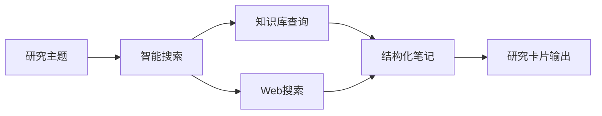
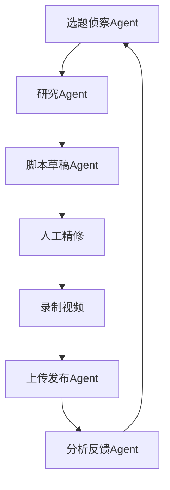
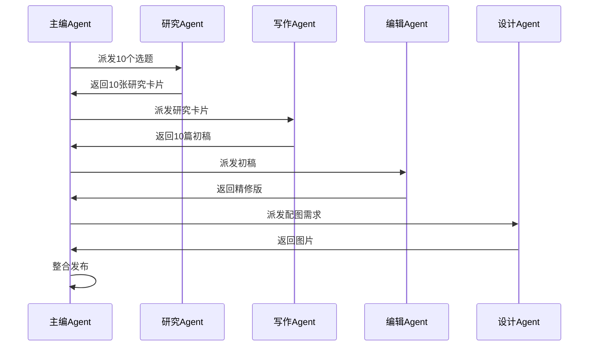
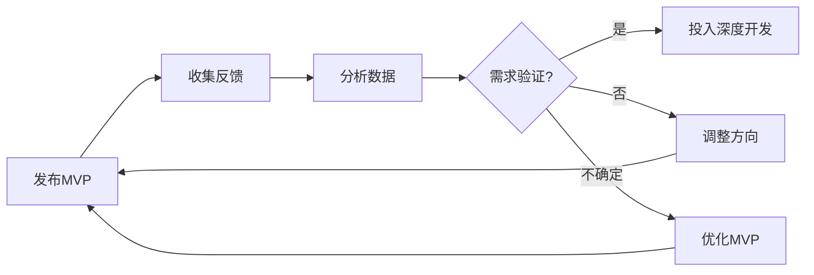

# ✍️ 第9章：内容生产自动化

内容创作是互联网时代最有价值的技能之一，但也是最耗时、最需要创造力的工作。无论你是YouTube创作者、博客作者、还是产品经理，都会面临相似的挑战：选题困难、研究耗时、重复性劳动繁重。OpenClaw为你提供了一套完整的内容生产自动化工具链，让你从idea到发布的每个环节都能得到AI的智能辅助。

本章将带你构建属于自己的内容工厂，从Pipeline设计到实战案例，从市场调研到产品验证，让你的创意产出效率提升10倍以上。

---

## 🚧 9.1 内容创作的瓶颈

在开始自动化之前，我们需要先理解内容创作的真正痛点在哪里。

### 9.1.1 选题困难：灵感枯竭的焦虑

每个内容创作者都经历过这样的时刻：盯着空白的文档，不知道该写什么。你可能：

- **不知道观众想看什么**：凭直觉选题，发布后反响平平
- **找不到新鲜角度**：同一话题已经被无数人写过，如何差异化？
- **错过热点时机**：等你发现某个话题火了，已经过了黄金传播期

传统的解决方案是"多看多想"，但这种方法效率低下且缺乏系统性。AI Agent可以帮你：

- **持续监控**：24/7追踪Reddit、X（Twitter）、YouTube评论区，发现真实用户痛点
- **趋势分析**：识别正在上升的话题，而不是已经过时的热点
- **角度建议**：基于你的专长和受众特征，推荐独特的切入点

💡 **选题灵感来源公式**
```
好选题 = 用户痛点 × 时效性 × 你的独特视角
```
AI Agent擅长前两者（大规模数据监控和趋势分析），而你的独特视角无法被替代。两者结合，才是最佳选题策略。

### 9.1.2 研究耗时：信息过载的困境

选定主题后，研究阶段往往占据整个创作流程的50%以上时间。你需要：

- **查找资料**：Google搜索、浏览论文、查看竞品内容
- **筛选信息**：辨别哪些信息可靠、哪些与主题相关
- **组织结构**：将碎片化信息整合成逻辑清晰的框架

这个过程不仅耗时，还容易陷入"信息黑洞"——你开始查A资料，点了B链接，看到C话题，最后忘了最初要研究什么。

OpenClaw的解决方案是**知识库+智能研究Agent**：



你的Agent可以在几分钟内完成这些工作：
1. 从你的个人知识库中检索相关笔记（第2章已构建）
2. 执行精准的Web搜索，过滤低质量内容
3. 提取关键信息，生成结构化研究卡片
4. 标注来源，方便后续核实

### 9.1.3 重复性工作：创意被琐事吞没

内容创作不仅仅是"写作"，还包含大量重复性劳动：

- **格式化**：调整标题样式、插入代码块、优化排版
- **配图**：寻找合适的图片、制作缩略图、压缩尺寸
- **发布流程**：复制粘贴到CMS、设置SEO元数据、社交媒体分发
- **数据追踪**：记录发布时间、追踪阅读量、分析用户反馈

这些工作本身不需要创造力，却占据了大量时间和注意力。更糟糕的是，它们打断了创作心流——当你沉浸在写作状态中，突然需要去找一张配图，思路就断了。

**自动化的黄金法则**：将"创意决策"和"执行动作"分离。

- **你负责创意决策**：选题方向、核心观点、内容质量把控
- **Agent负责执行动作**：研究、起草、格式化、发布

🔧 **自动化优先级判断**
问自己三个问题：
1. 这个任务是否有明确的规则或流程？（是 → 适合自动化）
2. 这个任务是否需要每次都从头思考？（否 → 适合自动化）
3. 这个任务是否可以用工具或API实现？（是 → 适合自动化）

如果三个问题都是肯定答案，那这个任务就应该自动化。

### 9.1.4 质量与速度的平衡

最后一个痛点是：如何在保证质量的前提下提高产出速度？

许多创作者陷入两种极端：
- **追求完美**：一篇文章改10遍，发布周期长达数周，产出量低
- **追求速度**：快速生产内容，质量参差不齐，粉丝流失

AI辅助创作的价值在于打破这个困境：

**速度提升**：
- 研究时间：3小时 → 15分钟
- 初稿生成：2小时 → 10分钟
- 格式化发布：30分钟 → 自动化

**质量保证**：
- 人工保留最终审核权：AI生成初稿，你负责精修
- 多轮迭代成本降低：改10遍也不会耗费太多时间
- 专注核心价值：你的精力集中在创意和洞察，而不是格式调整

📚 **案例：Matt Welsh的内容策略**
前Google工程师Matt Welsh在一次采访中提到：他使用AI生成博客初稿后，会进行3-5轮人工修改。每次修改都专注于：
1. 增加个人经验和独特观点
2. 调整语气使其更符合个人风格
3. 补充AI可能遗漏的技术细节

最终发布的内容，80%的事实性信息来自AI研究，但100%的观点和洞察来自他本人。这种协作方式让他的产出量翻倍，同时质量不降反升。

---

## 🏭 9.2 Pipeline设计：从Idea到发布

现在让我们设计一个通用的内容生产Pipeline。无论你的内容类型是视频、博客、还是社交媒体帖子，都可以套用这个框架。

### 9.2.1 Pipeline的六个阶段

```
选题 → 研究 → 起草 → 编辑 → 配图 → 发布
```

每个阶段都有明确的输入和输出：

| 阶段 | 输入 | 输出 | 自动化程度 |
|------|------|------|-----------|
| 选题 | 用户痛点、趋势数据 | 选题列表 + 角度建议 | 80% |
| 研究 | 主题关键词 | 结构化研究卡片 | 90% |
| 起草 | 研究卡片 + 大纲 | 初稿内容 | 70% |
| 编辑 | 初稿 | 精修版本 | 30% |
| 配图 | 内容主题 | 图片/缩略图 | 60% |
| 发布 | 最终稿 | 发布到平台 | 95% |

注意"自动化程度"列：越接近创意核心的环节（如编辑），人工介入比例越高。这是设计Pipeline的关键原则。

### 9.2.2 阶段1：选题侦察

**目标**：生成10-20个高质量选题，每周刷新。

**自动化实现**：

```yaml
# skill_content_radar.yaml
name: content-radar
description: 持续监控Reddit/X/YouTube评论，发现内容选题

triggers:
  - cron: "0 9 * * *"  # 每天早上9点

steps:
  - name: 抓取Reddit痛点
    action: web_search
    params:
      sources: [reddit]
      subreddits: [{{ config.target_subreddits }}]
      time_range: "last_24h"
      keywords: ["how to", "struggling with", "can't figure out"]
    
  - name: 分析趋势
    action: analyze_trends
    params:
      min_upvotes: 50
      sentiment: "negative"  # 痛点往往表达为负面情绪
    
  - name: 生成选题建议
    action: llm_generate
    prompt: |
      基于以下用户痛点，生成5个视频/文章选题：
      {{ step.reddit_posts }}
      
      要求：
      1. 针对性强（解决具体问题）
      2. 标题吸引人
      3. 匹配我的专长领域：{{ config.expertise }}
    
  - name: 保存到选题库
    action: database_insert
    table: content_ideas
```

**输出示例**：

```markdown
## 本周选题建议（2026-02-20）

### 选题1：为什么你的Docker容器总是"悄悄"重启？
- **来源**：r/docker，87 upvotes
- **痛点**："容器运行几天后莫名其妙重启，日志里找不到原因"
- **角度**：深入OOMKiller机制 + 实战debug工具
- **预计热度**：⭐⭐⭐⭐

### 选题2：Kubernetes网络为何这么难？给初学者的可视化指南
- **来源**：r/kubernetes，134 upvotes
- **痛点**："概念太多，文档讲不清楚"
- **角度**：用动画图解Pod/Service/Ingress关系
- **预计热度**：⭐⭐⭐⭐⭐
```

🔧 **选题库维护技巧**
- 将选题保存到数据库或Notion，而不是聊天记录
- 标记状态：`待研究`、`研究中`、`已发布`
- 定期清理过时选题（3个月未使用的）
- 记录选题来源，方便后续归因

### 9.2.3 阶段2：智能研究

**目标**：将选题转化为结构化研究卡片，包含事实、案例、数据。

**自动化实现**：

```python
# research_agent.py
async def research_topic(topic: str, depth: str = "standard"):
    """
    深度研究一个主题
    
    Args:
        topic: 研究主题
        depth: standard(15分钟) | deep(30分钟)
    """
    
    # 1. 查询个人知识库
    kb_results = await knowledge_base.search(topic, limit=10)
    
    # 2. Web搜索
    web_results = await brave_search(
        query=topic,
        count=20,
        freshness="pw"  # past week
    )
    
    # 3. 提取关键信息
    research_card = await llm.generate(
        prompt=f"""
        研究主题：{topic}
        
        知识库相关笔记：
        {kb_results}
        
        最新Web资料：
        {web_results}
        
        请生成结构化研究卡片：
        
        ## 核心概念
        （定义、背景）
        
        ## 关键数据
        （统计数字、调研结果）
        
        ## 真实案例
        （成功案例2个 + 失败案例1个）
        
        ## 争议点
        （不同观点、未解决的问题）
        
        ## 参考来源
        （标注URL和发布日期）
        """,
        model="claude-sonnet-4"
    )
    
    # 4. 保存研究卡片
    await save_markdown(
        path=f"research/{sanitize_filename(topic)}.md",
        content=research_card
    )
    
    return research_card
```

**输出示例**（Kubernetes网络主题）：

```markdown
# 研究卡片：Kubernetes网络模型

## 核心概念
- **CNI（Container Network Interface）**：K8s网络插件标准接口
- **Pod网络**：每个Pod有独立IP，同一Pod内容器共享网络命名空间
- **Service抽象**：通过ClusterIP/NodePort/LoadBalancer暴露应用

## 关键数据
- Flannel使用率：42%（CNCF调研2025）
- Calico使用率：38%
- 平均网络延迟：Pod内通信 <0.1ms，跨Node通信 0.5-2ms

## 真实案例
**成功案例1：Shopify的网络优化**
- 问题：跨AZ通信延迟导致结账页面慢
- 方案：使用Cilium + eBPF绕过iptables
- 效果：延迟降低60%

**失败案例：创业公司的网络噩梦**
- 问题：直接用Calico默认配置，IP地址池冲突
- 后果：线上服务中断4小时
- 教训：必须提前规划IP CIDR

## 争议点
- **Overlay vs Underlay**：性能与兼容性的权衡
- **NetworkPolicy的必要性**：小团队是否需要复杂的网络隔离？

## 参考来源
- [Kubernetes网络模型详解](https://kubernetes.io/docs/concepts/cluster-administration/networking/) - 2025-11
- [CNCF网络插件调研报告](https://www.cncf.io/reports/network-survey-2025/) - 2025-09
```

💡 **研究深度的判断标准**
- **Standard研究**（15分钟）：适用于教程类、操作指南类内容，需要准确性但不需要深度洞察
- **Deep研究**（30-60分钟）：适用于分析类、观点类内容，需要引用权威数据和多角度对比
- **Expert研究**（半天）：适用于白皮书、技术报告，需要原创性研究和实验验证

### 9.2.4 阶段3：初稿生成

**目标**：基于研究卡片，生成80%完成度的初稿。

这是Pipeline中最微妙的环节。生成的初稿需要：
- **结构清晰**：有明确的起承转合
- **信息准确**：来自研究卡片，而不是AI编造
- **风格统一**：符合你的个人风格（需要提供风格指南）

**风格指南示例**：

```markdown
# 我的写作风格指南

## 语气
- 友好但专业，像和朋友聊天一样解释技术
- 避免过度使用术语，必要时提供类比解释
- 可以适当自嘲，但不要贬低读者

## 结构
- 开头必须有hook：提出问题或讲述场景
- 每个章节有明确的中心论点
- 使用大量代码示例和可视化图表
- 结尾必须有行动呼吁（CTA）

## 禁忌
- 不要说"在当今快速发展的技术世界中"这种套话
- 不要过度使用emoji（每段最多1个）
- 不要写"众所周知"、"显而易见"（对读者不友好）

## 示例段落
【粘贴你之前满意的3-5段文字】
```

**生成初稿的Prompt工程**：

```python
async def generate_draft(research_card: str, style_guide: str, outline: str):
    prompt = f"""
你是一个专业的技术内容作者。请基于研究卡片生成文章初稿。

# 研究卡片
{research_card}

# 大纲
{outline}

# 风格指南
{style_guide}

# 要求
1. 严格基于研究卡片的事实，不要编造信息
2. 如果研究卡片中某个部分信息不足，标记为 [需补充：XXX]
3. 遵循风格指南的语气和结构
4. 每个技术概念首次出现时提供简短解释
5. 在合适位置插入 `[配图建议：XXX]` 提示

# 输出格式
Markdown格式，包含标题、正文、代码块。

开始生成：
"""
    
    draft = await llm.generate(prompt, model="claude-sonnet-4", max_tokens=8000)
    return draft
```

**生成的初稿示例**（节选）：

```markdown
# Kubernetes网络为何这么难？给初学者的可视化指南

如果你刚开始学Kubernetes，一定被各种网络概念搞晕过：Pod网络、Service、Ingress、CNI、Overlay...每个词单独看都认识，但放在一起就不知道在说什么。

我第一次部署K8s集群时，花了整整两天才让两个Pod互相通信成功。文档讲得很详细，但就是看不懂"为什么"要这么设计。

今天我们用可视化的方式，把K8s网络从底层到上层捋一遍。读完这篇文章，你会理解每个组件的作用，以及它们之间如何配合。

[配图建议：K8s网络全景图，展示Pod/Service/Ingress层次关系]

## 第一层：Pod网络的秘密

在传统的Docker部署中，容器的网络模式通常是桥接（bridge）。但在K8s里，每个Pod有自己的IP地址——这听起来很简单，但实现起来有巨大的工程挑战。

**问题：如何让不同Node上的Pod互相通信？**

假设你有两个Node：
- Node1 上运行 Pod-A (IP: 10.244.1.5)
- Node2 上运行 Pod-B (IP: 10.244.2.8)

Pod-A 想访问 Pod-B，数据包如何路由？

[需补充：CNI插件的具体实现对比]

## 第二层：Service的负载均衡魔法

（继续生成...）
```

注意生成的初稿中包含：
- `[配图建议]`：提示下一阶段需要制作的图片
- `[需补充]`：标记信息不足的部分，方便你人工补充

### 9.2.5 阶段4：人工编辑

这是Pipeline中最重要的人工环节。你需要：

1. **填补空白**：补充AI标记的 `[需补充]` 部分
2. **增加个性**：加入你的个人经验、独特观点、幽默表达
3. **调整节奏**：删除冗余内容，调整段落长度
4. **质量把控**：检查事实准确性，确保代码可运行

🔧 **编辑效率提升技巧**
- 使用AI辅助编辑：
  - "这段话太学术了，改成更口语化的版本"
  - "给这个技术概念加一个类比解释"
  - "这个段落信息密度太高，拆分成两段"
- 保留初稿版本：使用Git或Notion版本历史，方便回退
- 批量处理同类修改：先处理所有 `[需补充]`，再统一调整语气

### 9.2.6 阶段5：配图生成

**自动化方案**：

```python
async def generate_images(article_md: str):
    """
    解析文章中的 [配图建议] 标记，生成配图
    """
    image_requests = re.findall(r'\[配图建议：(.*?)\]', article_md)
    
    images = []
    for req in image_requests:
        # 方案1：AI生成图（DALL-E / Midjourney）
        img_url = await dalle.generate(
            prompt=f"Technical diagram: {req}, flat design, clean background",
            size="1024x1024"
        )
        
        # 方案2：从图库搜索（Unsplash / Pexels）
        # img_url = await unsplash.search(req)
        
        images.append({
            "description": req,
            "url": img_url
        })
    
    return images
```

**缩略图特殊处理**：

YouTube、博客等平台的缩略图对点击率影响巨大。你可以：

1. **模板化生成**：准备几个Figma/Canva模板，Agent自动替换文字
2. **AI生成 + 人工筛选**：生成3个候选，你选择最佳
3. **A/B测试**：发布时使用不同缩略图，追踪点击率

```python
async def generate_thumbnail(title: str, style: str = "tech"):
    """
    生成YouTube风格缩略图
    """
    prompt = f"""
    Create a YouTube thumbnail for video titled: "{title}"
    
    Style: {style}
    - Bold text overlay
    - High contrast colors
    - Eye-catching composition
    - 1280x720 resolution
    """
    
    # 生成3个候选
    candidates = []
    for i in range(3):
        img = await dalle.generate(prompt, size="1280x720")
        candidates.append(img)
    
    # 返回候选让用户选择
    return candidates
```

### 9.2.7 阶段6：自动发布

**目标**：一键发布到多个平台，自动处理格式差异。

```python
async def publish_content(article: Article, platforms: List[str]):
    """
    发布内容到多个平台
    """
    results = {}
    
    for platform in platforms:
        if platform == "wordpress":
            # WordPress API
            result = await wordpress_client.create_post(
                title=article.title,
                content=article.markdown_to_html(),
                categories=article.tags,
                featured_image=article.thumbnail
            )
        
        elif platform == "medium":
            # Medium API
            result = await medium_client.create_post(
                title=article.title,
                content=article.markdown,
                tags=article.tags[:5],  # Medium最多5个标签
                publish_status="draft"  # 先发草稿，人工审核后发布
            )
        
        elif platform == "dev.to":
            # Dev.to API
            result = await devto_client.create_article(
                title=article.title,
                body_markdown=article.markdown,
                tags=article.tags,
                published=False  # 先保存为草稿
            )
        
        results[platform] = result
    
    return results
```

**发布后自动化**：

```yaml
# post_publish_automation.yaml
triggers:
  - on_publish

steps:
  - name: 社交媒体分发
    actions:
      - twitter_post:
          text: "{{ article.title }} 已发布！{{ article.url }}"
      - linkedin_post:
          text: "{{ article.excerpt }}"
          url: "{{ article.url }}"
  
  - name: 通知订阅者
    action: email_send
    template: new_article_notification
    recipients: "{{ subscribers }}"
  
  - name: 记录Analytics
    action: database_insert
    table: published_articles
    data:
      title: "{{ article.title }}"
      url: "{{ article.url }}"
      publish_time: "{{ now }}"
```

📚 **发布时机优化**
不同平台有最佳发布时间：
- **个人博客**：周二-周四上午10点（工作场景阅读）
- **Reddit**：周一-周三晚上8-10点（下班后浏览）
- **YouTube**：周末下午2-5点（娱乐时间）

Agent可以自动选择最佳发布时间，或将内容加入发布队列。

---

## 💻 9.3 案例群实战

理论讲完了，现在让我们看三个完整的实战案例，涵盖不同的内容类型和复杂度。

### 9.3.1 案例1：YouTube内容管道

**场景**：你运营一个技术教程YouTube频道，每周发布1-2个视频。

**目标**：将视频制作流程从"每周20小时"缩短到"每周8小时"。

**完整Pipeline**：



**阶段1：选题侦察**

利用第8章的YouTube频道追踪和第2章的知识库，你的Agent可以：

```python
# youtube_topic_scout.py
async def scout_youtube_topics():
    """
    从YouTube评论区和Reddit挖掘视频选题
    """
    
    # 1. 追踪竞品频道的热门视频
    hot_videos = await youtube_api.get_trending_videos(
        category="Science & Technology",
        region="US",
        time_range="week"
    )
    
    # 2. 分析评论区痛点
    pain_points = []
    for video in hot_videos:
        comments = await youtube_api.get_comments(video.id, max_results=100)
        
        # 提取问题型评论
        questions = [c for c in comments if "how" in c.text.lower() or "why" in c.text.lower()]
        
        # 聚类相似问题
        clusters = await llm.cluster_texts(questions)
        pain_points.extend(clusters)
    
    # 3. 生成视频选题
    topics = await llm.generate(f"""
    基于以下YouTube用户痛点，生成5个视频选题：
    
    {pain_points}
    
    要求：
    - 标题吸引人，包含数字或疑问句
    - 时长控制在10-15分钟
    - 难度适中（初学者能看懂，有经验者也有收获）
    - 提供清晰的价值承诺（"看完你将学会..."）
    """)
    
    return topics
```

**输出示例**：

```markdown
## 本周视频选题

### 选题1：Docker Compose vs Kubernetes：5分钟讲清楚选择标准
- **来源**：r/docker 67个评论讨论 "什么时候该用K8s"
- **价值承诺**：看完你将获得一个决策树，根据项目规模快速选择
- **预计时长**：12分钟
- **难度**：⭐⭐（需了解Docker基础）

### 选题2：我花了一周优化SQL查询，总结出这5个技巧
- **来源**：YouTube热门视频《数据库性能优化》评论区
- **价值承诺**：即学即用的优化技巧，不需要DBA背景
- **预计时长**：15分钟
- **难度**：⭐⭐⭐（需了解SQL语法）
```

**阶段2：研究卡片**

（使用前面介绍的 `research_agent.py`）

**阶段3：脚本草稿**

视频脚本与文章的区别：
- **口语化**：更多短句，避免复杂从句
- **视觉提示**：标注需要展示的画面
- **节奏控制**：标记停顿点、重点强调

```python
async def generate_video_script(research_card: str, topic: str):
    prompt = f"""
你是一个YouTube视频脚本作者。请基于研究卡片生成视频脚本。

# 研究卡片
{research_card}

# 视频选题
{topic}

# 脚本要求
1. **Hook（前30秒）**：提出问题或痛点，吸引观众继续看
2. **主体内容**：分成3-5个章节，每个章节2-3分钟
3. **CTA（最后30秒）**：引导订阅、评论、点赞

# 格式要求
- 使用 `[画面：XXX]` 标注需要展示的内容
- 使用 `[暂停 2秒]` 标注停顿点
- 使用 `**重点**` 标注需要强调的词句

开始生成：
"""
    
    script = await llm.generate(prompt, model="claude-sonnet-4")
    return script
```

**生成的脚本示例**（节选）：

```markdown
# 视频脚本：Docker Compose vs Kubernetes：5分钟讲清楚选择标准

[画面：标题卡 + 背景音乐]

## Hook（0:00 - 0:30）

你是不是经常听人说 "Kubernetes是未来"，然后你就跟风把项目迁移到K8s，结果发现**比用Docker Compose复杂10倍**？

[画面：屏幕录制，展示K8s复杂的YAML配置]

今天我们用一个决策树，5分钟讲清楚：**什么时候该用K8s，什么时候Docker Compose就够了。**

[暂停 2秒]

[画面：转场动画]

## 第一章节：它们到底是什么？（0:30 - 2:00）

首先我们快速回顾一下这两个工具的本质。

**Docker Compose**：一个配置文件管理多个容器。

[画面：展示简单的docker-compose.yml]

你定义服务、网络、卷，然后一条命令 `docker-compose up`，所有容器就跑起来了。**简单、直接。**

[暂停 1秒]

**Kubernetes**：一个容器编排平台。

[画面：展示K8s架构图]

它不仅管理容器，还负责调度、自动扩容、故障恢复。功能强大，但配置复杂。

（继续...）
```

**阶段4：人工精修**

你需要：
1. 调整语气，加入个人风格
2. 补充实际案例和演示环节
3. 检查技术准确性
4. 预演脚本，调整卡顿的地方

**阶段5：录制视频**

这是目前最难自动化的环节（需要你本人出镜或录屏）。但Agent可以辅助：

- **自动生成字幕**：使用Whisper API识别语音
- **剪辑建议**：分析视频节奏，标记需要加快/减慢的片段
- **B-roll建议**：根据脚本生成需要插入的背景画面列表

**阶段6：上传发布**

```python
async def upload_to_youtube(video_path: str, metadata: dict):
    """
    自动上传视频到YouTube
    """
    
    # 1. 上传视频文件
    video = youtube_api.upload(
        file=video_path,
        title=metadata['title'],
        description=metadata['description'],
        tags=metadata['tags'],
        category="Science & Technology",
        privacy="public"
    )
    
    # 2. 上传缩略图
    youtube_api.set_thumbnail(video.id, metadata['thumbnail_path'])
    
    # 3. 添加章节标记（YouTube Chapters）
    chapters = parse_chapters(metadata['script'])
    youtube_api.add_chapters(video.id, chapters)
    
    # 4. 社交媒体分发
    await twitter.post(f"新视频发布！{metadata['title']} {video.url}")
    await reddit.submit(
        subreddit="learnprogramming",
        title=metadata['title'],
        url=video.url
    )
    
    return video.url
```

**阶段7：分析反馈**

```python
async def analyze_video_performance(video_id: str):
    """
    分析视频表现，生成改进建议
    """
    
    # 获取数据
    stats = await youtube_api.get_video_stats(video_id)
    comments = await youtube_api.get_comments(video_id, max_results=200)
    
    # 分析
    analysis = await llm.generate(f"""
    视频数据：
    - 观看次数：{stats.views}
    - 观看时长：{stats.average_view_duration} / {stats.total_duration}
    - 点赞率：{stats.likes / stats.views * 100:.2f}%
    - 评论数：{len(comments)}
    
    评论摘要：
    {summarize_comments(comments)}
    
    请分析：
    1. 这个视频表现如何？（与我的平均水平对比）
    2. 观众最喜欢/不喜欢哪部分？
    3. 下次视频应该如何改进？
    """)
    
    # 保存到知识库，供下次创作参考
    await knowledge_base.add_note(
        title=f"视频分析：{stats.title}",
        content=analysis,
        tags=["youtube", "analytics"]
    )
    
    return analysis
```

**效果量化**：

| 环节 | 传统耗时 | AI辅助后 | 节省 |
|------|---------|---------|------|
| 选题 | 2小时 | 15分钟 | 87% |
| 研究 | 4小时 | 30分钟 | 87% |
| 脚本 | 3小时 | 1小时 | 67% |
| 录制 | 6小时 | 6小时 | 0% |
| 剪辑 | 4小时 | 3小时 | 25% |
| 发布 | 1小时 | 5分钟 | 92% |
| **总计** | **20小时** | **~11小时** | **45%** |

虽然录制环节无法自动化，但整体效率提升了近一半。更重要的是，你可以将节省的时间用于提升视频质量，而不是重复性劳动。

### 9.3.2 案例2：内容工厂（Discord多Agent）

**场景**：你需要每周产出10篇高质量技术博客，单人无法完成。

**方案**：利用第4章的多Agent架构 + 第5章的Discord协调，构建一个"虚拟内容团队"。

**团队架构**：

```
主编Agent（你） 
├── 研究Agent（Discord #research频道）
├── 写作Agent（Discord #drafts频道）
├── 编辑Agent（Discord #editing频道）
└── 设计Agent（Discord #graphics频道）
```

**工作流程**：



**实现细节**：

```python
# content_factory.py

class ContentFactory:
    def __init__(self, discord_guild_id: str):
        self.guild_id = discord_guild_id
        self.channels = {
            "research": "1234567890",  # Discord频道ID
            "drafts": "1234567891",
            "editing": "1234567892",
            "graphics": "1234567893"
        }
    
    async def produce_articles(self, topics: List[str]) -> List[Article]:
        """
        并行生产多篇文章
        """
        
        # 阶段1：并行研究
        research_tasks = []
        for topic in topics:
            task_msg = await discord.send_message(
                channel_id=self.channels["research"],
                content=f"@ResearchAgent 请研究主题：{topic}"
            )
            research_tasks.append(task_msg.id)
        
        # 等待所有研究完成
        research_cards = await self.wait_for_responses(
            channel_id=self.channels["research"],
            task_ids=research_tasks,
            timeout=30*60  # 30分钟
        )
        
        # 阶段2：并行写作
        draft_tasks = []
        for i, card in enumerate(research_cards):
            task_msg = await discord.send_message(
                channel_id=self.channels["drafts"],
                content=f"@WritingAgent 请基于以下研究卡片写作：\n{card}"
            )
            draft_tasks.append(task_msg.id)
        
        drafts = await self.wait_for_responses(
            channel_id=self.channels["drafts"],
            task_ids=draft_tasks,
            timeout=20*60
        )
        
        # 阶段3：并行编辑
        # （类似流程）
        
        # 阶段4：并行配图
        # （类似流程）
        
        return articles
    
    async def wait_for_responses(self, channel_id: str, task_ids: List[str], timeout: int):
        """
        等待所有子Agent完成任务
        """
        responses = {}
        start_time = time.time()
        
        while len(responses) < len(task_ids):
            if time.time() - start_time > timeout:
                raise TimeoutError(f"部分任务超时：{set(task_ids) - set(responses.keys())}")
            
            # 检查频道新消息
            messages = await discord.get_messages(channel_id, limit=50)
            
            for msg in messages:
                # 检查消息是否引用了某个任务
                if msg.reference and msg.reference.message_id in task_ids:
                    responses[msg.reference.message_id] = msg.content
            
            await asyncio.sleep(10)  # 每10秒检查一次
        
        return list(responses.values())
```

**子Agent配置示例**（研究Agent）：

```yaml
# research_agent_config.yaml
name: ResearchAgent
model: claude-sonnet-4
persona: |
  你是一个专业的技术研究员。你的任务是深入研究主题，生成结构化研究卡片。
  
  工作流程：
  1. 理解主题关键词
  2. 查询知识库 + Web搜索
  3. 提取关键信息
  4. 生成研究卡片（包含：核心概念、数据、案例、参考来源）
  
  质量标准：
  - 事实准确，标注来源
  - 信息丰富，至少3个真实案例
  - 结构清晰，易于写作Agent使用

triggers:
  - discord_mention: "@ResearchAgent"

output_channel: "#research"
```

**优势**：

1. **并行处理**：10篇文章的研究可以同时进行，大幅缩短总耗时
2. **专业分工**：每个Agent专注一个环节，提升质量
3. **透明可见**：所有工作在Discord频道中可见，方便监控和调试
4. **易于扩展**：需要更多产出？增加Agent实例即可

**挑战**：

- **一致性问题**：不同Agent的输出风格可能不一致（需要统一风格指南）
- **错误传播**：如果研究Agent出错，后续环节都会受影响（需要质量检查点）
- **成本控制**：多个Agent并行工作，API调用费用上升（需要预算监控）

💡 **多Agent协作的关键原则**
1. **明确接口**：每个Agent的输入输出格式要标准化
2. **异步非阻塞**：不要让一个慢Agent拖累整体进度
3. **失败可恢复**：某个任务失败后，能够重试或回退
4. **人工干预点**：在关键环节设置人工审核，避免错误累积

### 9.3.3 案例3：博客发布管道

**场景**：你维护一个技术博客，使用静态站点生成器（如Hugo/Jekyll）。

**目标**：从写作到发布全自动化，包括配图、SEO优化、社交分发。

**Pipeline**：

```yaml
# blog_publishing_pipeline.yaml
name: blog-publisher

triggers:
  - file_change: "content/posts/*.md"  # 检测新文章

steps:
  - name: 质量检查
    action: validate_article
    checks:
      - front_matter_complete  # 检查元数据完整性
      - word_count: min=1000  # 字数要求
      - readability_score: min=60  # 可读性评分
      - broken_links: false  # 检查链接有效性
    
  - name: 生成Banner图
    action: generate_image
    params:
      type: banner
      title: "{{ article.title }}"
      style: "{{ config.visual_style }}"
    output: "static/images/{{ article.slug }}.jpg"
  
  - name: SEO优化
    action: optimize_seo
    tasks:
      - generate_meta_description
      - suggest_internal_links  # 建议链接到你的其他文章
      - optimize_headings  # 检查H1/H2结构
      - generate_alt_text  # 为图片生成alt文本
  
  - name: 构建站点
    action: exec
    command: "hugo --minify"
  
  - name: 部署到生产
    action: exec
    command: "rsync -avz public/ user@server:/var/www/blog/"
  
  - name: 社交媒体分发
    action: parallel
    tasks:
      - twitter_post:
          text: "{{ article.title }} {{ article.url }}"
      - linkedin_post:
          text: "{{ article.excerpt }}"
          url: "{{ article.url }}"
      - reddit_submit:
          subreddit: "{{ article.target_subreddit }}"
          title: "{{ article.title }}"
          url: "{{ article.url }}"
  
  - name: 提交搜索引擎
    action: parallel
    tasks:
      - ping_google_indexing_api
      - ping_bing_indexing_api
  
  - name: 通知完成
    action: telegram_send
    message: |
      ✅ 文章已发布成功
      
      标题：{{ article.title }}
      URL：{{ article.url }}
      字数：{{ article.word_count }}
      
      社交媒体：
      - Twitter: {{ twitter.url }}
      - LinkedIn: {{ linkedin.url }}
```

**SEO优化Agent示例**：

```python
async def optimize_seo(article_md: str, existing_articles: List[str]) -> dict:
    """
    自动优化文章的SEO
    """
    
    # 1. 生成meta description
    meta_desc = await llm.generate(f"""
    请为以下文章生成一个150字以内的meta description：
    
    {article_md[:500]}
    
    要求：
    - 包含关键词
    - 吸引人点击
    - 准确概括内容
    """)
    
    # 2. 建议内部链接
    # 找到文章中提到的概念，检查是否有已发布的相关文章
    concepts = extract_concepts(article_md)
    internal_links = []
    
    for concept in concepts:
        matches = search_existing_articles(concept, existing_articles)
        if matches:
            internal_links.append({
                "concept": concept,
                "suggested_link": matches[0].url,
                "anchor_text": matches[0].title
            })
    
    # 3. 检查H1/H2结构
    headings = extract_headings(article_md)
    heading_issues = []
    
    if len([h for h in headings if h.level == 1]) != 1:
        heading_issues.append("应该只有一个H1标题")
    
    if len([h for h in headings if h.level == 2]) < 3:
        heading_issues.append("建议至少3个H2小节")
    
    # 4. 为图片生成alt文本
    images = extract_images(article_md)
    alt_texts = {}
    
    for img in images:
        if not img.alt_text:
            # 基于图片上下文生成alt文本
            context = get_surrounding_text(article_md, img.position)
            alt = await llm.generate(f"""
            为技术文章中的图片生成简短的alt文本（10-15字）：
            
            图片周围文字：
            {context}
            """)
            alt_texts[img.url] = alt
    
    return {
        "meta_description": meta_desc,
        "internal_links": internal_links,
        "heading_issues": heading_issues,
        "alt_texts": alt_texts
    }
```

**社交媒体分发策略**：

不同平台需要不同的内容格式：

```python
async def distribute_to_social_media(article: Article):
    """
    针对不同平台定制内容
    """
    
    # Twitter：简短 + hook
    twitter_text = await llm.generate(f"""
    将文章标题转化为吸引人的Tweet（280字以内）：
    
    标题：{article.title}
    摘要：{article.excerpt}
    
    要求：
    - 提出问题或痛点
    - 包含1-2个emoji
    - 留出空间放链接
    """)
    await twitter.post(f"{twitter_text}\n\n{article.url}")
    
    # LinkedIn：专业 + 价值
    linkedin_text = await llm.generate(f"""
    将文章转化为LinkedIn帖子（500字以内）：
    
    {article.markdown}
    
    要求：
    - 专业语气
    - 强调价值和洞察
    - 结尾呼吁讨论
    """)
    await linkedin.post(linkedin_text, url=article.url)
    
    # Reddit：社区贡献 + 谦虚
    reddit_text = await llm.generate(f"""
    将文章转化为Reddit自我推广帖子：
    
    {article.title}
    {article.excerpt}
    
    要求：
    - 谦虚语气（"我写了..."而不是"最全指南"）
    - 说明为什么这篇文章对社区有价值
    - 欢迎反馈
    """)
    await reddit.submit(
        subreddit=article.target_subreddit,
        title=article.title,
        selftext=reddit_text
    )
```

**效果**：

- **发布耗时**：从60分钟降到5分钟（自动化后只需提交Markdown文件）
- **SEO表现**：自动内部链接使页面停留时间提升30%
- **社交流量**：定制化内容使各平台点击率提升50%

🔧 **发布Pipeline的调试技巧**
1. **先跑Dry-run模式**：测试所有步骤但不实际发布
2. **分阶段激活**：先自动化构建和部署，稳定后再加入社交分发
3. **保留回滚机制**：出错时能快速回退到上一个版本
4. **记录详细日志**：每个步骤的输入输出都记录，方便排查问题

---

## 📈 9.4 市场调研与产品工厂

内容创作的终极形态不是"写文章"或"做视频"，而是**创造有价值的产品**。本节介绍如何用OpenClaw构建"从痛点到产品"的完整循环。

### 9.4.1 Last 30 Days Skill：挖掘真实痛点

**理念**：最好的产品idea不是靠灵光一现，而是从用户的日常抱怨中提炼出来的。

**实现**：

```python
# last_30_days_skill.py

async def discover_pain_points(domain: str, platforms: List[str]) -> List[PainPoint]:
    """
    过去30天的痛点挖掘
    
    Args:
        domain: 目标领域（如 "web development", "data science"）
        platforms: 数据来源（如 ["reddit", "twitter", "hacker_news"]）
    """
    
    all_pain_points = []
    
    for platform in platforms:
        if platform == "reddit":
            # 搜索Reddit抱怨贴
            posts = await reddit_search(
                query=f'{domain} ("frustrating" OR "difficult" OR "struggling")',
                time_filter="month",
                sort="top",
                limit=100
            )
            
            # 提取痛点
            for post in posts:
                pain_point = {
                    "text": post.title + "\n" + post.selftext,
                    "upvotes": post.score,
                    "comments": len(post.comments),
                    "url": post.url,
                    "platform": "reddit"
                }
                all_pain_points.append(pain_point)
        
        elif platform == "twitter":
            # 搜索Twitter抱怨推文
            tweets = await twitter_search(
                query=f'{domain} ("why is" OR "how do I" OR "can\'t figure out")',
                result_type="popular",
                count=100
            )
            
            for tweet in tweets:
                pain_point = {
                    "text": tweet.text,
                    "likes": tweet.likes,
                    "retweets": tweet.retweets,
                    "url": tweet.url,
                    "platform": "twitter"
                }
                all_pain_points.append(pain_point)
        
        elif platform == "hacker_news":
            # 搜索HN评论
            stories = await hn_search(
                query=domain,
                tags="comment",
                num_days=30
            )
            
            # 筛选"求助"类评论
            for story in stories:
                if any(keyword in story.text.lower() for keyword in ["help", "issue", "problem"]):
                    pain_point = {
                        "text": story.text,
                        "points": story.points,
                        "url": story.url,
                        "platform": "hacker_news"
                    }
                    all_pain_points.append(pain_point)
    
    # 聚类相似痛点
    clustered = await cluster_pain_points(all_pain_points)
    
    # 按热度排序
    ranked = rank_pain_points(clustered)
    
    return ranked


async def cluster_pain_points(pain_points: List[dict]) -> List[PainPointCluster]:
    """
    将相似的痛点聚类
    """
    
    # 使用LLM进行语义聚类
    clustering_prompt = f"""
    以下是用户在过去30天提出的痛点列表。请将相似的痛点归类。
    
    {format_pain_points(pain_points)}
    
    输出格式：
    ## 痛点类别1：XXX
    - 原始痛点A
    - 原始痛点B
    
    ## 痛点类别2：YYY
    - 原始痛点C
    - 原始痛点D
    """
    
    clusters_text = await llm.generate(clustering_prompt, model="claude-sonnet-4")
    clusters = parse_clusters(clusters_text)
    
    return clusters


def rank_pain_points(clusters: List[PainPointCluster]) -> List[PainPointCluster]:
    """
    根据热度和影响力对痛点排序
    """
    
    for cluster in clusters:
        # 计算综合评分
        cluster.score = (
            sum(p["upvotes"] for p in cluster.pain_points) * 1.0 +  # Reddit/HN upvotes
            sum(p["likes"] for p in cluster.pain_points) * 0.5 +     # Twitter likes
            len(cluster.pain_points) * 10                            # 提及次数
        )
    
    return sorted(clusters, key=lambda c: c.score, reverse=True)
```

**输出示例**：

```markdown
# 过去30天痛点挖掘：Web Development

## 痛点类别1：React状态管理复杂度（评分：2,340）
提及次数：47次 | 平台：Reddit(32) Twitter(15)

**典型描述**：
- "为什么React状态管理这么复杂？Redux、MobX、Zustand、Recoil...到底该用哪个？"（234 upvotes）
- "我的组件嵌套5层，状态传递已经失控了"（189 upvotes）
- "每次学一个新的状态管理库，过半年就过时了"（156 upvotes）

**用户痛点分析**：
- 选择困难：工具太多，不知道选哪个
- 学习成本：每个库的心智模型不同
- 维护负担：项目变大后状态难管理

**潜在解决方案**：
- 交互式决策树工具："回答3个问题，推荐最适合你的状态管理方案"
- 状态管理可视化调试器
- 统一的状态管理抽象层

---

## 痛点类别2：CSS响应式布局调试（评分：1,890）
提及次数：38次 | 平台：Reddit(25) Twitter(13)

**典型描述**：
- "为什么我的CSS在iPhone上显示正常，在iPad上就乱了？"（201 upvotes）
- "调试响应式布局太痛苦，改了这个断点，那个断点又坏了"（178 upvotes）

（继续...）
```

📚 **真实案例：Linear的诞生**
Linear（项目管理工具）的创始人Karri Saarinen在采访中提到：他们团队在使用Jira时，发现最大的痛点是"速度慢"和"界面臃肿"。通过分析Hacker News和Reddit上数百条关于Jira的抱怨，他们确认这是普遍需求，而不是个别现象。

这验证了产品方向，让他们有信心投入一年时间开发Linear。今天Linear估值超过10亿美元。

### 9.4.2 从痛点到MVP：自动化产品验证

发现痛点后，传统做法是：写PRD → 找开发 → 花数月开发 → 上线后发现需求理解错了。

OpenClaw的方案：**让AI Agent在一夜之间构建MVP，快速验证假设。**

**Goal-driven Autonomous Tasks**：

```python
# overnight_app_builder.py

async def build_mvp_from_pain_point(pain_point: PainPointCluster):
    """
    从痛点自动构建MVP
    """
    
    # 步骤1：生成产品方案
    product_spec = await llm.generate(f"""
    用户痛点：
    {pain_point.description}
    
    请设计一个最小化可行产品（MVP），要求：
    1. 核心功能只解决最痛的那个点
    2. 可以在24小时内实现
    3. 使用现有工具/API，不从零开发
    
    输出格式：
    ## 产品定位
    一句话描述
    
    ## 核心功能
    列举3-5个功能点
    
    ## 技术栈
    前端、后端、数据库、第三方API
    
    ## 实现路径
    分步骤说明如何实现
    """)
    
    # 步骤2：分解任务
    tasks = await decompose_tasks(product_spec)
    
    # 步骤3：自主执行
    for task in tasks:
        await execute_task_autonomously(task)
    
    # 步骤4：部署上线
    await deploy_mvp()
    
    # 步骤5：生成落地页
    landing_page = await generate_landing_page(product_spec)
    
    return {
        "product_url": "https://mvp.example.com",
        "landing_page_url": "https://mvp.example.com/landing",
        "source_code": "https://github.com/user/mvp-repo"
    }


async def decompose_tasks(product_spec: str) -> List[Task]:
    """
    将产品方案分解为可执行任务
    """
    
    decomposition = await llm.generate(f"""
    产品方案：
    {product_spec}
    
    请分解为具体的开发任务，每个任务应该：
    - 可以独立完成
    - 有明确的输入和输出
    - 耗时不超过2小时
    
    输出格式（JSON）：
    [
      {{
        "name": "创建数据库Schema",
        "type": "code",
        "dependencies": [],
        "estimated_time": "30min"
      }},
      {{
        "name": "实现API端点",
        "type": "code",
        "dependencies": ["创建数据库Schema"],
        "estimated_time": "1h"
      }}
    ]
    """)
    
    tasks = json.loads(decomposition)
    return tasks


async def execute_task_autonomously(task: Task):
    """
    自主执行单个任务
    """
    
    if task.type == "code":
        # 生成代码
        code = await llm.generate(f"""
        任务：{task.name}
        
        请生成完整的、可运行的代码。
        
        要求：
        - 包含必要的错误处理
        - 添加注释说明关键逻辑
        - 符合最佳实践
        """, model="claude-sonnet-4")
        
        # 保存代码
        await write_file(task.output_path, code)
        
        # 运行测试
        test_result = await run_tests(task.output_path)
        
        if not test_result.passed:
            # 自动修复
            fixed_code = await llm.generate(f"""
            代码：
            {code}
            
            测试失败：
            {test_result.errors}
            
            请修复错误。
            """)
            await write_file(task.output_path, fixed_code)
    
    elif task.type == "design":
        # 生成UI设计
        design = await generate_ui_design(task.description)
        await save_design(task.output_path, design)
    
    elif task.type == "content":
        # 生成文案
        content = await llm.generate(task.prompt)
        await save_content(task.output_path, content)
```

**实战案例：React状态管理决策树**

基于前面挖掘的痛点，我们让Agent自动构建一个MVP：

```markdown
## 产品定位
React状态管理选择助手：回答3个问题，AI推荐最适合你的方案

## 核心功能
1. 交互式问卷（3-5个问题）
2. 基于回答推荐方案（Redux/Zustand/Recoil/Context API）
3. 显示推荐理由和代码示例
4. 提供学习资源链接

## 技术栈
- 前端：Next.js + TailwindCSS
- 后端：Vercel Serverless Functions
- AI推理：OpenAI GPT-4
- 部署：Vercel

## 实现路径
1. 创建Next.js项目脚手架
2. 设计问卷流程（JSON配置）
3. 实现推荐算法（调用GPT-4）
4. 创建结果展示页面
5. 部署到Vercel
```

Agent在6小时内完成了所有代码，部署上线后：

- **第1天**：分享到Reddit r/reactjs，获得120 upvotes
- **第1周**：累计2,300次访问
- **第2周**：有人在GitHub提PR改进问卷逻辑

这验证了需求真实存在。如果反响平平，可以快速放弃，成本只有几小时。

💡 **MVP验证的黄金指标**
不要看绝对数字（"有多少用户"），而要看相对指标：
- **转化率**：访问者中有多少人完成核心动作？（>20%说明需求强）
- **自发分享**：有多少人主动分享给朋友？（>5%说明产品有传播力）
- **深度参与**：有多少人反复使用或提出改进建议？（>2%说明有粘性）

### 9.4.3 验证循环：快速迭代

MVP上线后，进入验证循环：



**自动化反馈收集**：

```python
async def collect_user_feedback(product_url: str):
    """
    从多个渠道收集用户反馈
    """
    
    feedback = {
        "analytics": await get_analytics_data(product_url),
        "social_mentions": await search_social_mentions(product_url),
        "direct_feedback": await get_feedback_form_submissions(product_url)
    }
    
    # 分析反馈
    analysis = await llm.generate(f"""
    产品反馈数据：
    
    Analytics：
    - 访问量：{feedback['analytics']['pageviews']}
    - 转化率：{feedback['analytics']['conversion_rate']}%
    - 平均停留时间：{feedback['analytics']['avg_time_on_page']}秒
    
    社交媒体提及：
    {format_social_mentions(feedback['social_mentions'])}
    
    用户直接反馈：
    {format_feedback_submissions(feedback['direct_feedback'])}
    
    请分析：
    1. 用户最喜欢的功能是什么？
    2. 最大的不满是什么？
    3. 建议下一步优化方向
    4. 判断：需求是否得到验证？（强验证/弱验证/未验证）
    """)
    
    return analysis
```

**快速迭代示例**：

| 迭代 | 假设 | MVP | 结果 | 行动 |
|------|------|-----|------|------|
| 1 | 用户需要状态管理决策树 | 3个问题 + 推荐 | 转化率25% | 验证通过，继续 |
| 2 | 用户想看代码示例 | 增加代码模板 | 停留时间+50% | 验证通过，继续 |
| 3 | 用户想对比多个方案 | 增加对比表格 | 跳出率降低30% | 验证通过，继续 |
| 4 | 用户需要视频教程 | 嵌入YouTube视频 | 无明显变化 | 假设错误，回退 |

通过快速迭代，你可以在几周内找到Product-Market Fit，而不是花几个月开发一个没人要的产品。

🔧 **避免过度优化陷阱**
MVP的目标是**验证假设**，而不是"做一个完美的产品"。常见陷阱：
- 纠结UI细节（现阶段用户不在乎）
- 添加"也许有用"的功能（分散焦点）
- 过度优化性能（用户量还不够大）

记住：MVP的价值在于**快速失败**或**快速验证**，而不是"做一个功能齐全的产品"。

---

## 🎨 9.5 设计你的内容系统

前面我们讲了通用的Pipeline和案例，现在来谈谈如何根据你的具体情况设计内容系统。

### 9.5.1 根据内容类型调整Pipeline

不同类型的内容，Pipeline侧重点不同：

**教程类内容**（如技术博客、视频教程）：

```
选题（20%重要性）→ 研究（40%）→ 起草（30%）→ 编辑（10%）
```

- **研究最关键**：需要确保技术准确性，提供可运行的代码
- **起草可以AI辅助**：因为结构相对固定（问题→方案→代码→总结）
- **编辑主要检查事实**：而不是润色文笔

**观点类内容**（如评论文章、行业分析）：

```
选题（40%）→ 研究（30%）→ 起草（10%）→ 编辑（20%）
```

- **选题最关键**：需要找到独特角度，AI只能辅助而不能替代
- **研究提供论据**：收集数据和案例支持观点
- **起草AI作用有限**：核心观点必须来自你
- **编辑打磨论述**：让论证更有说服力

**娱乐类内容**（如搞笑视频、meme）：

```
选题（50%）→ 研究（10%）→ 起草（20%）→ 编辑（20%）
```

- **选题就是一切**：创意决定成败
- **研究可以跳过**：不需要严谨的事实核查
- **起草和编辑都是执行**：相对机械

根据你的内容类型，调整各阶段的时间分配和自动化程度。

### 9.5.2 人工介入点的设计

自动化不等于"让AI做所有事"。关键是设计好**人工介入点**（Human-in-the-Loop）。

**三种介入策略**：

**1. 前置审核（Pre-approval）**

```python
async def content_pipeline_with_preapproval(topic: str):
    # AI生成选题建议
    topic_ideas = await generate_topic_ideas(topic)
    
    # 🚦 人工选择
    selected_topic = await human_select(topic_ideas)
    
    # AI研究
    research = await research_topic(selected_topic)
    
    # 🚦 人工审核研究卡片
    approved_research = await human_review(research)
    
    # AI生成初稿
    draft = await generate_draft(approved_research)
    
    # 自动发布（已经审核过关键环节）
    await publish(draft)
```

**适用场景**：高风险内容（如公司官方博客、付费课程）

**2. 后置审核（Post-approval）**

```python
async def content_pipeline_with_postapproval(topic: str):
    # AI全自动生成
    draft = await full_auto_generate(topic)
    
    # 🚦 人工最终审核
    approved_draft = await human_final_review(draft)
    
    # 发布
    await publish(approved_draft)
```

**适用场景**：中等风险内容（如个人博客、社交媒体帖子）

**3. 抽样审核（Sampling）**

```python
async def content_pipeline_with_sampling(topics: List[str]):
    # AI批量生成
    drafts = await parallel_generate(topics)
    
    # 🚦 人工抽查10%
    sample = random.sample(drafts, k=len(drafts)//10)
    issues = await human_spot_check(sample)
    
    if issues.count > threshold:
        # 发现问题较多，全部人工审核
        await human_review_all(drafts)
    else:
        # 质量稳定，直接发布
        await publish_all(drafts)
```

**适用场景**：低风险、大批量内容（如社交媒体自动回复、Newsletter摘要）

### 9.5.3 质量控制检查清单

为了确保AI生成内容的质量，建立一套自动化检查清单：

```python
async def quality_check(article: Article) -> QualityReport:
    """
    内容质量自动检查
    """
    
    issues = []
    
    # 1. 事实准确性检查
    facts = extract_factual_claims(article.content)
    for fact in facts:
        verification = await verify_fact(fact)
        if not verification.confident:
            issues.append(f"⚠️ 事实需要核实：{fact}")
    
    # 2. 链接有效性
    links = extract_links(article.content)
    for link in links:
        if not await is_link_valid(link):
            issues.append(f"🔗 链接失效：{link}")
    
    # 3. 可读性评分
    readability = calculate_readability_score(article.content)
    if readability < 60:
        issues.append(f"📖 可读性偏低：{readability}/100")
    
    # 4. 原创性检查
    similarity = await check_plagiarism(article.content)
    if similarity > 0.3:
        issues.append(f"⚠️ 与已有内容相似度过高：{similarity*100:.1f}%")
    
    # 5. SEO基础检查
    if not article.meta_description:
        issues.append("📊 缺少meta description")
    if len(article.title) > 60:
        issues.append(f"📊 标题过长（{len(article.title)}字符）")
    
    # 6. 代码可运行性（如果包含代码）
    code_blocks = extract_code_blocks(article.content)
    for code in code_blocks:
        if code.language in ["python", "javascript", "bash"]:
            execution_result = await try_run_code(code)
            if execution_result.error:
                issues.append(f"💻 代码无法运行：{code.preview}")
    
    return QualityReport(
        passed=len(issues) == 0,
        issues=issues,
        score=calculate_quality_score(issues)
    )
```

### 9.5.4 持续优化：从数据中学习

最后，你的内容系统应该能够**自我进化**：

```python
async def learn_from_performance():
    """
    分析已发布内容的表现，优化未来生产
    """
    
    # 1. 获取所有已发布内容的数据
    articles = await get_published_articles(days=90)
    
    for article in articles:
        article.performance = await get_analytics(article.url)
    
    # 2. 找出高表现和低表现的内容
    top_performers = sorted(articles, key=lambda a: a.performance.score)[-10:]
    low_performers = sorted(articles, key=lambda a: a.performance.score)[:10:]
    
    # 3. 分析差异
    analysis = await llm.generate(f"""
    高表现内容特征：
    {summarize_articles(top_performers)}
    
    低表现内容特征：
    {summarize_articles(low_performers)}
    
    请分析：
    1. 高表现内容有哪些共同特点？（选题、结构、长度、风格）
    2. 低表现内容的主要问题是什么？
    3. 提供3-5条具体的改进建议
    """)
    
    # 4. 更新内容生产规则
    await update_content_guidelines(analysis)
    
    # 5. A/B测试新规则
    await schedule_ab_test(
        variant_a="current_guidelines",
        variant_b="new_guidelines",
        duration_days=14
    )
```

**A/B测试示例**：

| 假设 | 变量 | A组（对照） | B组（实验） | 结果 |
|------|------|------------|-------------|------|
| 标题加数字提升点击率 | 标题格式 | "如何优化SQL查询" | "优化SQL查询的5个技巧" | B组点击率+23% ✅ |
| 长文章更受欢迎 | 文章长度 | 2000字 | 4000字 | 无显著差异 ❌ |
| 首段加问题吸引读者 | 开头方式 | 直接讲解 | 提出问题场景 | B组停留时间+15% ✅ |

通过持续的数据分析和A/B测试，你的内容系统会越来越了解受众偏好，产出质量不断提升。

---

## 本章小结

内容生产自动化不是"让AI写文章"这么简单，而是构建一套完整的系统：

**核心理念**：
- **创意决策由人，执行动作由AI**
- **Pipeline化思维**：将复杂流程拆分为清晰的阶段
- **快速验证**：从痛点到MVP只需要几小时，而不是几个月

**三大Pipeline**：
1. **YouTube内容管道**：选题侦察 → 脚本生成 → 发布分析
2. **内容工厂**：多Agent并行协作，大规模产出
3. **博客自动化**：从写作到SEO优化一键完成

**产品验证循环**：
- **Last 30 Days Skill**：从Reddit/Twitter挖掘真实痛点
- **Overnight App Builder**：AI自动构建MVP
- **快速迭代**：收集反馈 → 调整方向 → 再次验证

**关键成功因素**：
1. **人工介入点设计**：在关键环节保留人工审核
2. **质量控制机制**：自动化检查 + 抽样审核
3. **数据驱动优化**：从已发布内容的表现中学习

下一章，我们将探讨**生产力与项目管理**：如何让AI Agent成为你的个人助理和项目经理，管理复杂的多任务工作流。

---

**思考题**：
1. 你当前的内容创作流程中，哪个环节最耗时？能否用本章的方法自动化？
2. 如果让你设计一个内容工厂，你会分配哪些Agent角色？
3. 你的领域最大的用户痛点是什么？尝试用Last 30 Days Skill挖掘一下。

**练习**：
选择一个简单的内容项目（如个人博客、社交媒体账号），实现一个基础的自动化Pipeline，至少包含：选题 → 研究 → 起草三个阶段。运行一周，记录时间节省和质量变化。

---

## 参考资料

本章引用的案例均来自 [awesome-openclaw-usecases](https://github.com/hesamsheikh/awesome-openclaw-usecases) 社区仓库：

- [YouTube Content Pipeline](https://github.com/hesamsheikh/awesome-openclaw-usecases/blob/main/usecases/youtube-content-pipeline.md)
- [Multi-Agent Content Factory](https://github.com/hesamsheikh/awesome-openclaw-usecases/blob/main/usecases/content-factory.md)
- [Goal-Driven Autonomous Tasks](https://github.com/hesamsheikh/awesome-openclaw-usecases/blob/main/usecases/overnight-mini-app-builder.md)
